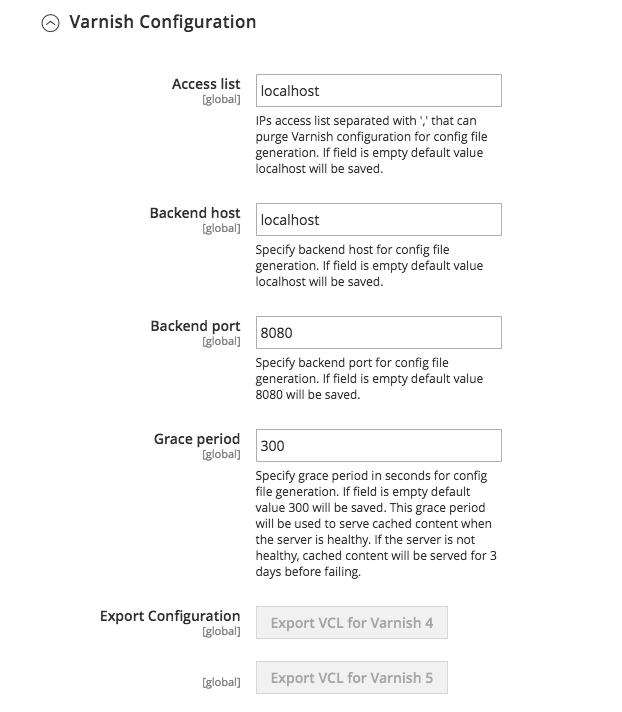

# Configuración de Barniz para Commerce

{{varnish-config-cloud}}

Para configurar Commerce para que utilice Barniz:

1. Inicie sesión en el administrador como administrador.
1. Haga clic en **[!UICONTROL Stores]** > Configuración > **Configuración** > **Avanzado** > **Sistema** > **Caché de página completa**.
1. En la lista **[!UICONTROL Caching Application]**, haga clic en **Barnizar almacenamiento en caché**.
1. Escriba un valor en el campo **[!UICONTROL TTL for public content]**.
1. Expanda **[!UICONTROL Varnish Configuration]** e introduzca la siguiente información:

   | Campo | Descripción |
   | ----- | ----------- |
   | Lista de acceso | Escriba el nombre de host completo, la dirección IP o el intervalo de direcciones IP de [Enrutamiento entre dominios sin clase (CIDR)](https://www.digitalocean.com/community/tutorials/understanding-ip-addresses-subnets-and-cidr-notation-for-networking) para el que se invalidará el contenido. Consulte [Depuración de caché de barniz](https://varnish-cache.org/docs/3.0/tutorial/purging.html). |
   | Host back-end | Escriba el nombre de host o la dirección IP completos y el puerto de escucha del servidor Varnish _backend_ o _origin server_; es decir, el servidor que proporciona el contenido que Varnish acelera. Normalmente, es su servidor web. Consulte [Servidores back-end de caché de Barnish](https://www.varnish-cache.org/docs/trunk/users-guide/vcl-backends.html). |
   | Puerto back-end | Puerto de escucha del servidor de origen. |
   | Período de gracia | Determina cuánto tiempo sirve Barnish al contenido obsoleto si el backend no responde. El valor predeterminado es 300 segundos. |
   | Tamaño de parámetros de identificadores | Especifica el número máximo de [controladores de diseño](https://developer.adobe.com/commerce/frontend-core/guide/layouts/#layout-handles) que se procesarán en el extremo HTTP [`{BASE-URL}/page_cache/block/esi`](use-varnish-esi.md) para el almacenamiento en caché de página completa. Restringir el tamaño puede mejorar la seguridad y el rendimiento. El valor predeterminado es 100. |

1. Haga clic en **Guardar configuración**.

También puede activar Varnish desde la línea de comandos, en lugar de iniciar sesión en Admin, mediante la herramienta de interfaz de línea de comandos de C:

```shell
bin/magento config:set --scope=default --scope-code=0 system/full_page_cache/caching_application 2
```

## Exportar un archivo de configuración de barniz

Para exportar un archivo de configuración de Barniz desde Admin:

1. Haga clic en uno de los botones de exportación para crear un(a) `varnish.vcl` que pueda usar con Barniz.

   Por ejemplo, si tiene Varnish 4, haga clic en **Exportar VCL para Varnish 4**

   La siguiente figura muestra un ejemplo:

   

1. Haga una copia de seguridad de su `default.vcl` existente. Luego cambie el nombre del archivo `varnish.vcl` que acaba de exportar a `default.vcl`. A continuación, copie el archivo en el directorio `/etc/varnish/`.

   ```shell
   cp /etc/varnish/default.vcl /etc/varnish/default.vcl.bak2
   ```

   ```shell
   mv <download_directory>/varnish.vcl default.vcl
   ```

   ```shell
   cp <download_directory>/default.vcl /etc/varnish/default.vcl
   ```

1. Adobe recomienda abrir `default.vcl` y cambiar el valor de `acl purge` a la dirección IP del host Varnish. (Puede especificar varios hosts en líneas independientes o también puede utilizar la notación CIDR).

   Por ejemplo,

   ```conf
    acl purge {
       "localhost";
    }
   ```

1. Si desea personalizar las comprobaciones de estado de Vagrant o la configuración del modo de gracia o del modo de santo, consulte [Configuración avanzada de barniz](config-varnish-advanced.md).

1. Reinicie Varnish y su servidor web:

   ```shell
   service varnish restart
   ```

   ```shell
   systemctl restart nginx
   ```

## Archivos estáticos de caché

Los archivos estáticos no deben almacenarse en caché de forma predeterminada, pero si desea almacenarlos en caché, puede editar la sección `Static files caching` de la VCL para que tenga el siguiente contenido:

```conf
# Static files should not be cached by default
  return (pass);

# But if you use a few locales and do not use CDN you can enable caching static files by commenting previous line (#return (pass);) and uncommenting next 3 lines
  #unset req.http.Https;
  #unset req.http./* {{ ssl_offloaded_header }} */;
  #unset req.http.Cookie;
```

Debe realizar estos cambios antes de configurar Commerce para que utilice Barniz.
