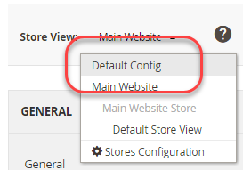

# Ejemplo con comandos CLI

Este ejemplo muestra cómo establecer valores compartidos, específicos del sistema y confidenciales en el sistema de desarrollo y, a continuación, implementar esos valores en el sistema de producción.
Esto se hace mediante una combinación de configuraciones compartidas, el archivo `config.php` y el comando CLI de Commerce.

Este ejemplo utiliza las opciones de configuración siguientes:

- **Número de IVA** y **Nombre de tienda** para las opciones de configuración compartidas.

  Se encuentran en **Tiendas** > Configuración > **Configuración** > General > **General**.

- **Enviar correos electrónicos a** para obtener el valor de configuración confidencial.

  Se encuentra en **Tiendas** > Configuración > **Configuración** > General > **Contactos**.

- **Dominio de correo electrónico predeterminado** para el valor de configuración específico del sistema.

  Se encuentra en **Tiendas** > Configuración > **Configuración** > Clientes > **Configuración del cliente** > **Crear nuevas opciones de cuenta**.

Puede utilizar el mismo procedimiento mostrado en este ejemplo para configurar cualquier configuración en las siguientes referencias:

- [Referencia de rutas de configuración confidenciales y específicas del sistema](../reference/config-reference-sens.md)
- [Referencia de rutas de configuración de pago](../reference/config-reference-payment.md)
- [Referencia de otras rutas de configuración](../reference/config-reference-general.md)
- [Referencia de rutas de configuración de la extensión Commerce Enterprise B2B](../reference/config-reference-b2b.md)

## Antes de empezar

Antes de empezar, configure los permisos y la propiedad del sistema de archivos como se describe en [Requisito previo para los sistemas de desarrollo, compilación y producción](../deployment/prerequisites.md).

## Suposiciones

En este tema se proporciona un ejemplo de cómo modificar la configuración del sistema de producción. Si lo desea, puede elegir diferentes opciones de configuración.

Para los fines de este ejemplo, suponemos lo siguiente:

- Utilice el control de código fuente Git
- El sistema de desarrollo está disponible en un repositorio remoto Git denominado `mconfig`
- Su rama de trabajo de Git se llama `m2.2_deploy`

## Paso 1: Establezca la configuración en el sistema de desarrollo

Para establecer la configuración regional y las unidades de peso predeterminadas en el sistema de desarrollo:

1. Inicie sesión en Admin.
1. Haga clic en **Tiendas** > Configuración > **Configuración** > General > **General**.
1. Si tiene más de un sitio web disponible, use la lista **Vista de tienda** en la esquina superior izquierda para cambiar a otro sitio web, como se muestra en la siguiente ilustración.

   

1. En el panel derecho, expanda **Información de almacén**.
1. Si es necesario, borra la casilla de verificación **Usar predeterminado** junto a los campos **Número de IVA** y **Nombre de tienda**.
1. Escriba un número en el campo (por ejemplo, `12345`).
1. En el campo **Nombre de tienda**, escriba un valor (como `My Store`).
1. Haga clic en **Guardar configuración**.
1. En el panel de navegación izquierdo, debajo de General, haga clic en **Contactos**.
1. En el panel derecho, expanda **Opciones de correo electrónico**.
1. Si es necesario, borre la casilla de verificación **Usar predeterminado** junto al campo **Enviar correos electrónicos a**.
1. Introduzca una dirección de correo electrónico en el campo.
1. Haga clic en **Guardar configuración**.
1. Use la lista **Vista de tienda** para seleccionar la **configuración predeterminada**, como se muestra en la siguiente ilustración.

   

1. En el panel izquierdo, haga clic en Clientes > **Configuración del cliente**.
1. En el panel derecho, expanda **Crear nuevas opciones de cuenta**.
1. Si es necesario, borre la casilla de verificación **Usar valor del sistema** junto al campo **Dominio de correo electrónico predeterminado**.
1. Introduzca un nombre de dominio en el campo.
1. Haga clic en **Guardar configuración**.
1. Si se le solicita, vacíe la caché.

## Paso 2: Actualizar la configuración

Ahora que ha cambiado la configuración en el Administrador, escriba la configuración compartida en un archivo como siguiendo los pasos siguientes:

{{$include /help/_includes/config-save-config.md}}

Aunque `app/etc/env.php` (la configuración específica del sistema) se haya actualizado, no la proteja en el control de código fuente.
Creará las mismas opciones de configuración en el sistema de producción más adelante en este procedimiento.

## Paso 3: Actualizar el sistema de compilación y generar archivos

Ahora que ha confirmado los cambios en la configuración compartida en el control de código fuente, puede extraer esos cambios en el sistema de generación, compilar el código y generar archivos estáticos.

{{$include /help/_includes/config-update-build-system.md}}

## Paso 4: Actualizar el sistema de producción

El último paso del proceso es actualizar el sistema de producción. Debe hacerlo en dos partes:

- Actualice la configuración confidencial y específica del sistema
- Actualizar la configuración compartida

### Actualice la configuración confidencial y específica del sistema

Para establecer la configuración confidencial y específica del sistema mediante variables de entorno, debe saber lo siguiente:

- Ámbito de cada configuración

  Si ha seguido las instrucciones del paso 1, el ámbito de **Enviar correos electrónicos a** es el sitio web y el ámbito de **Dominio de correo electrónico predeterminado** es global (es decir, el ámbito de configuración predeterminado).

  Necesita el código del sitio web para establecer el valor de configuración **Enviar correos electrónicos a**.

  Para obtener más información sobre cómo encontrar este valor, consulte: [Usar variables de entorno para anular las opciones de configuración](../reference/override-config-settings.md#environment-variables).

- Rutas de configuración para las opciones utilizadas en este ejemplo:

  | Nombre de configuración | Ruta de configuración |
  | -------------------- | -------------------------------------- |
  | Envío de correos electrónicos a | `contact/email/recipient_email` |
  | Dominio de correo electrónico predeterminado | `customer/create_account/email_domain` |

  Para todas las rutas de configuración confidenciales y específicas del sistema, vea: [Referencia de rutas de configuración confidenciales y específicas del sistema](../reference/config-reference-sens.md).

### Establecer las variables mediante comandos CLI

Utilice los siguientes comandos de CLI para establecer las opciones de configuración específicas del sistema y confidenciales:

- `magento config:set` para la configuración específica del sistema
- `magento config:sensitive:set` para la configuración confidencial

Para establecer la configuración específica del sistema **Dominio de correo electrónico predeterminado**, que se encuentra en el ámbito predeterminado, use el siguiente comando:

```bash
bin/magento config:set customer/create_account/email_domain <email domain>
```

No es necesario utilizar el ámbito en el comando porque es el ámbito predeterminado.

Sin embargo, para establecer los valores de **Enviar correos electrónicos a**, debe conocer el tipo de ámbito (`website`) y el código de ámbito, que probablemente sean diferentes en cada sitio.

Ejemplo:

```unix
bin/magento config:sensitive:set contact/email/recipient_email --scope=website --scope-code=<website code> <email address>
```

### Actualizar la configuración compartida

En esta sección se explica cómo extraer todos los cambios realizados en los sistemas de desarrollo y compilación en un entorno de producción, lo que actualiza la configuración compartida (nombre del almacén y número de IVA).

{{$include /help/_includes/config-update-prod-system.md}}

### Compruebe los ajustes de configuración en el Administrador

Para comprobar las opciones de configuración:

1. Inicie sesión en el administrador del sistema de producción.
1. Haga clic en **Tiendas** > Configuración > **Configuración** > General > **General**.
1. Use la lista **Vista de tienda** en la esquina superior izquierda para cambiar a otro sitio web.

   Las opciones de configuración compartida establecidas en el sistema de desarrollo se muestran de forma similar a la siguiente.

   

   >[!INFO]
   >
   >El campo **Store Name** se puede editar en el ámbito del sitio web, pero si cambia al ámbito de configuración predeterminado, no se puede editar. Este es el resultado de cómo se establecen las opciones en el sistema de desarrollo. El valor de **Número de IVA** no se puede editar en el ámbito del sitio web.

1. Si aún no lo ha hecho, cambie al ámbito de configuración predeterminada.
1. En el panel de navegación izquierdo, debajo de General, haga clic en **Contactos**.

   El campo **Enviar correos electrónicos a** no se puede editar, como se muestra en la siguiente ilustración. Esta es una configuración confidencial.

   

1. En el panel izquierdo, haga clic en Clientes > **Configuración del cliente**.
1. En el panel derecho, expanda **Crear nuevas opciones de cuenta**.

   El valor del campo **Dominio de correo electrónico predeterminado** se muestra de la siguiente manera. Esta es una configuración específica del sistema.

   

<!-- Last updated from includes: 2024-07-18 15:50:54 -->
