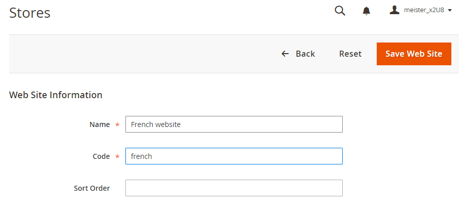
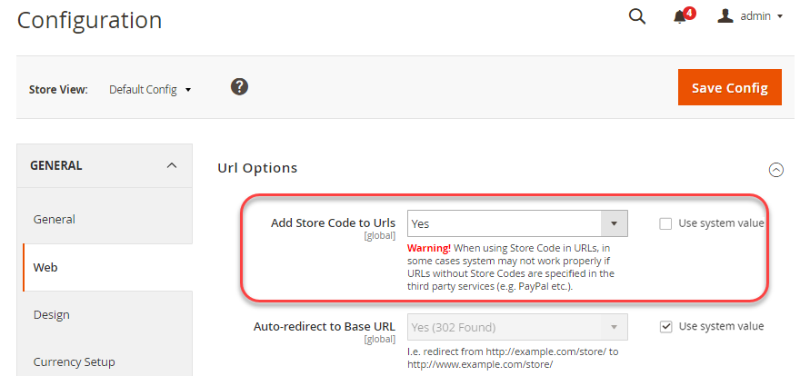

# Configure varias vistas en el administrador

Esta tarea requiere que cree una categoría raíz (y categorías adicionales, si lo desea) para cada tienda. Las tareas que se tratan en este tema proporcionan una forma de configurar varias tiendas. Para obtener más información, consulte los siguientes recursos en la Guía del usuario de Commerce:

- [Categorías](https://experienceleague.adobe.com/en/docs/commerce-admin/catalog/categories/categories)
- [Agregando sitios web](https://experienceleague.adobe.com/en/docs/commerce-admin/stores-sales/site-store/stores#add-websites)
- [URL de almacenamiento](https://experienceleague.adobe.com/en/docs/commerce-admin/stores-sales/site-store/store-urls)
- [Contenido](https://experienceleague.adobe.com/en/docs/commerce-admin/content-design/content-menu)

>[!INFO]
>
>Solo con fines de ejemplo, en este tema utilizamos un sitio web francés con código de sitio web `french`. Para obtener tutoriales paso a paso, consulte [Tutorial: Configurar varios sitios web con Apache](ms-apache.md) y [Tutorial: Configurar varios sitios web con nginx](ms-nginx.md)

## Paso 1: Crear categorías raíz

La creación de una categoría raíz es opcional, pero se muestra cómo hacerlo en este tutorial en el caso de que desee que cada sitio web tenga una categoría raíz única. Si lo desea, puede crear categorías adicionales.

Para crear una categoría raíz:

1. Inicie sesión en Admin como usuario autorizado para crear categorías.
1. Haga clic en **Catálogo** > **Categorías**.
1. Haga clic en **Agregar categoría raíz**.
1. En el campo **Nombre de categoría**, escriba un nombre único para identificar esta categoría.
1. Asegúrese de que Habilitar categoría está establecida en **Sí**.

   Para obtener información acerca de las demás opciones de esta página, vea [Categorías raíz](https://experienceleague.adobe.com/en/docs/commerce-admin/catalog/categories/category-root).

   La siguiente figura muestra un ejemplo.

   

1. Haga clic en **Guardar**.
1. Repita estas tareas tantas veces como sea necesario para crear categorías raíz para las tiendas.

## Paso 2: Crear sitios web

Para crear un sitio web:

1. Inicie sesión en Admin como usuario autorizado para crear sitios web, tiendas y vistas de tiendas.
1. Haga clic en **Tiendas** > **Configuración** > **Todas las tiendas**.
1. En la página _Tiendas_, haga clic en **Crear sitio web**.

   - **Nombre**: escriba un nombre para identificar el sitio web.
   - **Código**: escriba un código único; por ejemplo, si tiene una tienda en francés, puede escribir `french`
   - **Orden de clasificación**: escriba un orden numérico opcional.

   La siguiente figura muestra un ejemplo.

   

1. Haga clic en **Guardar sitio web**.
1. Repita estas tareas tantas veces como sea necesario para crear los sitios web.

## Paso 3: Crear tiendas

Para crear un almacén:

1. En el panel _Administrador_, haga clic en **Tiendas** > **Configuración** > **Todas las tiendas**.
1. En la página _Tiendas_, haga clic en **Crear tienda**.

   - **Sitio web**: haga clic en el nombre del sitio web con el que desea asociar este almacén.
   - **Nombre**: escriba un nombre para identificar el almacén.
   - **Código**: escriba un código único para identificar el almacén.
   - **Categoría raíz**: haga clic en el nombre de la categoría raíz de este almacén.

   La siguiente figura muestra un ejemplo.

   

1. Haga clic en **Guardar tienda**.
1. Repita estas tareas tantas veces como sea necesario para crear sus tiendas.

## Paso 4: Crear vistas de tienda

Para crear una vista de tienda:

1. En el panel _Administrador_, haga clic en **Tiendas** > **Configuración** > **Todas las tiendas**.
1. En la página Tiendas, haz clic en **Crear vista de tienda**.

   - **Almacén**: haga clic en el nombre del almacén con el que desea asociar esta vista de almacén.
   - **Nombre**: escriba un nombre para identificar esta vista de tienda.
   - **Código**: escriba un nombre único para identificar esta vista de tienda.
   - **Estado**—Seleccione **Habilitado**.

   La siguiente figura muestra un ejemplo.

   

1. Haga clic en **Guardar vista de tienda**.
1. Repita estas tareas tantas veces como sea necesario para crear las vistas de la tienda.

## Paso 5: cambiar la dirección URL base del sitio web

Para tener acceso a un sitio web mediante una dirección URL única como `http://french.magento.mg`, debe cambiar la dirección URL base de cada sitio en el Administrador.

Para cambiar la dirección URL base del sitio web:

1. En el panel _Administrador_, haga clic en **Tiendas** > **Configuración** > **Configuración** > **General** > **Web**.
1. En la lista **Vista de tienda** situada en la parte superior de la página, haz clic en el nombre de uno de tus sitios web, como se muestra en la siguiente ilustración.

   

1. En el panel derecho, expanda **URL base**.
1. En la sección _URL base_, borre **Usar valor del sistema**.
1. Escriba la dirección URL `http://french.magento.mg` en los campos **Dirección URL base** y **Dirección URL de vínculo base**.

1. Repita el paso anterior en la sección _URL base (seguras)_.

   >[!INFO]
   >
   >Si está configurando una dirección URL base para la implementación de Adobe Commerce en una infraestructura en la nube, debe reemplazar el primer periodo con tres guiones. Por ejemplo, si la dirección URL base es `french.branch-sbg7pPa-f3dueAiM03tpy.us.magentosite.cloud`, escriba `http://french---branch-sbg7pPa-f3dueAiM03tpy.us.magentosite.cloud`. Si va a configurar una dirección URL base para pruebas locales, utilice un punto.

1. Haga clic en **Guardar configuración**.

1. Repita estas tareas para otros sitios web.

## Paso 6: Añadir el código de tienda a la URL base

Commerce le da la opción de agregar el código de tienda a la dirección URL de la base del sitio, lo que simplifica el proceso de configuración de varias tiendas. Con esta opción, no tiene que crear directorios en el sistema de archivos de Commerce para almacenar `index.php` y `.htaccess`.

Esto evita que `index.php` y `.htaccess` se desincronicen con el código base de Commerce en futuras actualizaciones.

Consulte la [Guía del usuario de Commerce](https://experienceleague.adobe.com/en/docs/commerce-admin/stores-sales/site-store/store-urls).

Para agregar el código de tienda a la dirección URL base:

1. En el panel _Administrador_, haga clic en **Tiendas** > **Configuración** > **Configuración** > **General** > **Web**.
1. En la lista **Vista de tienda** en la parte superior de la página, haz clic en **Configuración predeterminada**, como se muestra en la siguiente ilustración.

   

1. En el panel derecho, expanda **Opciones de URL**.
1. Desactive la casilla de verificación **Usar valor del sistema** junto a _Agregar código de tienda a las direcciones URL_.
1. En la lista _Agregar código de tienda a direcciones URL_, haga clic en **Sí**.

   

1. Haga clic en **Guardar configuración**.
1. Si se le solicita, vacíe la caché. (**Sistema** > **Administración de caché**).

## Paso 7: cambiar la URL de base de vista de tienda predeterminada

Debe realizar este paso en último lugar porque perderá el acceso al administrador; el acceso vuelve después de configurar los hosts virtuales, tal como se describe en los temas específicos del servidor web.

Para cambiar la URL de base de vista de tienda predeterminada:

1. En el panel _Administrador_, haga clic en **Tiendas** > **Configuración** > **Configuración** > **General** > **Web**.

1. En la lista _Vista de tienda_ en la parte superior de la página, haz clic en **Configuración predeterminada**.

   

1. En el panel derecho, expanda **URL base**.
1. En la sección _URL base_, borre **Usar valor del sistema**.
1. Escriba la dirección URL `http://magento.mg` en los campos **Dirección URL base** y **Dirección URL de vínculo base**.

1. Repita el paso anterior en la sección **URL base (seguras)**.

   >[!INFO]
   >
   >Si está configurando una dirección URL base para Adobe Commerce en una infraestructura en la nube, debe reemplazar el primer periodo con tres guiones. Por ejemplo, si la dirección URL base es `french.branch-sbg7pPa-f3dueAiM03tpy.us.magentosite.cloud`, escriba `http://french---branch-sbg7pPa-f3dueAiM03tpy.us.magentosite.cloud`

1. Haga clic en **Guardar configuración**.

>[!INFO]
>
>El sitio web, la tienda y el código de vista de tienda solo pueden incluir letras (a-z o A-Z), números (0-9) y guiones bajos (_). Además, el primer carácter debe ser una letra. Si se utilizan mayúsculas o minúsculas, internamente la coincidencia no distingue entre mayúsculas y minúsculas para dar cabida a la anulación de los ajustes de configuración mediante variables de entorno. Consulte [Usar variables de entorno para anular las opciones de configuración](../reference/override-config-settings.md#environment-variables).