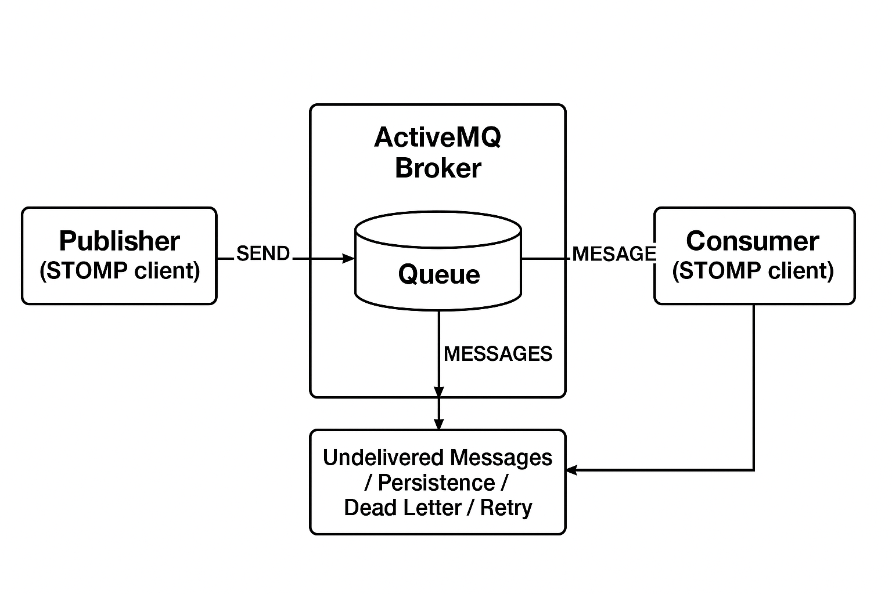

# Resumen de colas de mensajes

Message Queue Framework (MQF) es un sistema que permite a un módulo publicar mensajes en colas. También define los [consumidores](consumers.md) que recibirán los mensajes de manera asincrónica. El MQF admite varios agentes de mensajería:

- **[[!DNL RabbitMQ]](https://www.rabbitmq.com)**: el agente de mensajería principal, que proporciona una plataforma escalable para enviar y recibir mensajes. Incluye un mecanismo para almacenar mensajes no enviados y se basa en la especificación 0.9.1 del Protocolo avanzado de Message Queue Server (AMQP).
- **[Apache ActiveMQ Artemis](https://activemq.apache.org/components/artemis/)**: un agente de mensajería alternativo que usa STOMP (Protocolo de mensajería simple orientada a texto) para mensajes confiables y escalables. Se presenta en Adobe Commerce 2.4.6 y versiones posteriores.

## RabbitMQ (AMQP)

El diagrama siguiente ilustra el marco de trabajo de Message Queue:

- Un publicador es un componente que envía mensajes a un intercambio. Sabe a qué intercambio publicar y el formato de los mensajes que envía.

- Un intercambio recibe mensajes de los editores y los envía a las colas. Aunque [!DNL RabbitMQ] admite varios tipos de intercambios, Commerce solo utiliza intercambios de temas. Un tema incluye una clave de enrutamiento, que contiene cadenas de texto separadas por puntos. El formato del nombre de un tema es `string1.string2`: por ejemplo, `customer.created` o `customer.sent.email`.

  El agente de permite utilizar caracteres comodín al establecer reglas para reenviar mensajes. Puede usar un asterisco (`*`) para reemplazar _una_ cadena o un signo de almohadilla (`#`) para reemplazar 0 o más cadenas. Por ejemplo, `customer.*` filtraría `customer.create` y `customer.delete`, pero no `customer.sent.email`. Sin embargo, `customer.#` filtraría por `customer.create`, `customer.delete` y `customer.sent.email`.

- Una cola es un búfer que almacena mensajes.

- Un consumidor recibe mensajes. Sabe qué cola consumir. Puede asignar procesadores del mensaje a una cola específica.

## Apache ActiveMQ Artemis (STOMP)

Como alternativa a RabbitMQ, Adobe Commerce también admite [Apache ActiveMQ Artemis](https://activemq.apache.org/components/artemis/) como agente de mensajería mediante el Protocolo simple de mensajería orientada a texto (STOMP).

>[!NOTE]
>
>ActiveMQ Artemis se introdujo en Adobe Commerce 2.4.6 y versiones posteriores.

El diagrama siguiente ilustra el marco de STOMP con ActiveMQ Artemis:

### Componentes de STOMP Framework

- Un **publicador** es un componente que envía mensajes a un destino (cola o tema). Sabe a qué destino publicar y el formato de los mensajes que envía.

- Un **destino** en STOMP cumple una función similar a los intercambios en AMQP, recibe mensajes de los editores y los enruta. STOMP utiliza el direccionamiento de destino directo con un patrón de nomenclatura jerárquica mediante puntos: por ejemplo, `customer.created` o `inventory.updated`.

  Adobe Commerce usa el modo de direccionamiento **ANYCAST** para los destinos STOMP, que proporciona entrega de mensajes punto a punto. En el modo ANYCAST, los mensajes se envían a un único consumidor desde un grupo de consumidores disponibles, lo que permite el equilibrio de carga y la distribución del trabajo en varias instancias de consumidores.

- Una **cola** es un búfer que almacena mensajes. Con el direccionamiento de ANYCAST, la cola garantiza que los mensajes se envíen a un solo consumidor, incluso cuando varios consumidores están conectados al mismo destino.

- Un **consumidor** recibe mensajes de destinos. Sabe a qué destino suscribirse y puede procesar mensajes con diferentes modos de reconocimiento (automático, de cliente o individual de cliente).

## Adaptador MySQL (reserva)

También se puede configurar un sistema básico de cola de mensajes sin utilizar intermediarios de mensajes externos. En este sistema, un adaptador MySQL almacena mensajes en la base de datos. Tres tablas de base de datos (`queue`, `queue_message` y `queue_message_status`) administran la carga de trabajo de la cola de mensajes. Los trabajos de Cron garantizan que los consumidores puedan recibir mensajes. Esta solución no es muy escalable. Los agentes de mensajes externos como [!DNL RabbitMQ] o Apache ActiveMQ Artemis deben usarse siempre que sea posible en entornos de producción.

## Información relacionada

Para obtener instrucciones de instalación y configuración:

- [Instalar y configurar RabbitMQ](../../installation/prerequisites/rabbitmq.md)
- [Instalar y configurar ActiveMQ Artemis](../../installation/prerequisites/activemq.md)
- [Administrar colas de mensajes](manage-message-queues.md)
- [Consumidores de cola de mensajes](consumers.md)
