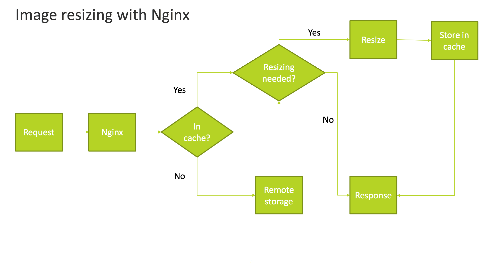

# Configurar el cambio de tamaño de la imagen para almacenamiento remoto

De forma predeterminada, Adobe Commerce admite el cambio de tamaño de las imágenes en la aplicación. Sin embargo, al habilitar el módulo Almacenamiento remoto, puede utilizar Nginx para descargar el cambio de tamaño de la imagen en el servidor, donde puede ahorrar recursos de disco y optimizar el uso del disco.

El diagrama siguiente muestra cómo Nginx recupera, cambia de tamaño y almacena imágenes en la caché. El cambio de tamaño viene determinado por los parámetros incluidos en la dirección URL, como la altura y la anchura.



>[!TIP]
>
>Para Adobe Commerce sobre proyectos de infraestructura en la nube, consulte [Configuración del almacenamiento remoto para Commerce en la infraestructura en la nube](cloud-support.md)

## Configuración del formato de URL en Adobe Commerce

Para cambiar el tamaño de las imágenes en el servidor, debe configurar Adobe Commerce para que proporcione argumentos para la altura, la anchura y la ubicación (URL) de la imagen.

**Para configurar Commerce para cambiar el tamaño de las imágenes del lado del servidor**:

1. En el panel _Admin_, haga clic en **[!UICONTROL Stores]** > **[!UICONTROL Settings]** > **[!UICONTROL Configuration]** > **[!UICONTROL General]** > **[!UICONTROL Web]**.

1. En el panel derecho, expanda **[!UICONTROL Url options]**.

1. En la sección _Formato de URL de medios de catálogo_, borre **[!UICONTROL Use system value]**.

1. Seleccione la URL `Image optimization based on query parameters` en el campo **_Formato de URL de medios del catálogo_**.

1. Haga clic en **[!UICONTROL Save Config]**.

1. Continúe con la [configuración de Nginx](#configure-nginx).

## Configuración De Nginx

Para seguir configurando el cambio de tamaño de las imágenes del lado del servidor, debe preparar el archivo `nginx.conf` y proporcionar un valor `proxy_pass` para el adaptador seleccionado.

**Para permitir que Nginx cambie el tamaño de las imágenes**:

1. Instale [Nginx image filter module](https://nginx.org/en/docs/http/ngx_http_image_filter_module.html).

   ```shell
   load_module /etc/nginx/modules/ngx_http_image_filter_module.so;
   ```

1. Crear un archivo de `nginx.conf` basado en el archivo de plantilla `nginx.conf.sample` incluido. Por ejemplo:

   ```conf
   location ~* \.(jpg|jpeg|png|gif|webp)$ {
       set $width "-";
       set $height "-";
       if ($arg_width != '') {
           set $width $arg_width;
       }
       if ($arg_height != '') {
           set $height $arg_height;
       }
       image_filter resize $width $height;
       image_filter_jpeg_quality 90;
   }
   ```

1. [_Opcional_] Configure un valor de `proxy_pass` para su adaptador específico.

   - [Amazon Simple Storage Service (Amazon S3)](remote-storage-aws-s3.md)

