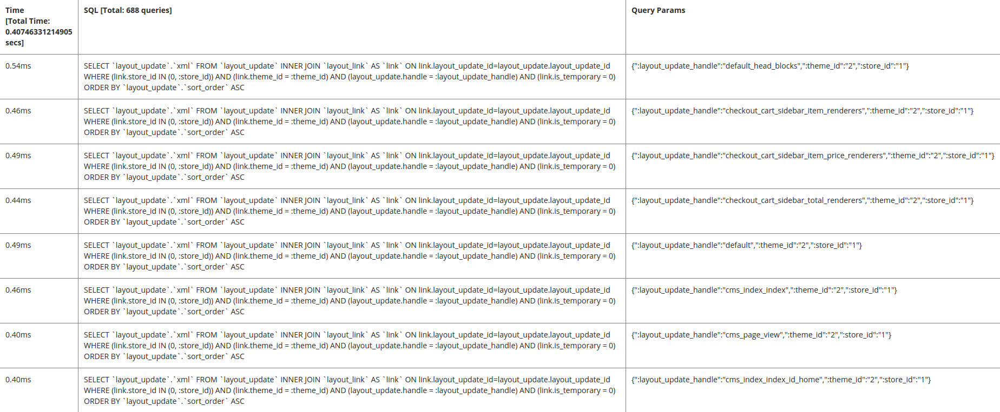

# Configurar el analizador de bases de datos

El analizador de la base de datos Commerce muestra todas las consultas implementadas en una página, incluida la hora de cada consulta y los parámetros aplicados.

## Paso 1: Modificar la configuración de implementación

Modifique `<magento_root>/app/etc/env.php` para agregar la siguiente referencia a la [clase de generador de perfiles de base de datos](https://github.com/magento/magento2/tree/2.4/lib/internal/Magento/Framework/DB/Profiler.php):

```php?start_inline=1
        'profiler' => [
            'class' => '\Magento\Framework\DB\Profiler',
            'enabled' => true,
        ],
```

A continuación se muestra un ejemplo:

```php?start_inline=1
 'db' =>
  array (
    'table_prefix' => '',
    'connection' =>
    array (
      'default' =>
      array (
        'host' => 'localhost',
        'dbname' => 'magento',
        'username' => 'magento',
        'password' => 'magento',
        'model' => 'mysql4',
        'engine' => 'innodb',
        'initStatements' => 'SET NAMES utf8;',
        'active' => '1',
        'profiler' => [
            'class' => '\Magento\Framework\DB\Profiler',
            'enabled' => true,
        ],
      ),
    ),
  ),
```

## Paso 2: Configuración de la salida

Configure la salida en el archivo de arranque de la aplicación Commerce; podría ser `<magento_root>/pub/index.php` o estar en una configuración de host virtual de servidor web.

El ejemplo siguiente muestra los resultados en una tabla de tres columnas:

- Tiempo total (muestra el tiempo total para ejecutar todas las consultas en la página)
- SQL (muestra todas las consultas SQL; el encabezado de fila muestra el recuento de consultas)
- Parámetros de Consulta (muestra los parámetros de cada consulta SQL)

Para configurar el resultado, agregue lo siguiente después de la línea `$bootstrap->run($app);` en el archivo de arranque:

```php?start_inline=1
/** @var \Magento\Framework\App\ResourceConnection $res */
$res = \Magento\Framework\App\ObjectManager::getInstance()->get('Magento\Framework\App\ResourceConnection');
/** @var Magento\Framework\DB\Profiler $profiler */
$profiler = $res->getConnection('read')->getProfiler();
echo "<table cellpadding='0' cellspacing='0' border='1'>";
echo "<tr>";
echo "<th>Time <br/>[Total Time: ".$profiler->getTotalElapsedSecs()." secs]</th>";
echo "<th>SQL [Total: ".$profiler->getTotalNumQueries()." queries]</th>";
echo "<th>Query Params</th>";
echo "</tr>";
foreach ($profiler->getQueryProfiles() as $query) {
    /** @var Zend_Db_Profiler_Query $query*/
    echo '<tr>';
    echo '<td>', number_format(1000 * $query->getElapsedSecs(), 2), 'ms', '</td>';
    echo '<td>', $query->getQuery(), '</td>';
    echo '<td>', json_encode($query->getQueryParams()), '</td>';
    echo '</tr>';
}
echo "</table>";
```

## Paso 3: Ver los resultados

Vaya a cualquier página de su tienda o administrador para ver los resultados. A continuación se muestra un ejemplo:


