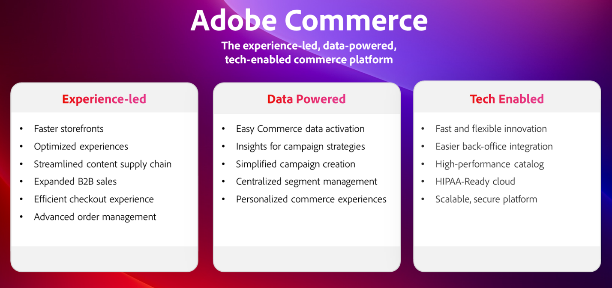

# Resumen de Adobe Summit para Adobe Commerce en 2024

Adobe Summit 2024 fue un evento destacable que reunió a la comunidad de Adobe Commerce, incluidos clientes líderes del sector, socios visionarios y nuestro equipo de Adobe Commerce para conectarse, explorar y aprender. ¡Todo el contenido que incluye sesiones con Hanesbrand, Coca-Cola, Nestle, Unilever, Canon y más está [**ahora disponible bajo demanda**](https://business.adobe.com/summit/2024/sessions.html?Track=Commerce)!

Estos fueron algunos de los aspectos destacados de Adobe Summit 2024.

## Sesión de hoja de ruta de Adobe Commerce

Comenzamos la conferencia con una [**sesión de hoja de ruta de Adobe Commerce**](https://business.adobe.com/summit/2024/sessions/adobe-commerce-2024-product-roadmap-review-s432.html) repleta de innovación, en la que mostramos cómo Adobe Commerce permite a las empresas innovar más rápido y acelerar las ventas con una plataforma basada en la experiencia.

Consulte esta sesión para conocer el rendimiento de Adobe Commerce:

- **[Experiencias de tienda más rápidas](https://experienceleague.adobe.com/developer/commerce/storefront/):** Nuestra nueva arquitectura de tienda de alto rendimiento, Edge Delivery Services, aumenta la velocidad del sitio, las clasificaciones SEO y el tráfico orgánico. Además, una nueva integración con Adobe Experience Manager Assets optimiza su cadena de suministro de contenido con acceso al desarrollo de contenido GenAI y a la administración de flujos de trabajo.

- **[recorridos de compra hiperpersonalizados](https://experienceleague.adobe.com/en/docs/commerce-admin/customers/customers-menu/personalize-scale):** Recopile y comparta automáticamente clics en tiendas en tiempo real, historial de pedidos back-end y ahora datos de perfil del cliente con otras soluciones de Adobe Experience Cloud. Automatice la configuración de campañas omnicanal con libros de reproducción de casos de uso y personalice las aplicaciones móviles de comercio y las ofertas de ampliación/venta cruzada con audiencias de Adobe Real-Time CDP.

- **[Desarrollo componible simplificado](https://developer.adobe.com/commerce/extensibility/app-development/learning-path/):** innove más rápido con costos más bajos usando Adobe Developer App Builder. Simplifique las integraciones a su ERP y otros sistemas back-end con el nuevo kit de inicio de integración de back-office. Configure los webhooks y personalice la interfaz de usuario del administrador a través de una experiencia de desarrollador unificada que incluya orquestación de API, administración de eventos y extensibilidad sin servidor.

- **[Commerce y Order Management B2B avanzados](https://experienceleague.adobe.com/en/docs/commerce-admin/b2b/introduction):** Aumente las ventas B2B con herramientas de cotización avanzadas y configuración de cuentas principal-secundaria para admitir cuentas globales grandes y casos de uso B2B2X. Conéctese a IBM Sterling Order Management más rápido que nunca con nuestra nueva integración prediseñada para maximizar la eficacia operativa con la administración de inventario en tiempo real, la realización automatizada de pedidos, la gestión de devoluciones y un conjunto completo de paneles y flujos de trabajo.

## Sesiones potentes con clientes y socios

Nuestra innovadora comunidad de clientes y socios de Adobe Commerce también compartió sus estrategias, prácticas recomendadas y conocimientos.

Explore la lista completa de sesiones de Commerce [aquí](https://business.adobe.com/summit/2024/sessions.html?Track=Commerce) y vea algunas de las sesiones más populares a continuación:

- [Cómo Unilever digitalizó su ruta comercial de distribución para comercializar globalmente](https://business.adobe.com/summit/2024/sessions/how-unilever-digitized-its-distributive-trade-rout-s430.html) con Prashaant Huria, vicepresidente y director técnico, Unilever; *Prashant fue seleccionado como [Creador de experiencia del año](https://www.adobeexperienceawards.com/stories2024) en APAC*

- [E-Comm Masterclass: Hanesmarks Crea la Tienda Más Rápida del Mundo](https://business.adobe.com/summit/2024/sessions/ecomm-masterclass-hanesbrands-creates-the-worlds-f-s435.html) con Emmylou Jordan, Gerente Principal Global de Información Comercial y Análisis de Datos, Hanesmarks

- [Coca-Cola: desbloqueando datos para crear experiencias Commerce centradas en el consumidor](https://business.adobe.com/summit/2024/sessions/cocacola-unlocking-data-to-create-consumercentric-s434.html) con Vinay Gopinath, director de plataformas Adtech/Martech globales, The Coca-Cola Company

- [Cómo Canon aumentó las tasas de conversión y el tráfico usando Adobe Commerce](https://business.adobe.com/summit/2024/sessions/how-canon-increased-conversion-rates-and-traffic-u-s438.html) con Matthew Mandato, gerente de Martech Engagement Ops, Canon USA

- [Nestle Purina: Cree una plataforma componible para la agilidad empresarial con Adobe Commerce](https://business.adobe.com/summit/2024/sessions/purina-takes-composable-commerce-approach-to-boost-s437.html) con Ben Robie, Director Técnico Sr. D2C, Nestle Purina

## Muestra de innovación con Adobe Commerce Rockstars

Cada año, echamos un vistazo a lo que los desarrolladores de socios y clientes más innovadores están creando con Adobe Commerce. Eche un vistazo al **[Escaparate Adobe Commerce Rockstar](https://business.adobe.com/summit/2024/sessions/adobe-commerce-rockstar-showcase-s431.html)**, donde escuchamos de los 3 envíos principales, seleccionados entre más de 65:

- **Innovación de tiendas con Edge Delivery Services y Luma Bridge**

  Martin Altmann, consultor principal y jefe de prácticas de Adobe, Comwrap Respuesta

- **Integraciones de App Builder para Lean Order Management**

  Shikha Raina, arquitecta, generosa

- **Creación de contenido de producto recomendado por GenAI GPT maestro**

  Yaroslav Rogoza, director técnico, Atwix

¡Vea quién fue coronado como el Rockstar de Adobe Commerce 2024!

Revive todas las excelentes sesiones sumergiéndote en el contenido bajo demanda **[&#128279;](https://business.adobe.com/summit/2024/sessions.html?Track=Commerce) y mantente siempre al día con las últimas innovaciones de Adobe Commerce en** Experience League [**&#x200B;**.](https://experienceleague.adobe.com/en/docs/commerce-admin/start/about)
