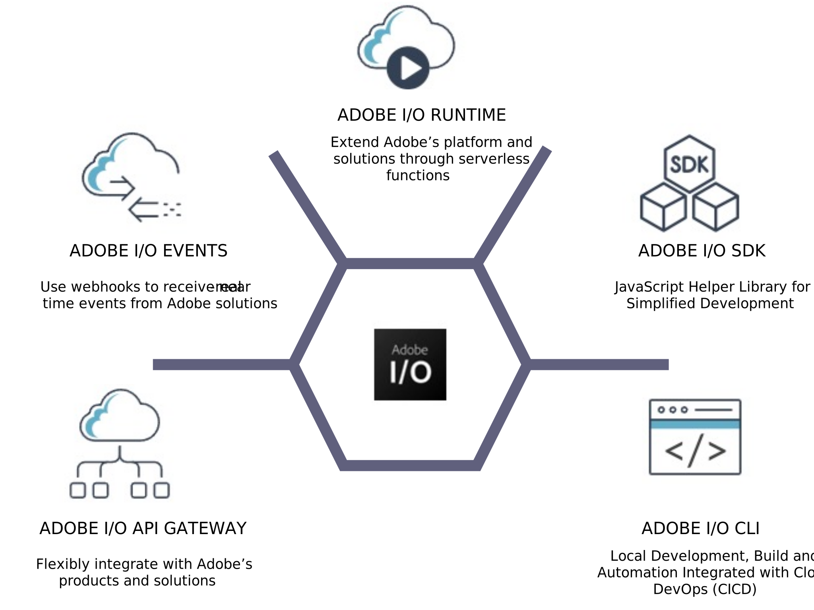

# Estrategia de extensibilidad

La plataforma de extensibilidad de Adobe Commerce permite a las marcas personalizar de forma eficaz los procesos, integrar los sistemas e implementar nuevas funcionalidades, al tiempo que mantienen la capacidad de actualización similar a SaaS.

