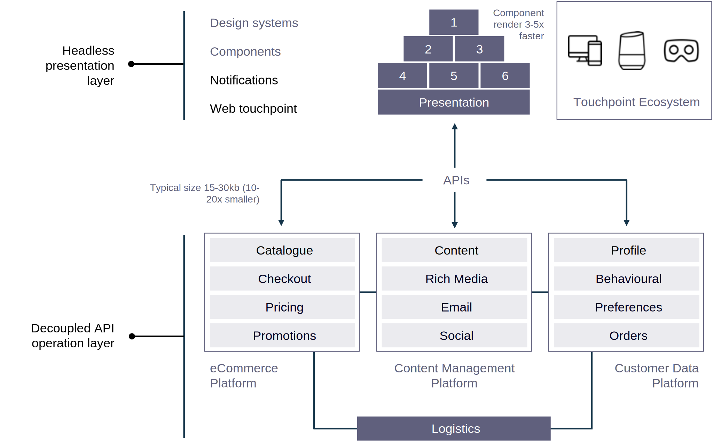

# Comercio sin encabezado

## ¿Por qué sin encabezado?

Para empezar, el comercio empresarial heredado es costoso y difícil de escalar debido a los silos; las estructuras heredadas se refuerzan mediante limitaciones de plataforma; y la innovación se vuelve un desafío.

Los clientes esperan que una empresa interactúe con ellos y se involucre con ellos en todos los canales. Las organizaciones centradas en el cliente buscan crear plataformas con garantías de futuro que se puedan adaptar a las cambiantes expectativas de los clientes.

El comercio sin encabezado es un comercio basado en API. Desvincula la lógica empresarial, así como los aspectos transaccionales y de datos del comercio, de la presentación. Headless es un marco de trabajo integrado que proporciona flexibilidad total para todos los canales y puntos de contacto, con una capa de experiencia de front-end separada de la propia plataforma. Esto permite a las marcas agilizar la entrega de contenido, como productos, datos y pedidos, a cualquier punto de contacto, tanto ahora como en el futuro, a la vez que pueden mostrarlo de la manera que deseen.

La arquitectura sin encabezado es la separación técnica del encabezado y el resto de la aplicación de comercio. Adobe Commerce no tiene encabezado con una arquitectura disociada que proporciona todos los servicios y datos de comercio a través de una capa de API de GraphQL. Esta arquitectura permite a los equipos de front-end desarrollar sus front-end de forma independiente de Adobe Commerce, lo que proporciona la agilidad para crear y probar rápidamente nuevos puntos de contacto con tecnologías emergentes.

Las API de Adobe Commerce GraphQL también se pueden ampliar con microservicios implementados en I/O Runtime de Adobe. Esto proporciona una agilidad sin precedentes para integrar, ampliar y personalizar los procesos empresariales omnicanal sin necesidad de personalizar el código en el back-end, lo que garantiza que la plataforma principal se pueda actualizar fácilmente sin afectar a los puntos de contacto de front-end. Las API de Adobe Commerce GraphQL son de código abierto y forman parte de nuestro programa de ingeniería de la comunidad, con contribuciones y supervisión significativas procedentes de nuestra comunidad de desarrolladores.

