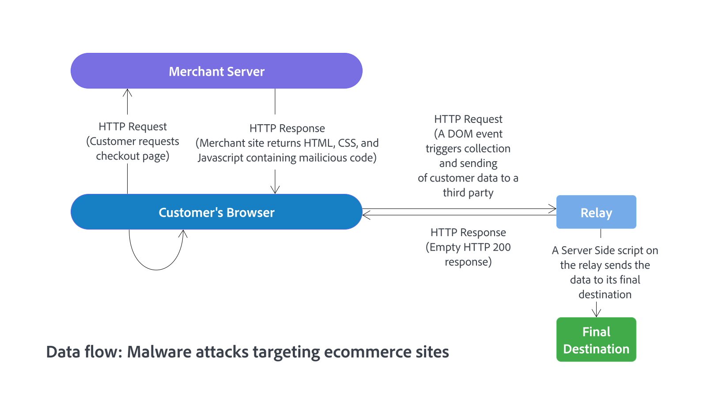

# Proteja su sitio e infraestructura de Commerce

El establecimiento y mantenimiento de un entorno seguro para los proyectos de Adobe Commerce implementados en la infraestructura en la nube es una responsabilidad compartida entre los clientes de Adobe Commerce, los socios de soluciones y Adobe. La intención de esta guía es proporcionar prácticas recomendadas para el cliente en la ecuación.

Aunque no puede eliminar todos los riesgos de seguridad, la aplicación de estas prácticas recomendadas endurece la postura de seguridad de las instalaciones de Commerce. Un sitio e infraestructura seguros reduce el atractivo de los ataques maliciosos, garantiza la seguridad de la solución y la información confidencial de los clientes, y ayuda a minimizar los incidentes relacionados con la seguridad que pueden causar interrupciones del sitio e investigaciones costosas.

>[!NOTE]
>
>Para obtener información sobre las funciones y responsabilidades para proteger y mantener los proyectos de Adobe Commerce en la infraestructura en la nube, consulte [Modelo de responsabilidad compartida](https://experienceleague.adobe.com/en/docs/commerce-operations/security-and-compliance/shared-responsibility#security-responsibilities-chart)) en la _Guía de seguridad y cumplimiento de Adobe Commerce_.

[Todas las versiones compatibles](../../../release/versions.md) de:

- Adobe Commerce en la infraestructura en la nube
- Adobe Commerce local

## Recomendaciones de prioridad

Adobe considera que las siguientes recomendaciones son prioritarias para todos los clientes. Implemente estas prácticas recomendadas de seguridad clave en todas las implementaciones de Commerce:

 **Habilite la autenticación de doble factor para su administrador y todas las conexiones SSH**

- [Seguridad para el administrador de Commerce](https://experienceleague.adobe.com/docs/commerce-admin/systems/security/2fa/security-two-factor-authentication.html)

- [Conexiones SSH seguras](https://experienceleague.adobe.com/docs/commerce-cloud-service/user-guide/project/multi-factor-authentication.html) (infraestructura en la nube)

Cuando MFA está habilitado en un proyecto, todas las cuentas de infraestructura en la nube de Adobe Commerce con acceso SSH deben seguir un flujo de trabajo de autenticación. Este flujo de trabajo requiere un código de autenticación de doble factor (2FA) o un token de API y un certificado SSH para acceder al entorno.

 **Proteger al administrador**

- [Configure una URL de administración no predeterminada](https://experienceleague.adobe.com/docs/commerce-admin/stores-sales/site-store/store-urls.html#use-a-custom-admin-url) en lugar de usar el `admin` predeterminado o un término común como `backend`. Esta configuración reduce la exposición a scripts que intentan obtener acceso no autorizado al sitio.

- [Configurar la configuración de seguridad avanzada](https://experienceleague.adobe.com/docs/commerce-admin/systems/security/security-admin.html): agregue una clave secreta a las direcciones URL, exija que las contraseñas distingan entre mayúsculas y minúsculas y limite la duración de la sesión del administrador, el intervalo de duración de la contraseña y el número de intentos de inicio de sesión permitidos antes de bloquear una cuenta de usuario de administrador. Para aumentar la seguridad, configure la duración de la inactividad del teclado antes de que caduque la sesión actual y requiera que el nombre de usuario y la contraseña distingan entre mayúsculas y minúsculas.

- [Habilite ReCAPTCHA](https://experienceleague.adobe.com/docs/commerce-admin/systems/security/captcha/security-google-recaptcha.html) para proteger al administrador de ataques de fuerza bruta automatizados.

- Siga el principio del menor privilegio al asignar [permisos de administración](https://experienceleague.adobe.com/docs/commerce-admin/systems/user-accounts/permissions.html) a roles y roles en cuentas de usuario de administrador.

 **Actualice a la última versión de Adobe Commerce**

Mantenga su código actualizado al [actualizar su proyecto de Commerce a la última versión](#upgrade-to-the-latest-release) de Adobe Commerce, servicios de Commerce y extensiones, incluidos parches de seguridad, revisiones y otros parches proporcionados por Adobe.

 **Valores de configuración confidenciales**

Use [administración de configuración](../../../configuration/cli/set-configuration-values.md) para bloquear valores de configuración críticos.

Los comandos CLI `lock config` y `lock env` configuran variables de entorno para evitar que se actualicen desde el administrador. El comando escribe el valor en el archivo `<Commerce base dir>/app/etc/env.php`. (Para Commerce sobre proyectos de infraestructura en la nube, consulte [Administración de configuración de tienda](https://experienceleague.adobe.com/docs/commerce-cloud-service/user-guide/configure-store/store-settings.html#sensitive-data)).

 **Ejecutar análisis de seguridad**

Use el [servicio Commerce Security Scan](https://experienceleague.adobe.com/docs/commerce-admin/systems/security/security-scan.html) para supervisar todos los sitios de Adobe Commerce en busca de malware y riesgos de seguridad conocidos, y regístrese para recibir actualizaciones de parches y notificaciones de seguridad.

## Garantizar la seguridad de las extensiones y el código personalizado

Cuando amplíe Adobe Commerce agregando extensiones de terceros desde Adobe Commerce Marketplace, o agregue código personalizado, garantice la seguridad de estas personalizaciones aplicando las siguientes prácticas recomendadas:

 **Elija un socio o integrador de soluciones (SI) con amplia experiencia en seguridad**: garantice integraciones seguras y la entrega segura del código personalizado mediante la selección de organizaciones que siguen prácticas de desarrollo seguro y tienen un historial sólido de prevención y solución de problemas de seguridad.

 **Usar extensiones seguras**: identifique las extensiones más apropiadas y seguras para implementaciones de Commerce consultando al integrador o desarrollador de la solución y siguiendo las [prácticas recomendadas de extensiones de Adobe](../planning/extensions.md).

- Solo extensiones de origen de Adobe Commerce Marketplace o a través del integrador de soluciones. Si la extensión se obtiene a través de un integrador, asegúrese de que la propiedad de la licencia de extensión sea transferible, en caso de que el integrador cambie.

- Reduzca la exposición al riesgo limitando el número de extensiones y proveedores.

- Si es posible, revise el código de extensión para comprobar la seguridad antes de integrarlo con la aplicación de Commerce.

- Asegúrese de que los desarrolladores de extensiones de PHP sigan las directrices de desarrollo, los procesos y las prácticas recomendadas de seguridad de Adobe Commerce. Específicamente, los desarrolladores deben evitar el uso de funcionalidades de PHP que pueden llevar a la ejecución de código remoto o a una criptografía débil. Consulte [Seguridad](https://developer.adobe.com/commerce/php/best-practices/security/) en la *Guía para desarrolladores de extensiones*.

 **Código de auditoría**: revise el servidor y el repositorio de código fuente para ver si quedan elementos de desarrollo. Asegúrese de que no haya archivos de registro accesibles, directorios .git visibles públicamente, túneles para ejecutar instrucciones SQL, volcados de base de datos, archivos de información php o cualquier otro archivo no protegido que no sea necesario y que pueda utilizarse en un ataque.

## Actualice a la última versión

Adobe lanza continuamente componentes de soluciones actualizados para mejorar la seguridad y proteger mejor a los clientes contra posibles riesgos. La actualización a la última versión de la aplicación de Adobe Commerce, los servicios instalados y las extensiones y la aplicación de los parches actuales constituyen la primera y mejor línea de defensa contra las amenazas a la seguridad.

Commerce suele publicar actualizaciones de seguridad trimestralmente, pero se reserva el derecho de publicar revisiones para las principales amenazas de seguridad en función de la prioridad y otros factores.

Consulte los siguientes recursos para obtener información sobre las versiones de Adobe Commerce disponibles, los ciclos de versiones y el proceso de actualización y aplicación de parches:

- [Versiones publicadas](../../../release/versions.md)
- [Disponibilidad de productos](../../../release/product-availability.md) (servicios de Adobe Commerce y extensiones creadas por Adobe)
- [directiva de ciclo vital de Adobe Commerce](../../../release/lifecycle-policy.md)
- [Guía de actualización](../../../upgrade/overview.md)
- [Cómo aplicar los parches](../../../upgrade/patches/overview.md)

>[!TIP]
>
>Obtenga la información de seguridad más reciente y mitigue los problemas de seguridad conocidos mediante la suscripción al [Servicio de notificación de seguridad de Adobe](https://www.adobe.com/subscription/adbeSecurityNotifications.html).

## Desarrollar un plan de recuperación ante desastres

Si su sitio de Commerce está comprometido, controle los daños y restaure rápidamente las operaciones normales de la empresa mediante el desarrollo y la implementación de un plan de recuperación ante desastres integral.

Si un cliente necesita restaurar una instancia de Commerce debido a un desastre, Adobe puede proporcionarle archivos de copia de seguridad. El cliente y el integrador de soluciones, si corresponde, pueden realizar la restauración.

Como parte de un plan de recuperación ante desastres, Adobe recomienda encarecidamente que los clientes [exporten su configuración de aplicación de Adobe Commerce](../../../configuration/cli/export-configuration.md) para facilitar la reimplementación si es necesaria por motivos de continuidad del negocio. El motivo principal para exportar la configuración al sistema de archivos es que la configuración del sistema tiene prioridad sobre la configuración de la base de datos. En un sistema de archivos de solo lectura, la aplicación debe volver a implementarse para cambiar los ajustes de configuración confidenciales, lo que proporciona una capa adicional de protección.

### Más información

**Adobe Commerce implementado en la infraestructura en la nube**

- [Copia de seguridad y recuperación ante desastres](https://experienceleague.adobe.com/docs/commerce-cloud-service/user-guide/architecture/pro-architecture.html#backup-and-disaster-recovery)

- [Administración de configuración de tienda para Adobe Commerce en la infraestructura en la nube](https://experienceleague.adobe.com/docs/commerce-cloud-service/user-guide/configure-store/store-settings.html)

**Adobe Commerce implementado localmente**

- [Exportar ajustes de configuración](../../../configuration/cli/export-configuration.md)

   - [Importar opciones de configuración](../../../configuration/cli/import-configuration.md)

   - [Realizar una copia de seguridad y una reversión del sistema de archivos, medios y base de datos](../../../installation/tutorials/backup.md)

## Mantener un sitio e infraestructura seguros

Esta sección resume las prácticas recomendadas para mantener la seguridad del sitio y de la infraestructura en una instalación de Adobe Commerce. Muchas de estas prácticas recomendadas se centran en proteger la infraestructura informática en general, por lo que es posible que algunas de las recomendaciones ya se hayan implementado.

 **Bloquear el acceso no autorizado**—Trabaje con su socio de alojamiento para configurar un túnel VPN a fin de bloquear el acceso no autorizado al sitio de Commerce y a los datos de los clientes. Configure un túnel SSH para bloquear el acceso no autorizado a la aplicación Commerce.

 **Use un firewall de aplicaciones web**: Analice el tráfico y descubra patrones sospechosos, como la información de tarjetas de crédito que se envía a una dirección IP desconocida mediante un firewall de aplicaciones web.

Las instalaciones de Adobe Commerce implementadas en la infraestructura de la nube pueden utilizar los servicios integrados de WAF disponibles con la [integración de Fastly services](https://experienceleague.adobe.com/docs/commerce-cloud-service/user-guide/cdn/fastly.html)

 **Configurar la configuración avanzada de seguridad de contraseñas**: configure contraseñas seguras y cámbielas al menos cada 90 días, tal como recomienda el Estándar de seguridad de datos PCI en la sección 8.2.4. Consulte [Configurar la seguridad de administración](https://experienceleague.adobe.com/docs/commerce-admin/systems/security/security-admin.html).

 **Usar HTTPS**: si el sitio de Commerce se ha implementado recientemente, inicie todo el sitio usando HTTPS. Google no solo utiliza HTTPS como factor de clasificación, sino que muchos usuarios ni siquiera consideran comprar en un sitio a menos que esté protegido con HTTPS.

## Protección contra malware

Los ataques de malware dirigidos a sitios de comercio electrónico son demasiado comunes, y los actores de amenazas continuamente desarrollan nuevas formas de obtener información personal y de tarjetas de crédito de las transacciones.

Sin embargo, Adobe ha descubierto que la mayoría de los compromisos del sitio no se deben a un hacker innovador. Por el contrario, los agentes de amenazas suelen aprovechar las vulnerabilidades existentes sin parches, las contraseñas incorrectas y la configuración débil de propiedad y permisos en el sistema de archivos.

En los ataques que se producen con más frecuencia, se inserta código malintencionado en el encabezado o pie de página absoluto de un almacén de clientes. En este caso, el código recopila los datos de formulario que un cliente introduce en la tienda, incluidas las credenciales de inicio de sesión del cliente y los datos del formulario de cierre de compra. A continuación, estos datos se envían a otra ubicación con fines malintencionados en lugar de al servidor de Commerce. Además, el malware puede comprometer al administrador a ejecutar código que reemplace el formulario de pago original con un formulario falso que anula cualquier protección establecida por el proveedor de pagos.

Los skimmers de tarjetas de crédito del lado del cliente son un tipo de malware que incrusta código en el contenido del sitio web del comerciante que se puede ejecutar en el explorador de un usuario, como se muestra en la siguiente figura.

Después de que se producen determinadas acciones, como que un usuario envíe un formulario o modifique un valor de campo, el simulador serializa los datos y los envía a extremos de terceros. Estos extremos suelen ser otros sitios web comprometidos que actúan como relé para enviar los datos a su destino final.

>[!TIP]
>
>Si un sitio de Commerce se ve afectado por un ataque de malware, siga las prácticas recomendadas de Adobe Commerce para [responder a un incidente de seguridad](../maintenance/respond-to-security-incident.md).

### Conocer los ataques más comunes

A continuación se muestra una lista de categorías comunes de ataques que Adobe recomienda que todos los clientes de Commerce tengan en cuenta y tomen medidas de protección contra:

- **Desfiguración del sitio**: un atacante daña un sitio web al cambiar el aspecto visual del sitio o al agregar sus propios mensajes. Aunque el acceso al sitio y a las cuentas de usuario se ha visto comprometido, la información de pago a menudo sigue siendo segura.

- **Botnets**: el servidor Commerce del cliente pasa a formar parte de un botnet que envía correo electrónico no deseado. Aunque los datos de usuario no suelen estar en peligro, el nombre de dominio del cliente puede verse incluido en la lista de bloqueados por filtros de correo no deseado, lo que impide la entrega de cualquier correo electrónico desde el dominio. Alternativamente, el sitio del cliente pasa a formar parte de una botnet y provoca un ataque de denegación de servicio (DDoS) distribuido en otro sitio o sitios. La botnet puede bloquear el tráfico IP entrante al servidor de Commerce, lo que impide que los clientes puedan realizar compras.

- **Ataques directos al servidor**: los datos se ven comprometidos, se instalan puertas traseras y malware, y las operaciones del sitio se ven afectadas. La información de pago que no se almacena en el servidor tiene menos probabilidades de verse comprometida a través de estos ataques.

- **Captura silenciosa de tarjetas**: en este ataque tan desastroso, los intrusos instalan software malicioso o de captura de tarjetas, o peor aún, modifican el proceso de pago para recopilar datos de tarjetas de crédito. A continuación, los datos se envían a otro sitio para su venta en la web oscura. Estos ataques pueden pasar desapercibidos durante un periodo prolongado de tiempo y pueden resultar en un compromiso importante de las cuentas de los clientes y la información financiera.

- **Registro de claves silencioso**: el actor de amenazas instala el código de registro de claves en el servidor del cliente para recopilar las credenciales de usuario administrador y así poder iniciar sesión e iniciar otros ataques sin ser detectados.

### Proteger contra ataques de adivinación de contraseñas

Los ataques de adivinación de contraseña por fuerza bruta pueden resultar en acceso no autorizado del administrador. Proteja su sitio de estos ataques siguiendo estas prácticas recomendadas:

- Identifique y proteja todos los puntos desde donde se pueda acceder a la instalación de Commerce desde el mundo exterior.

  Puede proteger el acceso al administrador, que suele requerir la mayor protección, si sigue las [recomendaciones de prioridad](#priority-recommendations) de Adobe al configurar su proyecto de Commerce.

- Controle el acceso al sitio de Commerce mediante la configuración de una lista de control de acceso que solo permita el acceso a los usuarios procedentes de una dirección IP o red especificadas.

  Puede utilizar una ACL de Fastly Edge con un fragmento de código VCL personalizado para filtrar solicitudes entrantes y permitir el acceso por dirección IP. Consulte [VCL personalizado para permitir solicitudes](https://experienceleague.adobe.com/docs/commerce-cloud-service/user-guide/cdn/custom-vcl-snippets/fastly-vcl-allowlist.html).

  >[!TIP]
  >
  >Si emplea un personal remoto, asegúrese de que las direcciones IP de los empleados remotos se incluyan en la lista de direcciones con permiso para acceder al sitio de Commerce.

### Evite ataques de clickjacking

Adobe protege su tienda de los ataques de secuestro de clics al proporcionar el encabezado de solicitud HTTP `X-Frame-Options` que puede incluir en las solicitudes a su tienda. Consulte [Evitar ataques de clickjacking](../../../configuration/security/xframe-options.md) en la *Guía de configuración de Adobe Commerce*.
