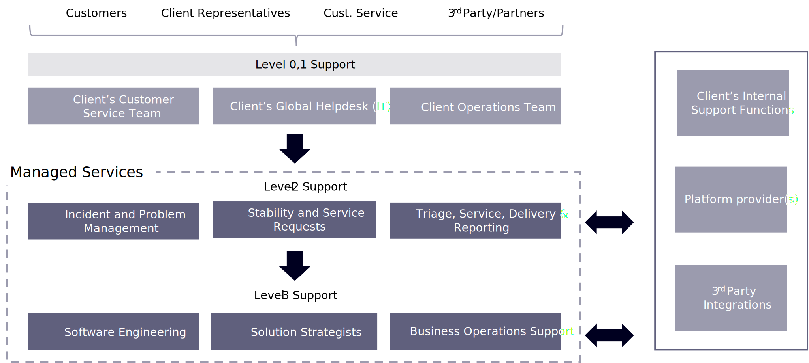

# Modelos de mantenimiento y soporte

No hay una sola manera de manejar el soporte de su sitio de comercio electrónico. Hemos delineado cuatro opciones, dependiendo de las necesidades y objetivos de su marca.

## Modelos habituales

La opción de los servicios administrados con un compromiso de SLA y capacidad de mantenimiento fija es un modelo impulsado por los resultados para administrar, mantener y mejorar los ecosistemas de comercio digital con niveles de servicio esperados y producir resultados sólidos, de calidad y mensurables para el negocio y las operaciones digitales con capacidad y costo fijos.

- **Soporte y mejoras de producción de capacidad fija**

   - La capacidad fija se refiere a un número restringido de horas comprometidas para los recursos como contratado. Para sitios de comercio simples, este número generalmente puede variar de 40 a 160 horas al mes.

   - La naturaleza del trabajo y el tipo de recursos dependen del alcance del apoyo necesario. Esto es apropiado para organizaciones más pequeñas con ecosistemas digitales relativamente simples, y también en compromisos específicos donde la marca ya tiene un equipo tecnológico considerable.

- **Compatibilidad con SLA con hotfix**
   - Compatibilidad opcional de gravedad 1 las 24 horas, los 7 días de la semana
   - SLA para todos los incidentes de soporte
   - Asignación mensual de recursos para actividades de apoyo y prestación de servicios
   - Recursos adicionales para seguir el proceso convenido de gestión del cambio

- **Soporte de SLA para incidentes críticos con capacidad de entrega dedicada**
   - Soporte opcional con SLA las 24 horas del día, los 7 días de la semana para incidentes de gravedad 1
   - Recursos de entrega fijos y soporte operativo ilimitado
   - Recursos adicionales de entrega para seguir el proceso convenido de gestión del cambio
   - Abarca todas las funciones (Dev/QA/SA/PM/RM) y el soporte operativo

- **Soporte de servicio administrado con una capacidad de mantenimiento fija**
   - SLA para todos los incidentes de soporte, incluido el tiempo de respuesta las 24 horas del día, los 7 días de la semana
   - Recursos de entrega fijos y soporte operacional ilimitado para cumplir con los acuerdos de SLA
   - Completar operaciones de desarrollo para la compatibilidad con HotFix
   - Recursos adicionales de entrega para seguir el proceso convenido de gestión del cambio
   - Abarca todas las funciones (Dev/QA/SA/PM/RM) y el soporte operativo

## Niveles de servicio típicos

Los niveles de servicio típicos se definen como operaciones y correcciones, mejoras (también denominados servicios de nivel 3 o L3) y servicios opcionales (servicios opcionales de nivel L3).

Las operaciones y las actividades de corrección pueden dividirse en L1 (Nivel 1: supervisión y gestión de incidentes) y L2 (Nivel 2: administración de problemas y mejora continua del servicio). El ámbito de estas actividades incluye lo siguiente:

- **Operaciones y correcciones**
   - Gestión de eventos
   - Gestión de incidentes
   - Solicitudes de servicio
   - Notificación de prioridad e informes
   - Administración de problemas
   - Administración de cambios
   - Compatibilidad máxima

- **Mejoras**
   - Preparación de casos de retraso + priorización
   - Planificación de Sprint + versiones
   - Diseño + desarrollo
   - Pruebas funcionales de sprint
   - Soporte de pruebas de seguridad y rendimiento
   - Planificación de la implementación

- **Servicios opcionales**
   - Auditoría de arquitectura y recomendación
   - Pruebas de seguridad y rendimiento
   - Compatibilidad con operaciones comerciales
   - Producción de contenido
   - Operaciones de comercialización
   - Consulta estratégica
   - Actualizaciones de Adobe Commerce

La gestión de la prestación y los servicios también forma parte integrante de la función de apoyo y mejora. Estas son las actividades normalmente incluidas en el ámbito dentro de esta función:

- Supervisión de la prestación y los servicios, gestión de los niveles mínimos y los turnos
- Ensayo de incidentes y problemas
- Comunicación y gestión de las partes interesadas
- Informes y gobernanza de servicios
- Mejora continua
- Auditoría de procesos
- Documentación e informes
- Actualizaciones de la plataforma Adobe Commerce

El modelo de soporte funciona sin problemas con una clara rendición de cuentas distribuida entre los equipos cliente y los equipos L1, L2 y L3, con un modelo de gobernanza y comunicación probado.

