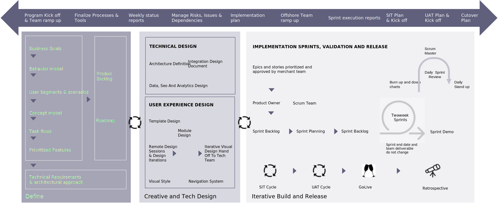

# Enfoque de entrega y planificación

Comprender el ámbito completo de un proyecto antes de comenzar la implementación es tan crítico como tener un plan para ofrecer una solución a tiempo, dentro del presupuesto y que satisfaga sus necesidades. Esto requiere identificar un modelo a prueba de errores para el diseño y la implementación de la solución y ejecutar ese modelo a la vez que se mide el éxito.

Es un compromiso de todo el equipo que comienza en la ideación inicial y no termina hasta después del lanzamiento. Y si bien este es un aspecto del proceso orientado a los detalles y a veces tedioso, el trabajo que usted pone en el plan y la gobernanza hace que los obstáculos sean mucho más fáciles de navegar y superar.

Los proyectos de comercio estratégico pueden realizarse con varios enfoques y diferentes metodologías de gestión de proyectos. Sin embargo, recomendamos un enfoque Agile híbrido para una entrega exitosa y una ejecución óptima.

Este enfoque consta de los siguientes pasos:

- Defina fases para planificar, diseñar arquitectos y crear estrategias

- Agile sprints para crear y diseñar la solución

- Pruebas de integración, rendimiento y aceptación del usuario para el piloto

- Despliegues de equipo de Scrum para sitios de marca y comercio

El modelo híbrido le permite aprovechar el poder de la metodología Agile, manteniendo el objetivo para la cronología, el coste y la calidad. El plan completo se divide en dos fases diferentes, seguidas de actividades de lanzamiento, optimización y mantenimiento.

- **Conseguir la idea correcta**—Esta es una fase previa a la implementación para garantizar que los requisitos, el diseño y la solución tecnológica estén estratégicamente, documentados y colaboren entre las partes interesadas. El registro de pendientes para la implementación se prepara y crea, se planifican los sprints de desarrollo y se finaliza una estrategia secuencial para la creación del producto.

- **Acertar en la idea**: esta es la fase de implementación para crear el producto de forma iterativa, probarlo a fondo y publicarlo correctamente. El primer paso es desarrollar el código a través de varios sprints; cada sprint contiene pruebas y desarrollo in-sprint, seguido de pruebas de integración del sistema, pruebas de rendimiento y seguridad, pruebas de aceptación del usuario y actividades de lanzamiento.

La planificación de proyectos es una actividad crítica. Guía a las partes interesadas, los equipos, los patrocinadores y los jefes de proyecto sobre cómo monitorizar, administrar y controlar las fases del proyecto. También ayuda a identificar objetivos, evitar plazos incumplidos, priorizar tareas esenciales, reducir riesgos y ofrecer los resultados deseados.

El plan del proyecto suele constar de cuatro fases:

- Inicio y planificación
- Ejecución
- Launch
- Posterior al lanzamiento

Cada fase se puede realizar a través de múltiples sprints más pequeños, gestionando así el progreso y los resultados a través de incrementos más pequeños y con un mayor grado de agilidad. Sin embargo, la planificación es única, ya que suele formar parte de las otras tres fases. Hemos proporcionado un desglose detallado de cada fase y un ejemplo de plan de proyecto para una implementación exitosa de Adobe Commerce:

El enfoque que hemos definido muestra diferentes fases del proyecto que se unen para permitir una ejecución correcta del proyecto. La Oficina de Gestión de Proyectos (PMO) proporciona una estrecha supervisión en varios niveles y garantiza el éxito en cada fase (y sprint) hasta la ejecución exitosa y oportuna con una calidad y un costo óptimos.

