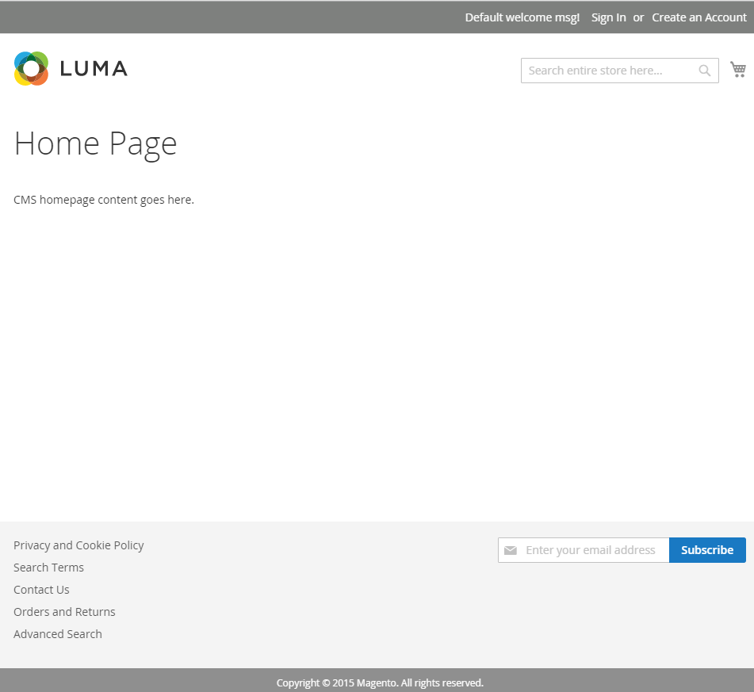

# Compruebe la instalación

Vaya a la tienda en un navegador web. Por ejemplo, si la dirección URL de la base de instalación es `http://www.example.com`, escríbala en la dirección o en la barra de ubicación del explorador.

La siguiente figura muestra una página de tienda de muestra. Si se muestra de la siguiente manera, su instalación ha sido un éxito.

## Verificar la tienda (sin datos de ejemplo)

Vaya a la tienda en un navegador web. Por ejemplo, si la dirección URL de la base de instalación es `http://www.example.com`, escríbala en la dirección o en la barra de ubicación del explorador.

La siguiente figura muestra una página de tienda de muestra. Si se muestra de la siguiente manera, su instalación ha sido un éxito.

Si la página muestra un error de `404 (Not Found)` o no muestra estilos, consulte [solución de problemas](https://support.magento.com/hc/en-us/articles/360032994352).

## Verificar el administrador

Vaya a Admin en un explorador web. Por ejemplo, si la dirección URL de base de instalación es `http://www.example.com` y el URI de administrador es `admin_au1nT`, escriba `http://www.example.com/admin_au1nT` en la dirección o barra de ubicación del explorador.

(El URI de administrador se especifica mediante el valor del parámetro de instalación `backend-frontname`.)

Cuando se le solicite, inicie sesión como administrador.

La siguiente figura muestra una página de administración de ejemplo. Si se muestra de la siguiente manera, su instalación ha sido un éxito.

Si la página no muestra estilos, consulte [solución de problemas](https://support.magento.com/hc/en-us/articles/360032994352).

Si recibes un error 404 (no encontrado) similar al siguiente, consulta [error de versión de PHP o 404 al acceder a Adobe Commerce en el navegador](https://support.magento.com/hc/en-us/articles/360033117152).

`The requested URL /magento2index.php/admin/admin/dashboard/index/key/0c81957145a968b697c32a846598dc2e/ was not found on this server.`
