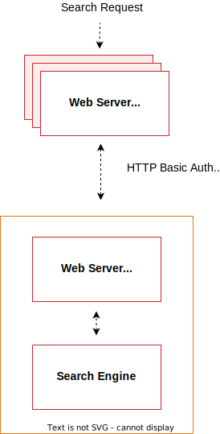

# Requisitos previos del motor de búsqueda

A partir de Adobe Commerce 2.4, todas las instalaciones deben estar configuradas para usar [Elasticsearch](https://www.elastic.co) o [OpenSearch](https://opensearch.org/) como solución de búsqueda en el catálogo.

>[!NOTE]
>
>Se ha añadido compatibilidad con OpenSearch en 2.4.4. OpenSearch es una ramificación compatible de Elasticsearch. Todas las instrucciones para configurar Elasticsearch 7 se aplican a OpenSearch. [Migrar de Elasticsearch a OpenSearch](../../../upgrade/prepare/opensearch-migration.md) proporciona instrucciones para cambiar a OpenSearch.

## Versiones compatibles

Debe instalar y configurar Elasticsearch o OpenSearch antes de instalar Adobe Commerce 2.4.4 y posteriores.

Consulte [Requisitos del sistema](../../system-requirements.md) para obtener información específica sobre la versión.

## Configuración recomendada

Recomendamos lo siguiente:

* [Configuración de nginx para el motor de búsqueda](configure-nginx.md)
* [Configuración de Apache para el motor de búsqueda](configure-apache.md)

## Ubicación de instalación

Las siguientes tareas suponen que ha configurado el sistema según el diagrama siguiente:



El diagrama anterior muestra:

* La aplicación de Commerce y el motor de búsqueda están instalados en hosts diferentes.

  La ejecución en hosts independientes requiere el funcionamiento del proxy. (La agrupación en clúster del motor de búsqueda excede el ámbito de esta guía, pero puede encontrar más información en la [documentación de agrupación en clúster de Elasticsearch](https://www.elastic.co/guide/en/elasticsearch/guide/current/distributed-cluster.html).)

* Cada host tiene su propio servidor web; los servidores web no tienen por qué ser iguales.

  Por ejemplo, la aplicación de Commerce puede ejecutar Apache y el motor de búsqueda puede ejecutar nginx.

* Ambos servidores web utilizan Transport Layer Security (TLS).

  La configuración de TLS está fuera del ámbito de nuestra documentación.

Las solicitudes de búsqueda se procesan de la siguiente manera:

1. El servidor web de Commerce recibe una solicitud de búsqueda de un usuario y la reenvía al servidor del motor de búsqueda.

   Puede configurar el motor de búsqueda para que se conecte al host y al puerto del proxy. Recomendamos el puerto SSL del servidor web (443 de forma predeterminada).

1. El servidor web del motor de búsqueda (que escucha en el puerto 443) envía la solicitud al servidor del motor de búsqueda (de forma predeterminada, escucha en el puerto 9200).

1. El acceso al motor de búsqueda está aún más protegido por la autenticación HTTP Basic. Para que una solicitud llegue al motor de búsqueda, debe viajar a través de SSL *y* proporcionar un nombre de usuario y una contraseña válidos.

1. El motor de búsqueda procesa la solicitud.

1. La comunicación vuelve por la misma ruta, con el servidor web Elasticsearch actuando como un proxy inverso seguro.

## Requisitos previos

Las tareas tratadas en esta sección requieren lo siguiente:

* [Firewall y SELinux](#firewall-and-selinux)
* [Instale el Kit de desarrollo de software de Java (JDK)](#install-the-java-software-development-kit)
* [Instalación del motor de búsqueda](#install-the-search-engine)
* [Elasticsearch de actualización](#upgrading-elasticsearch)

### Firewall y SELinux

El software relacionado con la seguridad (iptables, SELinux, AppArmor) puede configurarse de forma predeterminada para bloquear la comunicación entre subsistemas. Puede ser una buena idea revisarlos si hay problemas.

#### Configurar reglas para iptables y SELinux

Para configurar reglas que permitan la comunicación con el cortafuegos o con SELinux activado, consulte los siguientes recursos:

* [procedimientos de iptables](https://help.ubuntu.com/community/IptablesHowTo)
* [Cómo editar reglas iptables (proyecto fedora)](https://fedoraproject.org/wiki/How_to_edit_iptables_rules)
* [Introducción a SELinux (CentOS.org)](https://www.centos.org)
* [Wiki de procedimientos para SELinux (CentOS.org)](https://wiki.centos.org/HowTos/SELinux)

### Instalación del kit de desarrollo de software de Java

Para determinar si Java ya está instalado, introduzca el siguiente comando:

```bash
java -version
```

Si se muestra el mensaje `java: command not found`, debe instalar el SDK de Java como se describe en la sección siguiente.

Consulte una de las siguientes secciones:

* [Instale el JDK más reciente en CentOS](#install-the-jdk-on-centos)
* [Instale el último JDK de en Ubuntu](#install-the-jdk-on-ubuntu)

#### Instalación del JDK en CentOS

Ver este [tutorial de Digital Ocean](https://www.digitalocean.com/community/tutorials/how-to-install-java-on-centos-and-fedora#install-oracle-java-8).

Asegúrese de instalar el JDK y *no* el JRE.

```bash
yum -y install java-1.8.0-openjdk
```

>[!NOTE]
>
>Es posible que la versión 8 de Java no esté disponible para todos los sistemas operativos. Por ejemplo, puede [buscar en la lista de paquetes disponibles para Ubuntu](https://packages.ubuntu.com/).

#### Instalación del JDK en Ubuntu

Para instalar JDK 1.8 en Ubuntu, introduzca los siguientes comandos como usuario con privilegios de `root`:

```bash
apt-get -y update
```

```bash
apt-get install -y openjdk-8-jdk
```

Para ver otras opciones, consulte [documentación de Oracle](https://docs.oracle.com/javase/8/docs/technotes/guides/install/install_overview.html).

### Instalación del motor de búsqueda

Siga [Elasticsearch de instalación](https://www.elastic.co/guide/en/elasticsearch/reference/current/install-elasticsearch.html) o [Instale y configure OpenSearch](https://opensearch.org/docs/latest/opensearch/install/index/) para los pasos específicos de su plataforma.

Para comprobar que Elasticsearch funciona, introduzca el siguiente comando en el servidor en el que se está ejecutando:

```bash
curl -XGET '<host>:9200/_cat/health?v&pretty'
```

Se muestra un mensaje similar al siguiente:

```terminal
epoch      timestamp cluster       status node.total node.data shards pri relo init unassign pending_tasks
1519701563 03:19:23  elasticsearch green           1         1      0   0    0    0        0             0
```

Para comprobar que OpenSearch funciona, introduzca los siguientes comandos:

```bash
curl -XGET https://<host>:9200 -u 'admin:admin' --insecure
```

```bash
curl -XGET https://<host>:9200/_cat/plugins?v -u 'admin:admin' --insecure
```

## Elasticsearch de actualización

Consulte [Actualización del Elasticsearch](https://www.elastic.co/guide/en/elasticsearch/reference/current/setup-upgrade.html) para obtener instrucciones completas sobre cómo realizar copias de seguridad de los datos, detectar posibles problemas de migración y probar las actualizaciones antes de implementarlas en producción. Según la versión actual del Elasticsearch, puede que sea necesario o no reiniciar el clúster por completo.

Elasticsearch requiere JDK 1.8 o superior. Consulte [Instalar el kit de desarrollo de software de Java](#install-the-java-software-development-kit) para comprobar qué versión de JDK está instalada.

## Recursos adicionales

Consulte la documentación de [Elasticsearch](https://www.elastic.co/guide/en/elasticsearch/reference/current/index.html) o [OpenSearch](https://opensearch.org/docs/latest/).
