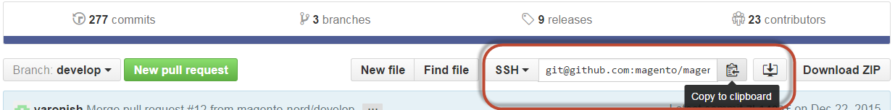

# Clonar repositorios Git de datos de muestra

En este tema se explica cómo clonar y agregar datos de ejemplo si ha clonado el repositorio de GitHub de Magento Open Source. Este método está diseñado únicamente para desarrolladores colaboradores (es decir, desarrolladores que planean contribuir al código base de Magento Open Source).

Si no es un desarrollador colaborador, elija una de las otras opciones que se muestran en la tabla de contenido de la izquierda de la página.

Los desarrolladores colaboradores pueden utilizar este método para instalar datos de ejemplo *solamente* si se cumple lo siguiente:

* Utiliza Magento Open Source
* Usted [clonado del repositorio de GitHub](https://developer.adobe.com/commerce/contributor/guides/install/clone-repository/)

>[!WARNING]
>
>Puede utilizar datos de ejemplo con las API `develop` rama (más actual) o una rama liberada (como `2.4` (más estable). Le recomendamos que utilice una rama liberada porque es más estable. Si va a contribuir con código al repositorio y necesita el código más reciente, utilice el `develop` Rama. Independientemente de la sucursal que elija, debe [clonar](https://developer.adobe.com/commerce/contributor/guides/install/clone-repository/) la rama correspondiente del repositorio de GitHub del Magento Open Source. Por ejemplo, datos de ejemplo para `develop` se puede utilizar la rama *solamente* con el Magento Open Source `develop` Rama.

## Clonar el repositorio de datos de ejemplo

En esta sección se explica cómo instalar datos de ejemplo mediante la clonación del repositorio de datos de ejemplo. Puede clonar el repositorio de datos de ejemplo de cualquiera de las siguientes maneras:

* Clonar con [protocolo SSH](#clone-with-ssh)
* Clonar con [Protocolo HTTPS](#clone-with-https)

### Clonar con SSH

Para clonar el repositorio de GitHub de datos de ejemplo utilizando el protocolo SSH:

1. En un explorador web, vaya a la [repositorio de datos de ejemplo](https://github.com/magento/magento2-sample-data).
1. Junto al nombre de la rama, haga clic en **SSH** de la lista.
1. Clic **Copiar al portapapeles**

   La siguiente figura muestra un ejemplo.

   

1. Cambie al directorio docroot del servidor web.

   Normalmente, para Ubuntu, es `/var/www` y para CentOS es `/var/www/html`.

1. Entrar `git clone` y pegue el valor obtenido anteriormente.

   A continuación se muestra un ejemplo:

   ```bash
   git clone git@github.com:magento/magento2-sample-data.git
   ```

1. Espere a que el repositorio se clone en el servidor.

   >[!NOTE]
   >
   >Si se muestra el siguiente error, asegúrese de que [compartió su clave SSH](https://docs.github.com/articles/generating-ssh-keys/) con GitHub:<br>

   ```terminal
   Cloning into 'magento2'...
   Permission denied (publickey).
   fatal: The remote end hung up unexpectedly
   ```

1. Asegúrese de extraer la rama del repositorio de datos de ejemplo que corresponda con la rama utilizada desde el repositorio principal `magento2` repositorio.

   Por ejemplo:

   Si ha utilizado la variable `2.4-develop` rama del repositorio de GitHub del Magento Open Source, la rama de datos de ejemplo debe ser `2.4-develop`.

   Para extraer la rama correcta, ejecute el siguiente comando desde el directorio raíz del repositorio de datos de ejemplo (suponiendo que necesite la rama `2.4-develop` rama):

   ```bash
   git checkout 2.4-develop
   ```

1. Cambiar a `<app_root>`.
1. Introduzca el siguiente comando para crear vínculos simbólicos entre los archivos clonados de modo que los datos de ejemplo funcionen correctamente:

   ```bash
   php -f <sample-data_clone_dir>/dev/tools/build-sample-data.php -- --ce-source="<path_to_your_magento_instance>"
   ```

1. Espere a que se complete el comando.

1. Consulte [Establecer permisos y propiedad del sistema de archivos](#set-file-system-ownership-and-permissions).

1. Ejecute el siguiente comando:

   ```bash
   bin/magento setup:upgrade
   ```

### Clonar con HTTPS

Para clonar el repositorio de GitHub de datos de ejemplo utilizando el protocolo HTTPS:

1. En un explorador web, vaya a la [repositorio de datos de ejemplo](https://github.com/magento/magento2-sample-data).
1. En el lado derecho de la página, debajo de **clonar URL** , haga clic en **HTTPS**.
1. Clic **Copiar al portapapeles**.

   La siguiente figura muestra un ejemplo.

   

1. Cambie al directorio docroot del servidor web.

   Normalmente, para Ubuntu, es `/var/www` y para CentOS es `/var/www/html`.

1. Entrar `git clone` y pegue el valor obtenido anteriormente.

   A continuación se muestra un ejemplo:

   ```bash
   git clone https://github.com/magento/magento2-sample-data.git
   ```

1. Espere a que el repositorio se clone en el servidor.
1. Asegúrese de extraer la rama del repositorio de datos de ejemplo que corresponda con la rama utilizada desde el repositorio principal `magento2` repositorio.

   Por ejemplo:

   Si ha utilizado la variable `2.4-develop` rama del repositorio de GitHub del Magento Open Source, la rama de datos de ejemplo debe ser `2.4-develop`.

   Para extraer la rama correcta, ejecute el siguiente comando desde el directorio raíz del repositorio de datos de ejemplo (suponiendo que necesite la rama `2.4-develop` rama):

   ```bash
   git checkout 2.4-develop
   ```

1. Cambiar a `<magento_root>`.
1. Introduzca el siguiente comando para crear vínculos simbólicos entre los archivos clonados de modo que los datos de ejemplo funcionen correctamente:

   ```bash
   php -f <sample-data_clone_dir>/dev/tools/build-sample-data.php -- --ce-source="<path_to_your_magento_instance>"
   ```

   Por ejemplo,

   ```bash
   php -f <sample-data_clone_dir>/dev/tools/build-sample-data.php -- --ce-source="/var/www/magento2"
   ```

1. Espere a que se complete el comando.
1. Consulte la siguiente sección.

>[!WARNING]
>
>Si va a instalar datos de ejemplo *después* Al instalar Adobe Commerce o Magento Open Source, también debe ejecutar el siguiente comando para actualizar la base de datos y el esquema:
>
>```bash
><magento_root>/bin/magento setup:upgrade
>```

## Establecer propiedad y permisos del sistema de archivos

Debido a que el `php build-sample-data.php` La secuencia de comandos crea enlaces simbólicos entre el repositorio de datos de ejemplo y el repositorio de Magento Open Source. Debe definir los permisos y la propiedad del sistema de archivos en el repositorio de datos de ejemplo. Si no se hace esto, se producen errores al acceder a la tienda.

Para establecer los permisos y la propiedad del sistema de archivos en el repositorio de datos de ejemplo:

1. Cambie al directorio de clonación de datos de ejemplo.
1. Establecer propiedad:

   ```bash
   chown -R :<your web server group name> .
   ```

   Ejemplos habituales:

   * CentOS: `chown -R :apache .`

   * Ubuntu: `chown -R :www-data .`

1. Definir permisos:

   ```bash
   find . -type d -exec chmod g+ws {} +
   ```

1. Borrar archivos estáticos:

   ```bash
   cd <your Magento Open Source install dir>
   ```

   ```bash
   rm -rf var/cache/* var/page_cache/* generated/*
   ```

## Completar la instalación de datos de ejemplo

{{$include /help/_includes/sample-data-complete.md}}
