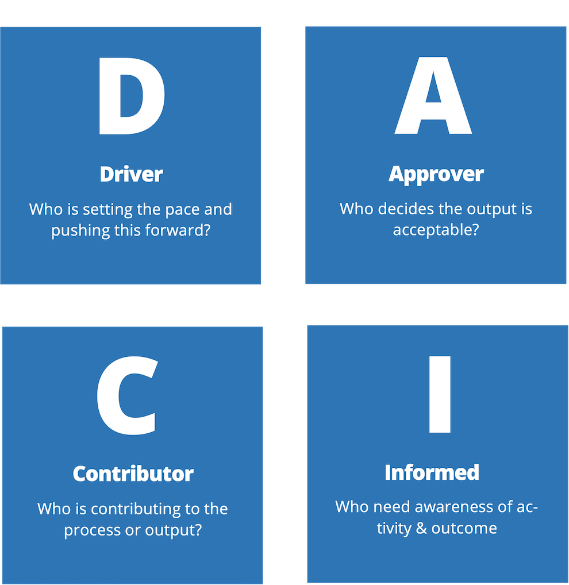

# Marco de administración de proyectos

El modelo DACI es un marco de gestión de proyectos que se utiliza para definir claramente las funciones y responsabilidades de las distintas partes interesadas en un proyecto, lo que conduce a decisiones de grupo eficaces y eficientes. DACI significa Controlador, Aprobador, Colaborador e Informado. Estas funciones dejan claro quién tiene autoridad en ciertas áreas y situaciones, lo que permite que un proyecto avance sin problemas.

