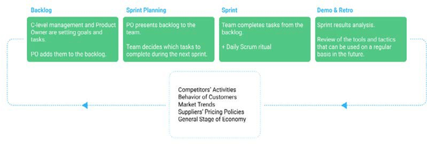

# Administración de proyectos

La administración de proyectos es la aplicación de conocimientos, habilidades, herramientas y técnicas para lograr objetivos y cumplir con éxito los requisitos del proyecto.

En el diagrama siguiente se describen las cinco fases de la administración de proyectos y el ciclo de vida de la administración de proyectos:

El ciclo de vida de la administración de proyectos proporciona un proceso de entrega oportuno y controlado que beneficia a los interesados en el proyecto. El primer paso para ofrecer un proyecto de comercio electrónico exitoso es la administración de proyectos. Se necesitan el enfoque y la metodología adecuados para que el equipo pueda ejecutar el proyecto de manera eficaz y eficiente.

Algunos equipos eligen la metodología de administración de proyectos de Scrum para sus proyectos de comercio electrónico. Las funciones de Scrum que se mencionan a continuación ayudan a facilitar y administrar el proyecto:

- Periodización de tareas
- Periodización de las tareas pendientes antes y durante el sprint
- Stand-ups diarios del equipo
- Sesión de planificación para cada sprint
- Retrospectivas de Sprint

Scrum ayuda a gestionar los cambios durante el proyecto, permite a los equipos mostrar resultados rápidos, es flexible y aumenta la colaboración.

## Plan de proyecto básico

Un plan básico de administración de proyectos de comercio electrónico incluye:

- **Análisis**—En la fase inicial de un proyecto, la empresa necesita llevar a cabo análisis, incluyendo análisis de mercado y de la competencia para comprender las fortalezas y debilidades de la organización.

- **Requisitos**: defina los requisitos detallados de lo que la organización desea al final del proyecto en términos de mejorar las habilidades existentes o implementar nuevas funciones o integraciones.

- **Proveedores de terceros**: en esta fase, asigne las integraciones de terceros necesarias (por ejemplo, pagos, envíos, clasificaciones y revisiones).

- **Diseño**—Haga una lluvia de ideas sobre los requisitos específicos de diseño para plantillas y el libro de marca de la empresa.

- **Migración**: planifique los pasos para migrar contenido y datos.

- **Plataforma de comercio electrónico**: permite analizar y finalizar la plataforma necesaria para que la empresa cumpla los requisitos.

## Prácticas recomendadas

Algunas prácticas recomendadas a las que las empresas pueden hacer referencia para la administración de proyectos son:

- Establecimiento de objetivos claros, precisos y rastreables
- Monitorización del tiempo empleado en tareas y recursos para evitar desperdicios
- Seleccionar las herramientas de comercio electrónico correctas requeridas por el equipo, como la plataforma de comercio electrónico y las herramientas de comunicación
- Las pruebas y la iteración deben realizarse constantemente
- Seguimiento del presupuesto
- Manteniendo bajo control el alcance

Hay muchos aspectos diferentes a considerar cuando se desarrolla un sitio de comercio electrónico. La administración de proyectos proporciona la estructura necesaria para realizar el seguimiento de los objetivos, las escalas de tiempo y las entregas del proyecto, así como para alinear a los integrantes del equipo en el progreso.
