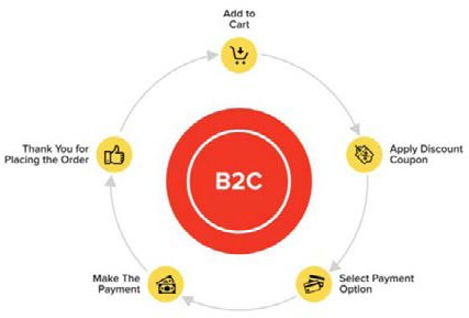

# Flujos y procesos de cierre de compra

Checkout es una parte crítica de las compras en línea. Aquí es donde se hace el dinero real. Los minoristas tienden a centrarse más en el aspecto del sitio web y pasan por alto el flujo de cierre de compra, pero ambas partes son igualmente importantes.

El flujo de cierre de compra es como la línea de llegada, donde los compradores se convierten en clientes que realizan transacciones. Pero incluso un pequeño inconveniente en el cierre de compra puede tener un gran impacto negativo en la tasa de conversión y el retorno de la inversión, por lo tanto, mejorar la tasa de conversión incluso ligeramente puede ayudar al aumento de retorno de la inversión de forma masiva. La mejora de los flujos y procesos de cierre de compra comienza incluso antes de la página de cierre de compra.

## Páginas de producto

Intente mantener toda la información antes del pliegue de página, como detalles del producto, precios, imágenes del producto, críticas y clasificaciones. Todos los factores necesarios para que el cliente tome la decisión de comprar el producto.

Agregue secciones como &quot;Es posible que le guste&quot;, que muestra productos relacionados con el producto que está viendo un cliente en ese momento. Se trata de una estrategia utilizada para aumentar las compras de los clientes.

## Optimizar el proceso de cierre

Intente realizar pasos limitados y menos clics en la página de cierre de compra para realizar un seguimiento rápido del proceso. Por ejemplo, el cierre de compra debe incluir:

- Envío
- Factura
- Pago

La implementación de un cierre de compra fácil y conveniente elimina el riesgo de abandono del carro de compras.

## Flujo de cierre visual

Muestre un flujo de cierre de compra visual en el que los compradores puedan ver la vista previa del número de pasos necesarios para completar la compra.

## Eliminar extras

Elimine la información adicional, como la minibolsa, la barra de búsqueda o de navegación. Esto ayuda al cliente a centrarse en el proceso de cierre de compra en lugar de en navegar a otra página.

Tienen botones de CTA limpios y audaces con un diseño de página simple.

## Confianza

Los clientes que compran en línea siempre están preocupados por la seguridad. Para ofrecer garantías a los clientes, muestre lo siguiente en el sitio:

- Acreditaciones de credibilidad como Norton secure, MacAfee secure y Google Trusted Store
- Certificados SSL
- Logotipos de método de pago
- Valoraciones y comentarios
- Políticas
- Términos y condiciones

## Opciones de cierre

Proporcionar diferentes opciones de cierre de compra, como:

- Usuario invitado
- Usuario registrado
- Crear una cuenta

No fuerce un tipo de opción al usuario.

## Opciones de envío

Los minoristas deben proporcionar diferentes métodos de envío para satisfacer las necesidades de diferentes clientes.

Además de las opciones de pago, los minoristas también pueden proporcionar opciones como [haga clic en y recopile](click-collect.md).

## Datos de pago

Los datos de pago deben colocarse al final, justo antes de confirmar la realización de un pedido.

Proporciona un modo sencillo de introducir los datos de pago, como el nombre de la tarjeta y el número de tarjeta.

Proporcione una opción para que el usuario guarde sus datos de crédito para la siguiente compra.

## Resumen del pedido

Proporcione un resumen detallado del pedido antes de que el usuario confirme la compra.

## Confirmación del pedido

Muestre un mensaje de agradecimiento con los detalles de confirmación del pedido para proporcionar al cliente la confianza de que ha realizado correctamente un pedido.

Algunos minoristas también proporcionan mensajes promocionales si el usuario ha cerrado la compra como invitado para promocionar la suscripción como usuario registrado.

## Correos electrónicos

Siga siempre la confirmación del pedido con un correo electrónico de confirmación que describa todos los detalles del pedido y la función de seguimiento.

El cierre de compra es un factor importante para aumentar la tasa de conversión y, a su vez, aumentar el retorno de la inversión. Es necesario optimizar el proceso de cierre de compra para proporcionar una experiencia de cierre de compra fácil de usar, rápida y conveniente. No es una talla única cuando se trata del flujo y el proceso de pago, por lo que es esencial que los minoristas investiguen, analicen y prueben las mejores opciones.

## Comprobación de B2C frente a B2B

Hay una diferencia entre los flujos y procesos de cierre de compra B2B y B2C.

### B2C

- Posibilidad de cambiar la cantidad
- No se puede eliminar el producto del carro
- Cierre de compra simple
- Diferentes opciones de pago, como tarjeta de crédito y monedero electrónico
- Posibilidad de añadir un código de cupón al cierre de compra

### B2B

- Posibilidad de cambiar la cantidad
- No se puede eliminar el producto del carro
- Cierre de compra simple
- Diferentes opciones de pago, como pedido de compra, transferencia bancaria o cheque
- Proceso sencillo para reordenar

