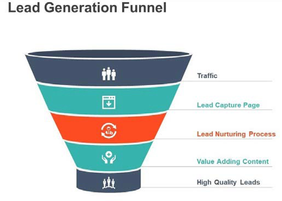

# Generación de posibles clientes

En la industria del comercio electrónico, un posible cliente es todo aquel que muestre interés en la marca y sus productos; haga clic en el sitio web, consulte un anuncio en los medios sociales o explore productos. La generación de un líder en el sector del comercio electrónico es una parte fundamental del negocio, ya que un posible cliente de hoy en día puede ser cliente de mañana. La generación de posibles clientes es un proceso largo que lleva tiempo y requiere paciencia.

El diagrama siguiente muestra un flujo de trabajo sencillo que los minoristas pueden utilizar para la generación de posibles clientes:

## Prácticas recomendadas

Las prácticas recomendadas para la generación de posibles clientes incluyen:

- **Contenido único**—Los minoristas deben investigar y averiguar qué les gusta a los clientes, en qué les interesa y qué quieren comprar. El contenido necesita captar la atención del cliente, inventarlo y crear un vínculo con ellos. El contenido no solo se limita a vídeos e imágenes, sino que también incluye los medios sociales.

- **Comunidades en línea**: puede tener comunicación en línea, como una página de Instagram o una comunidad de Facebook, donde las personas pueden publicar comentarios, preguntas o preocupaciones. El equipo del Servicio de atención al cliente puede participar activamente en los medios sociales.

- **Influenciadores**: los usuarios con influencia pueden pagar para promocionar su marca. Los usuarios influyentes tienen una base de seguidores (un grupo de seguidores) que los escuchan, lo que puede ser beneficioso para su marca. Puede colaborar oficialmente o enviar productos gratuitos a los influyentes para que los promocionen.

- **Medios sociales**—Tener presencia en los medios sociales es importante para las marcas hoy en día. Las marcas deben asegurarse de que se sienten presentes publicando con regularidad, publicando contenido para dirigirse a distintos clientes, asegurándose de que el contenido sea correcto y siempre republicando en los comentarios de las publicaciones originales.

- **SEO** Necesita tener un buen SEO en su lugar porque la clasificación SEO aumenta el tráfico del sitio y le da a su marca una mejor oportunidad de ser notado.

- **Campañas de pago**: puede centrarse en la publicación de campañas pagadas, lo que lleva el foco al sitio.

- **Clientes insatisfechos**: debe ponerse en contacto con los clientes que no estén satisfechos.

Aunque la generación de posibles clientes puede no ser fácil, es necesario si desea que su marca tenga éxito en el mercado y tenga una ventaja competitiva.

## B2B frente a B2C

La generación de posibles clientes es diferente entre las empresas B2B y B2C:

- **Ciclo de ventas**—La generación de plomo para las empresas B2B es mucho más larga que la de las empresas B2C porque los contratos B2B son para períodos de tiempo a largo plazo en comparación con las transacciones B2C. Los precios, el tiempo y los recursos asignados para las transacciones B2B son buenos. Los ciclos de ventas B2C son mucho más cortos y requieren menos tiempo, dinero y recursos.

- **Contenido**—Los clientes de B2B generalmente tienen más conocimientos sobre los productos porque realizan más investigación sobre ellos, mientras que los clientes de B2C generalmente compran en función del contenido de tendencia del mercado.

- **Audiencia**—Las empresas B2C llegan a una amplia gama de audiencias, mientras que las empresas B2B tienen audiencias específicas

- **Objetivo**—Las empresas B2C tienden a atraer clientes de un mercado altamente saturado, mientras que las empresas B2B crean relaciones con clientes en confianza. Tanto las empresas B2B como las B2C tienen el mismo objetivo final, que es aumentar el ROI.

- **Interacción**: los clientes de B2C toman decisiones de compra de forma individual, mientras que múltiples partes interesadas participan en el proceso de toma de decisiones de compras B2B.

No hay un método definido para generar posibles clientes, pero es posible aumentar la generación de posibles clientes analizando los métodos que mejor se adaptan a las necesidades del negocio y ayudando a configurar la organización.
