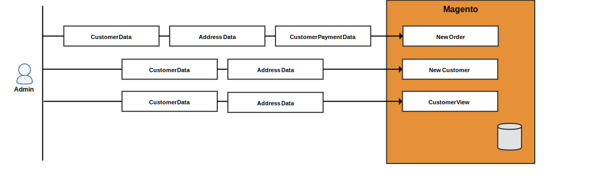

# Referencia de información personal del cliente (versión 1.x)

>[!NOTE]
>
>Este es uno de los temas de una serie para ayudar a los comerciantes y desarrolladores de Adobe Commerce y Magento Open Source a prepararse para el cumplimiento de las normas de privacidad. Consulte con su asesor legal para determinar si su empresa debe cumplir con alguna obligación legal y cómo debe hacerlo.

Utilice los siguientes diagramas de flujo de datos y asignaciones de entidades de base de datos como referencia al desarrollar programas de cumplimiento de normas para regulaciones de privacidad como:

- [RGPD](gdpr.md)
- [CCPA](ccpa.md)

## Diagramas de flujo de datos

Los diagramas de flujo de datos muestran los tipos de datos que los clientes y administradores pueden introducir y recuperar en la tienda y el administrador.

### Puntos de entrada de datos del front-end

Un usuario puede introducir la información de cliente, dirección y pago al registrarse en una cuenta, durante el cierre de compra y eventos similares.

### Puntos de acceso a los datos del front-end

Commerce carga la información del cliente cuando el cliente inicia sesión y visualiza varias páginas diferentes o cierra la compra.

### Puntos de entrada de datos del back-end

Un comerciante puede introducir la información de cliente, dirección y pago desde el Administrador para crear un cliente o pedido.

### Puntos de acceso de datos back-end

Comercio carga la información del cliente cuando un comerciante ve varios tipos de cuadrículas, hace clic en una cuadrícula para ver información detallada y realiza otras tareas.

## Entidades de base de datos

El Magento 1 almacena la información del cliente en las tablas de cliente, ventas y otras bases de datos.

### Datos del cliente

El Magento 1 almacena la información del cliente en la variable `customer_entity` y `customer_address_entity` tablas. Ambas tablas tienen varias tablas de referencia que pueden contener atributos del cliente personalizados.

#### `customer_entity` y tablas de referencia

Las columnas siguientes de la sección `customer_entity`contiene información del cliente:

| Columna | Tipo de datos |
| --- | --- |
| `email` | varchar(255) |

Estas tablas hacen referencia a `customer_entity` y pueden contener atributos de cliente personalizados:

| Tabla | Columna | Tipo de datos |
| --- | --- | --- |
| `customer_entity_datetime` | `value` | datetime |
| `customer_entity_decimal` | `value` | decimal(12,4) |
| `customer_entity_int` | `value` | int(11) |
| `customer_entity_text` | `value` | text |
| `customer_entity_varchar` | `value` | varchar(255) |

#### `customer_address_entity` y tablas de referencia

Las siguientes tablas hacen referencia a `customer_address_entity` y pueden contener atributos de cliente personalizados:

| Tabla | Columna | Tipo de datos |
| --- | --- | --- |
| `customer_address_entity_datetime` | `value` | datetime |
| `customer_address_entity_decimal` | `value` | decimal(12,4) |
| `customer_address_entity_int` | `value` | int(11) |
| `customer_address_entity_text` | `value` | text |
| `customer_address_entity_varchar` | `value` | varchar(255) |

### Ordenar datos

La variable `sales_flat_order` y las tablas relacionadas contienen el nombre del cliente, las direcciones de facturación y envío y la información relacionada.

#### `sales_flat_order` tabla

Las columnas siguientes de la sección `sales_order` contiene información del cliente:

| Columna | Tipo de datos |
| --- | --- |
| `customer_id` | int(10) |
| `customer_email` | varchar(128) |
| `customer_firstname` | varchar(128) |
| `customer_gender` | int(11) |
| `customer_lastname` | varchar(128) |
| `customer_middlename` | varchar(128) |
| `customer_prefix` | varchar(32) |
| `customer_suffix` | varchar(32) |
| `customer_taxvat` | varchar(32) |
| `remote_ip` | varchar(32) |

#### `sales_flat_order_address` tabla

La variable `sales_flat_order_address` contiene la dirección del cliente.

| Columna | Tipo de datos |
| --- | --- |
| `customer_id` | int(10) |
| `fax` | varchar(255) |
| `region` | varchar(255) |
| `postcode` | varchar(255) |
| `lastname` | varchar(255) |
| `street` | varchar(255) |
| `city` | varchar(255) |
| `email` | varchar(255) |
| `telephone` | varchar(255) |
| `firstname` | varchar(255) |
| `prefix` | varchar(255) |
| `suffix` | varchar(255) |
| `middlename` | varchar(255) |
| `company` | varchar(255) |
| `vat_id` | text |

#### `sales_flat_order_grid` tabla

Las columnas siguientes de la sección `sales_flat_order_grid` contiene información del cliente:

| Columna | Tipo de datos |
| --- | --- |
| `customer_id` | int(10) |
| `shipping_name` | varchar(255) |
| `billing_name` | varchar(255) |

#### `sales_flat_order_payment` tabla

Las columnas siguientes de la sección `sales_flat_order_payment` contiene información del cliente:

| Columna | Tipo de datos |
| --- | --- |
| `cc_exp_month` | varchar(255) |
| `cc_ss_start_year` | varchar(255) |
| `echeck_bank_name` | varchar(128) |
| `echeck_type` | varchar(255) |
| `cc_ss_start_month` | varchar(255) |
| `cc_owner` | varchar(255) |
| `cc_exp_year` | varchar(255) |
| `echeck_routing_number` | varchar(255) |
| `echeck_account_name` | varchar(255) |

### Datos de cotización

Las cotizaciones contienen el nombre del cliente, el correo electrónico, la dirección y la información relacionada.

#### `sales_flat_quote` tabla

Las columnas siguientes de la sección `sales_flat_quote` contiene información del cliente:

| Columna | Tipo de datos |
| --- | --- |
| `customer_id` | int(10) |
| `customer_tax_class_id` | int(10) |
| `customer_group_id` | int(10) |
| `customer_email` | varchar(255) |
| `customer_prefix` | varchar(40) |
| `customer_firstname` | varchar(255) |
| `customer_middlename` | varchar(40) |
| `customer_lastname` | varchar(255) |
| `customer_suffix` | varchar(40) |
| `customer_dob` | datetime |
| `customer_note` | varchar(255) |
| `remote_ip` | varchar(255) |
| `customer_gender` | varchar(255) |

#### `sales_flat_quote_address` tabla

Las columnas siguientes de la sección `sales_flat_quote_address` contiene información del cliente:

| Columna | Tipo de datos |
| --- | --- |
| `email` | varchar(255) |
| `prefix` | varchar(40) |
| `firstname` | varchar(255) |
| `middlename` | varchar(40) |
| `lastname` | varchar(255) |
| `suffix` | varchar(40) |
| `company` | varchar(255) |
| `street` | varchar(255) |
| `city` | varchar(255) |
| `region` | varchar(255) |
| `postcode` | varchar(255) |
| `fax` | varchar(255) |

#### `sales_flat_quote_payment` tabla

La variable `sales_flat_quote_payment` incluye información de tarjetas de crédito y otra información transaccional.

| Columna | Tipo de datos |
| --- | --- |
| `cc_last_4` | varchar(255) |
| `cc_owner` | varchar(255) |
| `cc_exp_month` | smallint(5) |
| `cc_exp_year` | smallint(5) |
| `cc_ss_owner` | varchar(255) |
| `cc_ss_start_month` | smallint(5) |
| `cc_ss_start_year` | smallint(5) |

### Archivar datos

Las siguientes tablas y columnas contienen información del cliente:

| Tabla | Columna | Tipo de datos |
| --- | --- | --- |
| `enterprise_sales_creditmemo_grid_archive` | `billing_name` | varchar(255) |
| `enterprise_sales_invoice_grid_archive` | `billing_name` | varchar(255) |
| `enterprise_sales_order_grid_archive` | `billing_name` | varchar(255) |
| `enterprise_sales_order_grid_archive` | `customer_id` | int(10) |
| `enterprise_sales_order_grid_archive` | `shipping_name` | varchar(255) |
| `enterprise_sales_shipment_grid_archive` | `shipping_name` | varchar(255) |

### Datos de ventas

Las siguientes tablas y columnas contienen información del cliente:

| Tabla | Columna | Tipo de datos |
| --- | --- | --- |
| `sales_flat_creditmemo_grid` | `billing_name` | varchar(255) |
| `sales_flat_invoice_grid` | `billing_name` | varchar(255) |

### Datos de RMA

Las siguientes tablas y columnas de RMA contienen información del cliente:

| Tabla | Columna | Tipo de datos |
| --- | --- | --- |
| `enterprise_rma` | `customer_custom_email` | varchar(255) |
| `enterprise_rma_grid` | `customer_id` | int(10) |
| `enterprise_rma_grid` | `customer_name` | varchar(255) |

### Datos diversos

Las siguientes tablas y columnas contienen información del cliente:

| Tabla | Columna | Tipo de datos |
| --- | --- | --- |
| `core_email_queue_recipients` | `recipient_email` | varchar(128) |
| `core_email_queue_recipients` | `recipient_name` | varchar(255) |
| `customer_flowpassword` | `email` | varchar(255) |
| `customer_flowpassword` | `ip` | varchar(50) |
| `enterprise_giftregistry_person` | `email` | varchar(150) |
| `enterprise_giftregistry_person` | `firstname` | varchar(100) |
| `enterprise_giftregistry_person` | `lastname` | varchar(100) |
| `enterprise_giftregistry_person` | `middlename` | text |
| `enterprise_invitation` | `customer_id` | int(10) |
| `enterprise_invitation` | `email` | varchar(255) |
| `enterprise_invitation` | `referral_id` | int(10) |
| `enterprise_reminder_rule_coupon` | `customer_id` | int(10) |
| `enterprise_reminder_rule_coupon` | `emails_failed` | smallint(5) |
| `enterprise_scheduled_operations` | `email_receiver` | varchar(150) |
| `enterprise_scheduled_operations` | `email_sender` | varchar(150) |
| `gift_message` | `customer_id` | int(10) |
| `gift_message` | `recipient` | varchar(255) |
| `gift_message` | `sender` | varchar(255) |
| `newsletter_subscriber` | `customer_id` | int(10) |
| `newsletter_subscriber` | `subscriber_email` | varchar(150) |
| `persistent_session` | `customer_id` | int(10) |
| `persistent_session` | `info` | text |
| `poll_vote` | `customer_id` | int(10) |
| `poll_vote` | `ip_address` | varbinary(16) |
| `rating_option_vote` | `customer_id` | int(10) |
| `rating_option_vote` | `remote_ip` | varchar(50) |
| `rating_option_vote` | `remote_ip_long` | varbinary(516) |
| `send_friend_log` | `ip` | varbinary(16) |

Otras tablas que hacen referencia a Cliente:

- `catalog_compare_item`
- `downloadable_link_purchased`
- `enterprise_customerbalance`
- `enterprise_customersegment_customer`
- `enterprise_giftregistry_entity`
- `enterprise_reminder_rule_log`
- `enterprise_reward`
- `log_customer`
- `log_visitor_online`
- `oauth_token`
- `product_alert_price`
- `product_alert_stock`
- `report_compared_product_index`
- `report_viewed_product_index`
- `review_detail`
- `sales_billing_agreement`
- `sales_flat_shipment`
- `sales_recurring_profile`
- `salesrule_coupon_usage`
- `salesrule_customer`
- `tag`
- `tag_relation`
- `wishlist`
