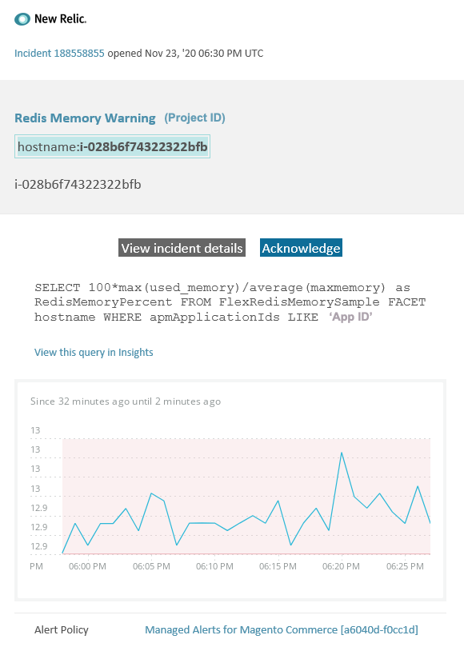

# Alertas administradas en Adobe Commerce: [!DNL Redis] alerta de advertencia de memoria

Este artículo proporciona pasos de solución de problemas para cuando reciba una alerta de advertencia [!DNL Redis] para Adobe Commerce en [!DNL New Relic]. Se requiere una acción inmediata para resolver el problema. La alerta tendrá el siguiente aspecto, según el canal de notificación de alerta que haya seleccionado:



## Productos y versiones afectados

Todas las versiones de Adobe Commerce en la infraestructura en la nube planifican la arquitectura Pro.

## Problema

Recibirá una alerta en [!DNL New Relic] si se ha registrado en [Alertas administradas para Adobe Commerce](managed-alerts-for-magento-commerce.md) y se han sobrepasado uno o más de los umbrales de alerta. Estas alertas las ha desarrollado Adobe para ofrecer a los comerciantes un conjunto estándar de alertas mediante datos de Soporte e Ingeniería.

**<u>Hacer!</u>**

* Se recomienda cancelar cualquier implementación programada hasta que se borre esta alerta.
* Si su sitio no responde o deja de responder por completo, ponga inmediatamente el sitio en modo de mantenimiento. Para ver los pasos, consulte [Habilitar o deshabilitar el modo de mantenimiento](https://experienceleague.adobe.com/en/docs/commerce-operations/installation-guide/tutorials/maintenance-mode) en la Guía de instalación de Commerce.
* Asegúrese de añadir su IP a la lista de direcciones IP exentas para asegurarse de que aún puede acceder al sitio para solucionar problemas. Para ver los pasos, consulte [Mantener la lista de direcciones IP exentas](https://experienceleague.adobe.com/en/docs/commerce-operations/installation-guide/tutorials/maintenance-mode#maintain-the-list-of-exempt-ip-addresses) en la Guía de instalación de Commerce.

**<u>¡No!</u>**

* Inicie campañas de marketing adicionales que puedan llevar vistas de página adicionales al sitio.
* Ejecute indexadores o crons adicionales que puedan causar una tensión adicional en el CPU o el disco.
* Realice cualquier tarea administrativa importante (es decir, una acción importante en el administrador de Commerce, como importaciones/exportaciones de datos, vaciado de medios, guardado de categorías con un gran número de productos asignados y actualizaciones masivas).
* Borre la caché.

## Solución

Siga estos pasos para identificar y solucionar los problemas de la causa.

1. Compruebe si la memoria usada de [!DNL Redis] aumenta o disminuye en [one.newrelic.com](https://login.newrelic.com/login) > **Infraestructura** > **Servicios de terceros**, seleccione el panel [!DNL Redis]. Si es estable o aumenta, [envíe un vale de soporte técnico](https://experienceleague.adobe.com/en/docs/commerce-knowledge-base/kb/help-center-guide/magento-help-center-user-guide#support-case) para que se actualice el clúster, o bien aumente el límite de `maxmemory` al siguiente nivel.
1. Si no puede identificar la causa del aumento del consumo de memoria de [!DNL Redis], revise las tendencias recientes para identificar los problemas con las implementaciones de código o los cambios de configuración recientes (por ejemplo, nuevos grupos de clientes y grandes cambios en el catálogo). Se recomienda revisar los últimos siete días de actividad para cualquier correlación en implementaciones o cambios de código.
1. Compruebe si hay extensiones de terceros con comportamiento incorrecto:
   * Intente encontrar una correlación con las extensiones de terceros instaladas recientemente y la hora en que comenzó el problema.
   * Revise las extensiones que podrían afectar a la caché de Adobe Commerce y hacer que esta crezca rápidamente. Por ejemplo, los bloques de diseño personalizados, la anulación de la funcionalidad de la caché y el almacenamiento de grandes cantidades de datos en la caché.
1. Si no hay evidencia de extensiones con comportamiento incorrecto, [instale los parches más recientes para corregir [!DNL Redis] problemas de Adobe Commerce en la infraestructura en la nube](https://experienceleague.adobe.com/en/docs/commerce-knowledge-base/kb/troubleshooting/miscellaneous/install-latest-patches-to-fix-magento-redis-issues). Si los pasos anteriores no le ayudan a identificar o solucionar el origen del problema, considere habilitar la caché L2 para reducir el tráfico de red entre la aplicación y [!DNL Redis]. Para obtener información general sobre qué es la caché L2, consulte [Almacenamiento en caché L2 en la aplicación Adobe Commerce](https://experienceleague.adobe.com/en/docs/commerce-operations/configuration-guide/cache/level-two-cache) en la Guía de configuración de Commerce. Para habilitar la caché L2 para la infraestructura en la nube, intente lo siguiente:
   * Actualice las herramientas de ECE si es inferior a la versión 2002.1.2.
   * Configurar la caché L2 mediante [Usar la variable REDIS\_BACKEND](https://experienceleague.adobe.com/en/docs/commerce-on-cloud/user-guide/configure/env/stage/variables-deploy#redis_backend) y actualizar el archivo `.magento.env.yaml`:

   ```yaml
   stage:
      deploy:
          REDIS_BACKEND: '\Magento\Framework\Cache\Backend\RemoteSynchronizedCache'
   ```
