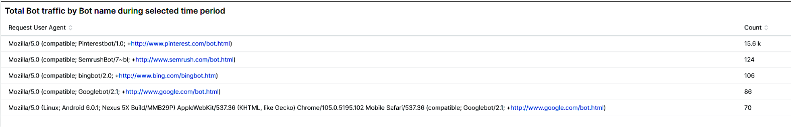

# La variable [!UICONTROL bots] ficha

Esta pestaña tiene información que explica cómo identificar si y qué [!DNL bots] están causando problemas en el sitio.

## Descripción general de alto nivel [!DNL bots]:

* A [!DNL bot] es un software que ejecuta tareas automatizadas repetitivas. Con inteligencia artificial y evolución del aprendizaje automático, las tareas, los métodos y las interacciones de [!DNL bots] están cambiando. Hay *good* [!DNL bots] que benefician a los sitios al rastrearlos y agregarlos a los motores de búsqueda de Internet. Esto hace que los usuarios de Internet reciban la guía del sitio a través de los resultados de los motores de búsqueda. A *good* [!DNL bot] normalmente respeta los límites colocados en la variable [!DNL bot] por `robots.txt` archivo o configuración en una consola de motor de búsqueda. Los límites pueden restringir el acceso al sitio o a partes del mismo.
* Malintencionado [!DNL bots] ignore la variable `robots.txt` o pueden falsificar un bien [!DNL bot] a través del campo request user agent de los datos de solicitud HTTP. Algunas cosas que malintencionan [!DNL bots] haga lo siguiente:
   * Agregue carga a un sitio para denegar el acceso al sitio a los usuarios legítimos.
   * Cree y reutilice contenido sin permiso.
   * Registre cuentas falsas para inundar servicios de correo electrónico o direcciones o redirigir a otros sitios ([!DNL SPAM bots]).
   * Crear vistas falsas ([!DNL Viewbots]).
   * Comprar productos o entradas ([!DNL Focused bots]).
* Administración [!DNL bots]
   * [!DNL Observation for Adobe Commerce] tiene vistas de [!DNL bot] tráfico:
      * Muestra el total no almacenado en caché [!DNL bot] actividad que muestra la carga que un [!DNL bot] se agrega a un sitio y cuando se produce esa carga.
      * Muestra la variable [!DNL bots] que generan errores. Normalmente, si una [!DNL bot] está agregando carga que causa problemas en el sitio, que [!DNL bot] o la dirección IP tiene la mayor frecuencia de errores.
      * Muestra [!DNL bot] nombres (solicitar valores de campo de agente de usuario) y direcciones IP para administrar mediante:
         * [!DNL Fastly] (limitación de velocidad o [!DNL VCLs] que bloquean direcciones IP, intervalos o [!DNL bots] por valor de nombre).
         * Añadir bueno [!DNL bot] información para `robots.txt field` para restringir o limitar la tasa de acceso al sitio.
         * Administración [!DNL Bing] o [!DNL Google bots] a través de la consola del motor de búsqueda.

## [!UICONTROL Total Bot traffic by bot name]:

* La variable **[!UICONTROL Total Bot traffic by bot name during selected time period]** contiene el recuento agregado de solicitudes no almacenadas en caché en las que la variable [!UICONTROL request_user_agent] El campo tiene una cadena de [!DNL bots] en el valor. Puede o no ser el nombre [!DNL bot] como el [!UICONTROL request_user_agent] el valor de campo se puede falsificar. El valor debajo de la variable [!UICONTROL Count] es la columna más importante.

## [!UICONTROL Total Bot Traffic by Bot name/IP address]

* La variable **[!UICONTROL Total Bot Traffic by Bot name/IP address during selected time period How to block bot traffic on Fastly level OR manage bots through your robots.txt file Best practices for Adobe Commerce robots.txt]** muestra los mismos datos que la tabla anterior, pero agrega direcciones IP que realizan las solicitudes en nombre del [!DNL bot]. Como malintencionado [!DNL bots] buena parodia [!DNL bots], las direcciones IP deben verificarse mediante sitios web que identifiquen direcciones IP abusivas o a través de *whois* servicios o [!DNL DNS lookups]. Por ejemplo, [!DNL Google] publica sus [[!DNL googlebot] Direcciones IP](https://developers.google.com/search/apis/ipranges/googlebot.json) y [!DNL Microsoft] tiene una herramienta de verificación para [[!DNL Bingbots]](https://www.bing.com/webmasters/help/Verify-Bingbot-2195837f).

## [!UICONTROL Graph - Bots with HTTP status errors]

* La variable **[!UICONTROL Graph - Bots with HTTP status errors during selected time period How to block bot traffic on Fastly level OR manage bots through your robots.txt file Best practices for Adobe Commerce robots.txt]** el gráfico muestra errores en [!DNL bots] que se declaran en el campo Solicitar agente de usuario . Esto no significa necesariamente que el error esté causado por el volumen del [!DNL bot] u otro tráfico. Los errores podrían ser que la variable [!DNL bot] solicita información que no existe o existe otro problema en la solicitud.
* Si hay un pico de errores en las direcciones IP durante la inestabilidad o interrupción del sitio, podrían ser sospechosos en el problema del sitio.

## [!UICONTROL Table - IPs that do not identify as bots]

* La variable **[!UICONTROL Table - IPs that do not identify as bots with HTTP status errors during selected time period How to block bot traffic on Fastly level OR manage bots through your robots.txt file Best practices for Adobe Commerce robots.txt]** La tabla muestra las solicitudes IP con códigos de estado http que no sean 200 y que NO se autoidentifican como [!DNL bots] en el campo request user agent . Estas direcciones IP podrían ser direcciones IP malintencionadas, especialmente si los recuentos son altos durante el período de tiempo seleccionado.
* Si los recuentos de código de estado http que no son 200 son bajos y los intervalos de direcciones IP no son similares, es posible que las direcciones no contribuyan a los problemas del sitio.

## [!UICONTROL Table – Cache Status 'ERROR']

* Cuando las direcciones IP generan una alta frecuencia de errores, pregunte qué están haciendo? La variable **[!UICONTROL Table – Cache Status 'ERROR' detail table (what are these IPs doing?) How to block bot traffic on Fastly level OR manage bots through your robots.txt file Best practices for Adobe Commerce robots.txt]** La tabla muestra la dirección URL solicitada junto con el valor de estado HTTP para las solicitudes que tienen un estado de caché [!UICONTROL ERROR] valor. La frecuencia se ve afectada por la dirección URL, por lo que el recuento puede ser bajo. Recuerde que la dirección IP puede estar realizando miles de solicitudes durante el período de tiempo seleccionado. Se trata de una vista con un máximo de 2000 solicitudes durante el lapso de tiempo (el límite de visualización de registros).

## [!UICONTROL Show 5XX status distribution]

* La variable **[!UICONTROL Show 5XX status distribution across IP addresses (top 200 addresses) How to block bot traffic on Fastly level OR manage bots through your robots.txt file Best practices for Adobe Commerce robots.txt]** frame es potente. Muestra las direcciones IP que tienen códigos de estado http 5XX durante el período de tiempo seleccionado. Si una dirección IP realiza un gran volumen de solicitudes y el sitio se ve afectado hasta el punto en el que no puede gestionar el tráfico, las direcciones IP que realizan la mayor frecuencia de solicitudes suelen tener el mayor volumen de errores. Los códigos de estado http 5XX normalmente indican un sitio que tiene dificultades para responder a solicitudes.
* Cuanto mayor sea la barra, mayor será el porcentaje de errores que tiene la dirección IP en el número total de errores de 5xx durante ese período de tiempo. Nota: una dirección IP puede tener varios segmentos en el gráfico si tiene varios códigos de estado http (ejemplos de estados http 502 y 503).
* Se indicaría la distribución típica hacia la derecha de la barra, donde las direcciones IP tienen la misma anchura, o bien habría algunas barras anchas con recuentos muy bajos.
* Si pasa el ratón por encima del segmento de barra, se mostrará el número de errores indicados durante el período de tiempo seleccionado.

## [!UICONTROL IP cache status (MISS, PASS, ERROR) and HTTP status]

* Esta **[!UICONTROL IP cache status (MISS, PASS, ERROR) and HTTP status during selected time period How to block bot traffic on Fastly level OR manage bots through your robots.txt file Best practices for Adobe Commerce robots.txt]** frame muestra el recuento de código de estado HTTPS y las solicitudes no almacenadas en caché por IP en el lapso de tiempo seleccionado. Esto indica la carga proporcional de cada dirección IP y el volumen total. Muestra las direcciones IP con la mayor cantidad de solicitudes.

## [!UICONTROL Fastly Cache Summary for selected time period]

* Si hace clic en el botón [!UICONTROL Error] en el gráfico siguiente, puede comparar los dos últimos gráficos entre sí. Esto puede ayudar a indicar dónde contribuye la carga a los problemas del sitio.

## [!UICONTROL Graph - IPs that do not identify as bots]

* La variable **[!UICONTROL Graph - IPs that do not identify as bots without error during selected time period How to block bot traffic on Fastly level OR manage bots through your robots.txt file Best practices for Adobe Commerce robots.txt]** frame muestra el campo agente de usuario de solicitud, la dirección IP y el código de estado para las solicitudes en las que el campo agente de usuario de solicitud no indica [!DNL bot]. Este marco puede mostrar solicitudes de alta frecuencia de cualquier dirección IP, pero preste atención a las solicitudes de alta frecuencia, especialmente durante un período en el que el sitio puede tener problemas.

## [!UICONTROL Graph - Suspicious Non-Bot traffic]

* La variable **[!UICONTROL Graph - Suspicious Non-Bot traffic during selected time period]** graph busca un valor de agente de usuario de solicitud de Go-http-client, pero se ampliará para ver otros valores de agente de usuario de solicitud sospechosa. Este valor de agente de usuario de solicitud lo utilizan los sitios para conectarse desde servicios y puede ser válido, pero también lo utilizan malintencionados [!DNL bots].

## [!UICONTROL Graph - Bot traffic by Bot name]

* La variable **[!UICONTROL Graph - Bot traffic by Bot name during selected time period]** frame muestra los mismos datos que el tráfico total de bots por [!DNL Bot] nombre durante la tabla de periodo de tiempo seleccionada en la parte superior de la pestaña . Muestra los datos a través de la cronología para que pueda ver cuándo las solicitudes de [!DNL bots] se están haciendo y sus distribuciones.

## [!UICONTROL Graph - Top 250 Bot Names and IP addresses]

* La variable **[!UICONTROL Graph - Top 250 Bot Names and IP addresses during selected time period How to block bot traffic on Fastly level OR manage bots through your robots.txt file Best practices for Adobe Commerce robots.txt]** frame muestra los mismos datos que el total [!DNL Bot] Tráfico por nombre de Bot/dirección IP durante la tabla de período de tiempo seleccionada en la parte superior de la pestaña . Se muestran los datos a través de la cronología y faceteándolos por dirección IP. Esto muestra cuándo el [!DNL bots] se realizan, qué IP realiza solicitudes y las distribuciones de las solicitudes.

## [!UICONTROL Blocked Bot name / IP addresses (in Fastly)]

* La variable **[!UICONTROL Blocked Bot name / IP addresses (in Fastly) during selected time period. This graph displays bot traffic and IPs that were returned a 403 Forbidden HTTP Status code]** frame muestra el nombre del bot y las direcciones IP que están bloqueadas. Puede ver en este gráfico cómo se bloquean todas las solicitudes en [!DNL Fastly] en adelante.

## [!UICONTROL Blocked non-Bot name / IP addresses (in Fastly)]

* La variable **[!UICONTROL Blocked non-Bot name / IP addresses (in Fastly) during selected time period graph displays non-bot traffic and IPs that were returned a 403 Forbidden HTTP Status code]** frame muestra direcciones IP que no se identifican como [!DNL bot] que se han bloqueado [!DNL Fastly].

## [!UICONTROL This table shows the number of user agents per IP address, number of successful, unsuccessful and blocked requests:]

* Malintencionado [!DNL bots] a menudo parodia [!DNL bots] mediante el valor de la variable [!UICONTROL Request User Agent] campo . Esta tabla muestra cuántos valores únicos tiene la dirección IP en ese campo. Cuanto mayor sea el valor en la variable [!UICONTROL Request User Agent] , cuanto más sospechosa sea la dirección IP.

## [!UICONTROL IP with non-200 status errors]

* La variable **[!UICONTROL IP with non-200 status errors – without 403 status]** frame muestra la distribución en el intervalo de tiempo seleccionado de direcciones IP con códigos de estado HTTP distintos de 200. Cuando ve valores más altos en una sola dirección IP o grupo de direcciones IP, es necesario investigar más a fondo.

## [!UICONTROL IP with 403 status codes:]

* La variable **[!UICONTROL IP with 403 status codes]** frame muestra solicitudes que no están en caché sin [!UICONTROL cache_status=ERROR] que tienen un estado HTTP 403. Esto puede mostrar que el servidor de origen es la fuente del 403 (no autorizado) en lugar de un bloque de [!DNL Fastly].

## [!UICONTROL Top 5 with non-200 status codes]

* La variable **[!UICONTROL Top 5 with non-200 status codes showing cache_status]** la tabla muestra a nivel de IP/estado los recuentos de cada uno con la variable [!UICONTROL cache_status] valor.

## [!UICONTROL Pageview Latency will show as spikes]

* La variable **[!UICONTROL Pageview Latency will show as spikes on this graph:]** frame muestra la latencia de carga de página / respuesta de API que puede estar en línea con la variable [!DNL bot] tráfico.
