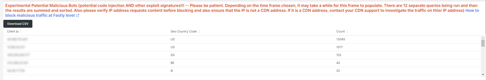
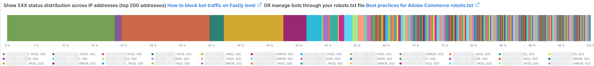

# La ficha [!UICONTROL bots]

Esta ficha contiene información que explica cómo identificar si y qué [!DNL bots] están causando problemas en el sitio.

## Descripción general de alto nivel de [!DNL bots]:

* Un [!DNL bot] es un software que ejecuta tareas automatizadas repetitivas. Con la evolución de la inteligencia artificial y el aprendizaje automático, las tareas, los métodos y las interacciones de [!DNL bots] están cambiando. Hay *buenos* [!DNL bots] que benefician a los sitios al rastrearlos y agregarlos a los motores de búsqueda de Internet. Esto hace que los usuarios de Internet sean guiados al sitio a través de los resultados de los motores de búsqueda. Un *buen* [!DNL bot] generalmente respeta los límites colocados en el [!DNL bot] por un archivo de `robots.txt` o la configuración de una consola de motor de búsqueda. Los límites pueden restringir el acceso al sitio o a partes del sitio.
* Los [!DNL bots] malintencionados omiten el archivo `robots.txt` o pueden suplantar un [!DNL bot] correcto a través del campo del agente de usuario de solicitud de los datos de solicitud HTTP. Algunas cosas que hacen los [!DNL bots] malintencionados:
   * Añada la carga a un sitio para denegar el acceso al sitio a los usuarios legítimos.
   * Rascar y reutilizar contenido sin permiso.
   * Registre cuentas falsas para inundar servicios o direcciones de correo electrónico o redirigir a otros sitios ([!DNL SPAM bots]).
   * Crear vistas falsas ([!DNL Viewbots]).
   * Comprar productos o tickets ([!DNL Focused bots]).
* Administrando [!DNL bots]
   * [!DNL Observation for Adobe Commerce] tiene vistas de [!DNL bot] tráfico:
      * Muestra la actividad total [!DNL bot] sin caché que muestra la carga que un [!DNL bot] está agregando a un sitio y cuándo se está produciendo esa carga.
      * Muestra los [!DNL bots] que están generando errores. Normalmente, si un [!DNL bot] agrega carga que causa problemas en el sitio, esa [!DNL bot] o dirección IP tiene la mayor frecuencia de errores.
      * Muestra nombres de [!DNL bot] (valores de campo de agente de usuario de solicitud) y direcciones IP para administrar mediante:
         * [!DNL Fastly] (limitación de velocidad o [!DNL VCLs] que bloquean direcciones IP, intervalos o [!DNL bots] por valor de nombre).
         * Agregando información de [!DNL bot] correcta a `robots.txt field` para restringir o limitar la tasa de acceso al sitio.
         * Administrando [!DNL Bing] o [!DNL Google bots] a través de la consola del motor de búsqueda.

## [!UICONTROL Experimental Potential Malicious Bots frame]

El marco **[!UICONTROL Experimental Potential Malicious Bots frame]** ejecuta más de 12 consultas separadas y complejas. Detecta firmas de solicitudes de IP malintencionadas y, a continuación, agrega los resultados, los suma y los ordena por recuento en orden descendente. Las consultas contienen una multitud de firmas de vulnerabilidades CVE y otras solicitudes malintencionadas. Incluso cuando las vulnerabilidades están bloqueadas por correcciones/parches de seguridad y no son una amenaza para el sitio, la solicitud debe ser gestionada por el sitio web. El volumen de solicitudes puede llegar a ser bastante significativo en un corto periodo de tiempo. Este marco no muestra las solicitudes totales de la dirección IP, sino las solicitudes que tienen señales que indican que la solicitud tenía intención sospechosa.

Asegúrese de comprobar que el tráfico es sospechoso y que no se origina desde una dirección [!DNL Content Distributed Network] (CDN) que también pueda estar enviando solicitudes válidas. Si se determina que las solicitudes provienen de una dirección IP de CDN, póngase en contacto con ese proveedor de servicios para que le ayude a bloquear el tráfico sospechoso a través de su red. Si necesita bloquear la dirección o solicitar URL, consulte [Bloquear el tráfico malintencionado para Adobe Commerce en [!DNL Fastly] nivel](https://experienceleague.adobe.com/docs/commerce-knowledge-base/kb/how-to/block-malicious-traffic-for-magento-commerce-on-fastly-level.html) en la Base de conocimiento de asistencia de Adobe Commerce.

## [!UICONTROL Rate of HTTP request per second (top 25) during requested time period]

El fotograma **[!UICONTROL Rate of HTTP request per second (top 25) during requested time period]** muestra las solicitudes más altas por segundo de direcciones IP durante el lapso de tiempo seleccionado. Si estas direcciones también se encuentran en la tabla anterior, asegúrese de que no sean direcciones CDN ni malintencionadas y bloquéelas a través de [!DNL Fastly].

## [!UICONTROL Total Bot traffic by bot name]:

La tabla **[!UICONTROL Total Bot traffic by bot name during selected time period]** contiene el recuento agregado de solicitudes no almacenadas en caché donde el campo [!UICONTROL request_user_agent] tiene una cadena de [!DNL bots] en el valor. Este puede ser o no el [!DNL bot] con nombre, ya que el valor del campo [!UICONTROL request_user_agent] se puede suplantar. El valor bajo la columna [!UICONTROL Count] es el más importante.

## [!UICONTROL Total Bot Traffic by Bot name/IP address]

La tabla **[!UICONTROL Total Bot Traffic by Bot name/IP address during selected time period How to block bot traffic on Fastly level OR manage bots through your robots.txt file Best practices for Adobe Commerce robots.txt]** muestra los mismos datos que la tabla anterior, pero agrega direcciones IP que realizan las solicitudes en nombre de [!DNL bot]. Por ser [!DNL bots] maliciosas [!DNL bots] que simulan ser buenas, las direcciones IP deben verificarse a través de sitios web que identifiquen direcciones IP abusivas o a través de servicios de *whois* o [!DNL DNS lookups]. Por ejemplo, [!DNL Google] publica sus [[!DNL googlebot] direcciones IP](https://developers.google.com/search/apis/ipranges/googlebot.json) y [!DNL Microsoft] tiene una herramienta de comprobación para [[!DNL Bingbots]](https://www.bing.com/webmasters/help/Verify-Bingbot-2195837f).

## [!UICONTROL Graph - Bots with HTTP status errors]

El gráfico **[!UICONTROL Graph - Bots with HTTP status errors during selected time period How to block bot traffic on Fastly level OR manage bots through your robots.txt file Best practices for Adobe Commerce robots.txt]** muestra errores en [!DNL bots] que se declaran a sí mismos en el campo del agente de usuario de solicitud. Esto no significa necesariamente que el error esté causado por el volumen del [!DNL bot] u otro tráfico. Los errores podrían ser que [!DNL bot] está solicitando información que no existe o que hay otro problema en la solicitud.

Si hay un pico de errores en las direcciones IP durante la inestabilidad o la interrupción del sitio, podrían ser sospechosos del problema del sitio.

## [!UICONTROL Table - IPs that do not identify as bots]

La tabla **[!UICONTROL Table - IPs that do not identify as bots with HTTP status errors during selected time period How to block bot traffic on Fastly level OR manage bots through your robots.txt file Best practices for Adobe Commerce robots.txt]** mostrará las solicitudes de IP con códigos de estado http que no sean 200 y que NO se identifiquen automáticamente como [!DNL bots] en el campo del agente de usuario de solicitud. Estas direcciones IP podrían ser direcciones IP malintencionadas, especialmente si los recuentos son altos para el período de tiempo seleccionado.

Si los recuentos del código de estado http no 200 son bajos y los intervalos de direcciones IP no son similares, es posible que las direcciones no contribuyan a los problemas del sitio.

## [!UICONTROL Table – Cache Status 'ERROR']

Cuando las direcciones IP generan una alta frecuencia de errores, pregunte ¿qué están haciendo? La tabla **[!UICONTROL Table – Cache Status 'ERROR' detail table (what are these IPs doing?) How to block bot traffic on Fastly level OR manage bots through your robots.txt file Best practices for Adobe Commerce robots.txt]** mostrará la dirección URL solicitada junto con el valor de estado HTTP para las solicitudes que tengan un valor de estado de caché [!UICONTROL ERROR]. La dirección URL faceta la frecuencia, por lo que el recuento puede ser bajo. Recuerde que la dirección IP puede estar realizando miles de solicitudes durante el período de tiempo seleccionado. Esta es una vista de hasta 2000 solicitudes durante el lapso de tiempo (el límite de visualización de registros).

## [!UICONTROL Show 5XX status distribution]

El fotograma **[!UICONTROL Show 5XX status distribution across IP addresses (top 200 addresses) How to block bot traffic on Fastly level OR manage bots through your robots.txt file Best practices for Adobe Commerce robots.txt]** es potente. Muestra las direcciones IP que tienen códigos de estado http 5XX durante el período de tiempo seleccionado. Si una dirección IP realiza un gran volumen de solicitudes y el sitio se ve afectado hasta el punto de no poder administrar el tráfico, las direcciones IP que realizan la mayor frecuencia de solicitudes tendrán generalmente el mayor volumen de errores. Los códigos de estado http 5XX suelen indicar un sitio que tiene problemas para responder a las solicitudes.

Cuanto más ancha sea la barra, mayor será el porcentaje de errores que la dirección IP tiene en el número total de errores 5xx durante ese período de tiempo. Nota: una dirección IP puede tener varios segmentos en el gráfico si tiene varios códigos de estado http (por ejemplo, estados http 502 y 503).

La distribución típica se indicaría en el lado derecho de la barra, donde las direcciones IP tienen la misma anchura, o habría algunas barras anchas con recuentos muy bajos.

Si pasa el ratón por encima del segmento de barra, se mostrará el número de errores indicados durante el período de tiempo seleccionado.

## [!UICONTROL IP cache status (MISS, PASS, ERROR) and HTTP status]

Este fotograma de **[!UICONTROL IP cache status (MISS, PASS, ERROR) and HTTP status during selected time period How to block bot traffic on Fastly level OR manage bots through your robots.txt file Best practices for Adobe Commerce robots.txt]** muestra el recuento de código de estado HTTPS y las solicitudes no almacenadas en caché por dirección IP en el lapso de tiempo seleccionado. Esto indica la carga proporcional de cada dirección IP y el volumen total. Muestra las direcciones IP con la mayor cantidad de solicitudes.

## [!UICONTROL Fastly Cache Summary for selected time period]

Si hace clic en el icono [!UICONTROL Error] del gráfico siguiente, podrá comparar los dos últimos gráficos entre sí. Esto puede ayudar a indicar dónde contribuye la carga a los problemas del sitio.

## [!UICONTROL Graph - IPs that do not identify as bots]

El marco **[!UICONTROL Graph - IPs that do not identify as bots without error during selected time period How to block bot traffic on Fastly level OR manage bots through your robots.txt file Best practices for Adobe Commerce robots.txt]** muestra el campo del agente de usuario de solicitud, la dirección IP y el código de estado de las solicitudes en las que el campo del agente de usuario de solicitud no indica un [!DNL bot]. Este marco puede mostrar solicitudes de alta frecuencia desde cualquier dirección IP, pero preste atención a las solicitudes de alta frecuencia, especialmente durante un período de tiempo en el que el sitio puede tener problemas.

## [!UICONTROL Graph - Suspicious Non-Bot traffic]

El gráfico **[!UICONTROL Graph - Suspicious Non-Bot traffic during selected time period]** busca un valor de agente de usuario de solicitud de Go-http-client, pero se ampliará para buscar otros valores de agente de usuario de solicitud sospechosos. Este valor de agente de usuario de solicitud lo utilizan los sitios para conectarse desde los servicios y puede ser válido, pero también lo utilizan [!DNL bots] malintencionados.

## [!UICONTROL Graph - Bot traffic by Bot name]

El fotograma **[!UICONTROL Graph - Bot traffic by Bot name during selected time period]** muestra los mismos datos que el tráfico de bots total por nombre de [!DNL Bot] durante la tabla de períodos de tiempo seleccionada en la parte superior de la pestaña. Muestra los datos a través de la cronología para que pueda ver cuándo se realizan las solicitudes de [!DNL bots] y sus distribuciones.

## [!UICONTROL Graph - Top 250 Bot Names and IP addresses]

El marco **[!UICONTROL Graph - Top 250 Bot Names and IP addresses during selected time period How to block bot traffic on Fastly level OR manage bots through your robots.txt file Best practices for Adobe Commerce robots.txt]** muestra los mismos datos que el tráfico total [!DNL Bot] por nombre de bot/dirección IP durante la tabla de período de tiempo seleccionado en la parte superior de la pestaña. Muestra los datos a través de la cronología y los faceta por dirección IP. Esto muestra cuándo se realizan las solicitudes de [!DNL bots], qué dirección IP realiza las solicitudes y las distribuciones de las solicitudes.

## [!UICONTROL Blocked Bot name / IP addresses (in Fastly)]

El marco **[!UICONTROL Blocked Bot name / IP addresses (in Fastly) during selected time period. This graph displays bot traffic and IPs that were returned a 403 Forbidden HTTP Status code]** muestra el nombre del bot y las direcciones IP que están bloqueadas. Puede ver en este gráfico cómo se bloquean todas las solicitudes en [!DNL Fastly] a partir de ahora.

## [!UICONTROL Blocked non-Bot name / IP addresses (in Fastly)]

El marco **[!UICONTROL Blocked non-Bot name / IP addresses (in Fastly) during selected time period graph displays non-bot traffic and IPs that were returned a 403 Forbidden HTTP Status code]** muestra las direcciones IP que no se identifican como [!DNL bot] y que han sido bloqueadas a través de [!DNL Fastly].

## [!UICONTROL This table shows the number of user agents per IP address, number of successful, unsuccessful and blocked requests:]

Los(as) [!DNL bots] malintencionados a menudo suplantan a otros [!DNL bots] a través del valor del campo [!UICONTROL Request User Agent]. Esta tabla muestra cuántos valores únicos tiene la dirección IP en ese campo. Cuanto mayor sea el valor en el campo [!UICONTROL Request User Agent], más sospechosa será la dirección IP.

## [!UICONTROL IP with non-200 status errors]

El marco **[!UICONTROL IP with non-200 status errors – without 403 status]** muestra la distribución en el intervalo de tiempo seleccionado de direcciones IP con códigos de estado HTTP distintos de 200. Cuando observa valores más altos en una sola dirección IP o en un grupo de direcciones IP, requieren más investigación.

## [!UICONTROL IP with 403 status codes:]

El marco **[!UICONTROL IP with 403 status codes]** muestra solicitudes sin caché sin [!UICONTROL cache_status=ERROR] que tienen un estado HTTP 403. Esto puede mostrar que el servidor de origen es el origen del error 403 (sin autorización) en lugar de un bloque de [!DNL Fastly].

## [!UICONTROL Top 5 with non-200 status codes]

La tabla **[!UICONTROL Top 5 with non-200 status codes showing cache_status]** muestra a nivel de IP/estado los recuentos de cada uno con el valor [!UICONTROL cache_status].

## [!UICONTROL Pageview Latency will show as spikes]

El marco **[!UICONTROL Pageview Latency will show as spikes on this graph:]** muestra la latencia de carga de página/respuesta de API que puede estar en línea con el tráfico [!DNL bot].
