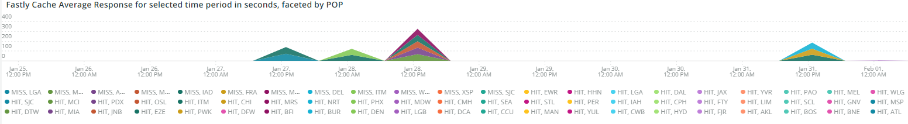

# La variable [!UICONTROL CDN] ficha

Esta pestaña tiene información centrada en el [!DNL content delivery network (CDN)]. En el caso de Adobe Commerce Cloud, esta es la [!DNL Fastly] servicio.

## [!UICONTROL HIT rate]

La variable **[!UICONTROL HIT rate]** frame muestra el número de solicitudes almacenables en caché que resultaron en [!UICONTROL HITS] en el último minuto. Esto indica que el almacenamiento en caché se ha realizado correctamente. La flecha a la derecha mostrará el porcentaje por encima o por debajo de la misma hora hace una semana.

## [!UICONTROL HIT Processing]

Esta **[!UICONTROL HIT processing]** muestra el número de solicitudes almacenables en caché que resultaron en [!UICONTROL HITS] durante la semana.

## [!UICONTROL MISS rate]

Esta **[!UICONTROL MISS rate]** muestra el número de errores de solicitudes almacenables en caché en el último minuto. Un error se produce cuando la solicitud no se almacena en caché y debe pasarse al servidor de origen para que sirva el contenido. El valor a la derecha es la comparación de aumento/disminución con el número de minutos por minuto una semana antes.

## [!UICONTROL MISS time]

## [!UICONTROL HIT Ratio]

## [!UICONTROL Error Percentage]

La variable **[!UICONTROL Error Percentage]** muestra el valor del porcentaje de ERROR de las solicitudes y muestra el aumento/disminución relativo comparado con el mismo tiempo una semana antes.

## [!UICONTROL Total Requests]

## [!UICONTROL ERROR rate]

## [!UICONTROL Fastly Cache Average Response for selected time period in seconds]

Este fotograma muestra la duración en segundos de las solicitudes almacenables en caché, lo que significa que si una `cache_response` es [!UICONTROL MISS], muestra el promedio de respuestas en caché perdidas durante el tiempo seleccionado.

## [!UICONTROL Fastly Cache Average Response for selected time period in seconds, faceted by POP]

## [!UICONTROL Total Bandwidth (All POPs) during the selected timeframe, compared with 1 week ago (% increase/decrease)]

## [!UICONTROL Requests – Since selected timeframe compared with one week ago]

Este marco es similar al cuadro de resumen de [!UICONTROL Total Requests] en la parte superior, pero muestra los recuentos de solicitudes de las semanas anteriores. Todas son solicitudes, no solo solicitudes almacenables en caché (donde `is_cacheable` es true).

## [!UICONTROL Response Count]

## [!UICONTROL Bandwidth by POP]

## [!UICONTROL Top 5 URLs (5xx or 3xx status codes)]

La variable **[!UICONTROL Top 5 URLs]** la vista muestra las 5 direcciones URL principales que están experimentando respuestas de error 5xx o 3xx. Debido a la restricción de espacio, tendrá que pasar el ratón por encima de la dirección URL para ver el código de error específico asociado a esa dirección URL. (ejemplo en el cuadro rojo de la figura anterior).

## [!UICONTROL Top 25 URLs (200 status)]

La variable **[!UICONTROL Top 25 URLs]** frame muestra las direcciones URL que devolvieron un estado de 200 por recuento durante el intervalo de tiempo seleccionado.

## [!UICONTROL Duration by Response Status]

La variable **[!UICONTROL Duration by Response Status]** gráfico muestra las respuestas de error por recuento durante el intervalo de tiempo seleccionado, desglosado por el código de estado de error.

## [!UICONTROL Duration by Response Status, top 25 urls]

La variable **[!UICONTROL Duration by Response Status, top 25 URLs]** El gráfico muestra las 25 direcciones URL principales por la duración de la respuesta en segundos. Es posible que tenga que pasar el ratón por encima de la dirección URL para ver la ruta completa. Además, para eliminar todas las direcciones URL excepto una, haga clic en esa dirección URL. A continuación, puede volver a añadir otras direcciones URL haciendo clic en ellas individualmente. Si desea eliminar direcciones URL individuales, puede mantener la clave y hacer clic en cada URL para eliminarlas del gráfico.

## [!UICONTROL Duration by Response Status, top 25 non-200 status]

La variable **[!UICONTROL Duration by Response Status, top 25 non-200 status]** es similar al último, excepto que el enfoque se centra en códigos de estado que no sean 200 o códigos de estado de error. Muestra el código de error y la dirección URL. Es posible que tenga que pasar el ratón por encima de la dirección URL para ver la ruta completa. Además, para eliminar todas las direcciones URL excepto una, haga clic en esa dirección URL. A continuación, puede volver a añadir otras direcciones URL haciendo clic en ellas individualmente. Si desea eliminar direcciones URL individuales, puede mantener la clave y hacer clic en cada URL para eliminarlas del gráfico.

## [!UICONTROL Error Count by POP timeline]

La variable **[!UICONTROL Error Count by POP timeline]** gráfico muestra el recuento de estados de error a lo largo de la cronología del marco de tiempo seleccionado, faceteado por el código de error.

## [!UICONTROL Duration by Response status, top 25 client IP, non-200 status]

La variable **[!UICONTROL Duration by Response status, top 25 client IP, non 200 status]** en el gráfico se muestran las direcciones IP por la duración media en el intervalo de tiempo seleccionado donde había códigos de error de estado.

## [!UICONTROL IP Frequency]

La variable **[!UICONTROL IP Frequency]** frame cuenta los estados (&quot;MISS&quot; y &quot;PASS&quot;) para cada IP desde el [!DNL Fastly] registros. Las solicitudes web con estos estados llegan al servidor de origen y añaden carga al servidor. Muestra las veinte direcciones principales con frecuencia. Este marco se puede utilizar para detectar ataques IP o fuentes de carga pesada en un sitio web. Este gráfico también está presente en la pestaña resumen y se coloca aquí para facilitar la comparación con más detalles sobre la [!DNL Fastly] la información de registro se muestra en esta pestaña.
