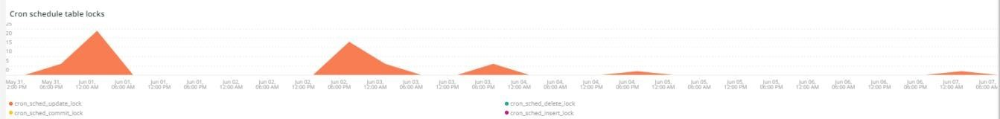

# La variable [!DNL Cron] ficha

Esta pestaña es un intento de aislar rápidamente los problemas y las causas de [!DNL cron] problemas.

## [!UICONTROL Cron transaction duration in seconds]

La variable **[!UICONTROL Cron transaction duration in seconds]** visualizaciones de marco [!DNL crons] duración de la transacción en segundos. Esto mostrará las transacciones que tienen largos tiempos de ejecución. Una profundización en APM mostrará más detalles sobre qué consulta se está ejecutando la transacción/operación.

## [!UICONTROL MySQL Non-Sleeping Threads by Node]

La variable **[!UICONTROL MySQL Non-Sleeping Threads by Node]** frame muestra los subprocesos no duraderos de MySQL por nodo en el intervalo de tiempo seleccionado.

## [!UICONTROL SQL Trace count by path]

La variable **[!UICONTROL SQL Trace count by path]** frame observa los recuentos de rastreo MySQL por ruta, lo que puede ayudar a rastrear las sentencias SQL a través de un intervalo de tiempo seleccionado.

## [!UICONTROL Cron database call]

La variable **[!UICONTROL Cron database call]** frame observa el número de [!DNL crons] llamar a la base de datos en un intervalo de tiempo seleccionado.

## [!UICONTROL Cron schedule table locks]

La variable **[!UICONTROL Cron schedule table locks]** aspectos del marco [!DNL cron] programar bloqueos de tabla en un intervalo de tiempo seleccionado.

## [!UICONTROL Cron schedule clean cron fired]

La variable **[!UICONTROL Cron schedule clean cron fired]** frame observa el número de [!DNL crons] se limpian en un intervalo de tiempo seleccionado. Si no se muestran datos en este marco, podría indicar un problema con [!DNL crons] se ejecuta correctamente. Si la variable [!DNL cron] la programación de trabajos no se limpia, [!DNL crons] no se ejecutará de forma óptima y puede tardar más en ejecutarse.

## [!UICONTROL Cron schedule clean records details table]

La variable **[!UICONTROL Cron schedule clean records details table]** la tabla proporciona detalles sobre el trabajo para limpiar registros de la `cron_schedule` en un intervalo de tiempo seleccionado.

## [!UICONTROL cron_schedule table updates]

La variable **[!UICONTROL cron_schedule table updates]** frame observa el número de [!DNL cron] actualizaciones de tabla programadas en un intervalo de tiempo seleccionado. La elevada actividad en la eliminación o actualización de esta tabla puede indicar un problema con [!DNL crons]. Además, [!DNL crons] actualice esta tabla cuando se ejecute y complete, de modo que si no hay actividad en esta tabla y hay [!DNL crons] configurado, podría haber un problema con [!DNL crons].

## [!UICONTROL Datastore Operations Tables]

La variable **[!UICONTROL Datastore Operations Tables]** busca las operaciones de tablas de base de datos, incluyendo `SELECT`, `DELETE`y `UPDATE` en un intervalo de tiempo seleccionado. Este marco muestra las tablas de la base de datos con la frecuencia de operación más alta contra ellas.
