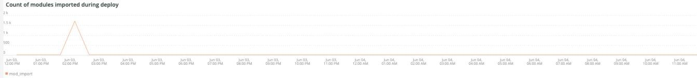

# La variable [!UICONTROL Deploy] ficha

Esta pestaña es un intento de aislar rápidamente los problemas y las causas de los problemas de implementación.

## [!UICONTROL Deploy log Deployment Troubleshooter]

La variable **[!UICONTROL Deploy log Deployment Troubleshooter]** muestra un recuento de eventos de registro de implementación que se produjeron en el intervalo de tiempo seleccionado. La intención es proporcionar una vista rápida de la actividad de implementación y determinar la complejidad de la implementación según el recuento. Cuantos más mensajes se registren, más compleja suele ser la implementación.

## [!UICONTROL Deploy State]

La variable **[!UICONTROL Deploy State]** muestra los eventos de implementación que se produjeron en el intervalo de tiempo seleccionado. El analizador de este fotograma está buscando estas señales específicas:

* &#39;%AVISO: Iniciando generate command%&#39;) como &#39;start_gen&#39;
* &#39;%git aplique /app/provider/magento/ece-tools/patches%&#39;) como &#39;apply_patches&#39;
* Indicador &#39;%Set: .static_content_deploy%&#39;) como &#39;SCD&#39;
* &#39;%AVISO: Generar comando completado%) como &#39;gen_compl&#39;
* &#39;%AVISO: Iniciando implementación.%&#39;) como &#39;start_deploy&#39;
* &#39;%AVISO: Implementación completada%) como &#39;deploy_compl&#39;
* &#39;%AVISO: Iniciando post-implementación.%&#39;) como &#39;start_deploy&#39;
* &#39;%AVISO: El posdespliegue se ha completado (%) como &quot;implementación&quot;
* &#39;%deploy-complete%&#39;) como &#39;cl_deploy_compl&#39;

## [!UICONTROL Deploy Log Detail]

La variable **[!UICONTROL Deploy Log Detail]** muestra los detalles del resumen del mensaje de registro de implementación que se produjeron en el intervalo de tiempo seleccionado. El marco está analizando las siguientes cadenas en los registros de implementación:

* &#39;%AVISO: Iniciando implementación.%&#39;) como &#39;start_ply&#39;
* &#39;%INFO: Situaciones de inicio: scenario/deploy.xml%) como &#39;start_scenario&#39;
* &#39;%AVISO: Iniciando pre-deploy%) como &#39;strt_predply&#39;
* &#39;% INFO: Restaurando el archivo de registro de parches%) como &#39;rstr_ptch_log&#39;
* &#39;%INFO: Actualizando la configuración de la caché.%&#39;) como &#39;updt_cach_config&#39;
* &#39;%INFO: Establecer conexión esclava de Redis%) como &#39;redis_sec_conn_set&#39;
* &#39;%INFO: La implementación de contenido estático se realizó durante el enlace de compilación, limpiando el contenido antiguo%&#39;) como &#39;scd_build_hk&#39;
* &#39;%INFO: Borrando pub/static%) como &#39;clr_pub_static&#39;
* &#39;%NFO: Borrando caché de redirección:%) como &#39;clr_redis_cach&#39;
* &#39;%INFO: Borrando var/cache directory%&#39;) como &#39;clr_var_cach&#39;
* &#39;% AVISO: Habilitar el modo de mantenimiento%) como &#39;enable_maint_mode&#39;
* &#39;%INFO: Deshabilitar cron%) como &#39;disable_cron&#39;
* &#39;%INFO: Tratando de matar trabajos cron en ejecución y consumidores procesa%&#39;) como &#39;kill_cron_try&#39;
* &#39;%INFO: No se encontraron procesos de ejecución de Magento cron y consumidores.%&#39;) como &#39;no_cron_fnd&#39;,
* %AVISO: Validando la configuración%&#39;) como &#39;validate_config&#39;
* &#39;%Se necesitan los siguientes datos administrativos para crear un usuario administrador durante la instalación inicial%&#39;) como &#39;no_admin&#39;
* &#39;%versión PHP recomendada que cumple la restricción%&#39;) como &#39;php_ver_constraint&#39;
* &#39;%WARNING: Corregir la configuración con sugerencias dadas:%) como &#39;fix_config_sugg&#39;
* &#39;%WARNING: [2003] No se ha configurado el valor de nivel de anidación de directorios para los informes de errores.%&#39;) como &#39;nest_err_reporting&#39;
* &#39;%AVISO: Fin de validación%) como &#39;end_validation&#39;
* &#39;%AVISO: Iniciando actualización.%&#39;) como &#39;start_update&#39;
* &#39;%INFO: Actualizando env.php.%&#39;) como &#39;update_php_env&#39;
* &#39;%INFO: Actualizando la configuración de conexión de base de datos env.php.%&#39;) como &#39;update_php_env_db&#39;
* &#39;%INFO: Actualizando la configuración AMQP de env.php%&#39;) como &#39;update_php_env_amqp&#39;
* &#39;%INFO: Establezca el motor de búsqueda en: elasticsearch7%) como &#39;set_elastic7&#39;
* &#39;%elasticsearch 6.5.4 ha pasado EOL%&#39;) como &#39;elastic_ver_EOL&#39;
* &#39;%INFO: Establezca el motor de búsqueda en: elasticsearch6%) como &#39;set_elastic6&#39;
* &#39;%INFO: Actualización de direcciones URL seguras y no seguras%) como &#39;update_urls&#39;
* &#39;%INFO: Ejecución de la actualización de configuración.%&#39;) como &#39;setup_upgrade_run&#39;
* &#39;%INFO: Enlaces posteriores a la implementación habilitados. Habilitación de cron, limpieza de caché y operaciones de precalentamiento se posponen%) como &#39;post_lock_enabled&#39;
* &#39;%AVISO: El modo de mantenimiento está desactivado.%&#39;) como &#39;maint_mode_disabled&#39;
* &#39;%INFO: Escenario(s) finalizado(s)%&#39;) como &#39;scenario_finalizado&#39;
* &#39;%WARNING: Mantenimiento del comando:enable finalizó con un error. Creación de un archivo de marca de mantenimiento%&#39;) como &#39;enable_maintenance_failed&#39;
* &#39;%El servidor MySQL ha desaparecido%&#39;) como &#39;MySQL_has_away_away&#39;

## [!UICONTROL Post Deploy Log Detail]

La variable **[!UICONTROL Post Deploy Log Detail]** muestra los detalles del registro posterior a la implementación que se produjeron en el intervalo de tiempo seleccionado. Este marco se centra en determinados mensajes de registro que contienen las siguientes cadenas:

* &#39;%Modo de mantenimiento desactivado%&#39;) como &#39;disabled_maint_mode&#39;
* &#39;%INFO: Situaciones de inicio: scenario/post-deploy.xml%) como &#39;start_pstdply_scenario&#39;
* &#39;% AVISO: Validando la configuración%&#39;) como &#39;val_config&#39;
* &#39;% AVISO: Fin de validación%) como &#39;end_val_config&#39;
* &#39;%INFO: Habilitar cron%&#39;) como &#39;cron_enabled&#39;
* &#39;% INFO: Cree una copia de seguridad de archivos importantes.%&#39;) como &#39;file_backup&#39;
* &#39;%INFO: Copia de seguridad creada correctamente (%) como &#39;file_backup_success&#39;
* &#39;%INFO: Iniciando el calentamiento de la página%) como &#39;pg_warmup_start&#39;
* &#39;%INFO: Página calentada:%) como &quot;warmed_up_pg&quot;
* &#39;%ERROR: Error en el calentamiento:%) como &#39;hot_up_pg_err&#39;
* &#39;% INFO: Escenario(s) finalizado(s)%&#39;) como &#39;scenario_finalizado&#39;

## [!UICONTROL Cloud Log Detail]

La variable **[!UICONTROL Cloud Log Detail]** frame muestra los detalles del registro de nube que se produjeron en el intervalo de tiempo seleccionado. Las siguientes cadenas se analizan y se devuelven con la etiqueta &quot;AS&quot; a continuación:

* &#39;%DEBUG: /bin/bash -c &quot;set -o pipefailure; php ./bin/magento setup:upgrade%) como &#39;start_update&#39;
* &#39;%Creación/actualizaciones de esquema:%&#39;) como &#39;schema_updates&#39;
* &#39;%Nada que importar.%&#39;) como &#39;mod_import_finish&#39;
* &#39;%AVISO: Fin de la actualización.%&#39;) como &#39;update_completed&#39;
* &#39;%DEBUG: Paso en ejecución: deploy-static-content%) como &#39;scd_run&#39;
* &#39;% AVISO: Omitiendo la implementación de contenido estático. SCD On Demand está habilitado.%&#39;) como &#39;scd_ondemand&#39;
* &#39;%INFO: Clearing%&#39;) como &#39;clr_dirs&#39;
* &#39;%DEBUG: El paso &quot;deploy-static-content&quot; (finalizado%) como &quot;scd_completed&quot;
* &#39;%AVISO: Omitiendo la compresión de contenido estático. SCD On Demand está habilitado.%&#39;) como &#39;scd_compression_run&#39;,
* &#39;%INFO: Borrando var/cache directory%&#39;) como &#39;clr_var_cach&#39;
* &#39;%DEBUG: Paso &quot;comprimir-contenido estático&quot; finalizado%&quot;) como &quot;scd_compression_completed&quot;
* &#39;%DEBUG: Paso en ejecución: deploy-complete%) como &#39;deploy_completed&#39;
* &#39;%INFO: Enlaces posteriores a la implementación habilitados. Las operaciones de activación de cron, limpieza de caché y precalentamiento se posponen para la fase posterior al despliegue.%&#39;) como &#39;Post_deploy_lock_enabled&#39;
* &#39;%AVISO: El modo de mantenimiento está desactivado.%&#39;) como &#39;maint_mode_disabled&#39;
* &#39;%INFO: Escenario(s) finalizado(s)%&#39;) como &#39;scenario_finalizado&#39;
* &#39;%post-deploy.xml%&#39;) como &#39;post_deploy_start&#39;
* &#39;%AVISO: Validando la configuración%&#39;) como &#39;validate_config&#39;
* &#39;%WARNING: [2003] No se ha configurado el valor de nivel de anidación de directorios para los informes de errores.%&#39;) como &#39;nest_err_reporting&#39;
* &#39;%AVISO: Fin de validación%) como &#39;end_validation&#39;
* &#39;%INFO: Habilitar cron%&#39;) como &#39;enable_cron&#39;
* &#39;%INFO: Crear copia de seguridad de archivos importantes%) como &quot;create_backup&quot;
* &#39;%DEBUG: Paso &quot;copia de seguridad&quot; finalizado%) como &quot;backup_completed&quot;
* &#39;%INFO: Iniciando el calentamiento de la página%) como &#39;warmup_start&#39;
* &#39;%ERROR: Error en el calentamiento:%) como &#39;hot_up_failed&#39;
* &#39;%DEBUG: Paso &quot;calentamiento&quot; finalizado%&quot;) como &quot;warmup_completed&quot;
* &#39;% DEBUG: Paso &quot;tiempo hasta el primer byte&quot; finalizado%&quot;) como &quot;ttfb_completed&quot;
* &#39;%INFO: Escenario(s) finalizado(s)%) como &#39;post_deploy_completed&#39;
* &#39;%DEBUG: Paso en ejecución: pre-build%) como &#39;run_pre-build&#39;
* &#39;%DEBUG: El indicador .static_content_deploy ya se ha eliminado%) como &#39;scd_flag_del&#39;
* &#39;%DEBUG: Paso &quot;precompilar&quot; finalizado%&quot;) como &quot;pre-build_completed&quot;
* &#39;%AVISO: Aplicar parches%) como &quot;apply_patches&quot;
* &#39;%se ha aplicado%&#39;) como &#39;parches_aplicados&#39;
* &#39;%DEBUG: El paso &quot;apply-patches&quot; ha finalizado%) como &quot;apply_patches_complete&quot;
* &#39;%Implementar usando quick strategy%&#39;) como &#39;quick_strategy_deploy&#39;
* &#39;% AVISO: Ejecución de la compilación de ID%) como &#39;di_compliation_start&#39;
* &#39;%AVISO: Finalización de la ejecución de la compilación de ID%) como &#39;di_compliation_completed&#39;
* &#39;%AVISO: Generación de contenido estático nuevo%) como &#39;gen_frsh_static_content&#39;
* Configuración de &#39;%magento:static-content:deploy%&#39;) como &#39;scd_execution&#39;
* &#39;%AVISO: Fin de la generación de contenido estático nuevo (%) como &#39;gen_frsh_static_cont_completed&#39;
* &#39;%INFO: Situaciones de inicio: scenario/build/transfer.xml%&#39;) como &#39;start_transferxml&#39;
* &#39;%INFO: Tratando de matar a los trabajos de cron&#39;%) como &#39;kill_crons&#39;
* &#39;%INFO: Borrando caché de redirección:%) como &#39;clear_redis_cache&#39;
* &#39;%INFO: Comprobando si db existe y hastables%) como &#39;db_check&#39;
* &#39;%WARNING: [2010] El servicio de Elasticsearch se instala en la capa de infraestructura, pero no se utiliza como motor de búsqueda.%&#39;) as&#39;es_not_used&#39;
* &#39;%AVISO: Iniciando actualización.%&#39;) como &#39;startup_update&#39;
* &#39;%INFO: Establezca el motor de búsqueda en: mysql%&#39;) como &#39;mysql_search&#39;
* &#39;%SQLSTATE[HY000] [2006] El servidor MySQL ha desaparecido%) como &#39;mysql_away&#39;

## [!UICONTROL Count of modules imported during deploy]

La variable **[!UICONTROL Count of modules imported during deploy]** frame muestra el número de módulos importados durante la implementación en el intervalo de tiempo seleccionado.

## [!UICONTROL Deployed module list]

La variable **[!UICONTROL Deployed module list]** muestra los módulos implementados en el intervalo de tiempo seleccionado.

