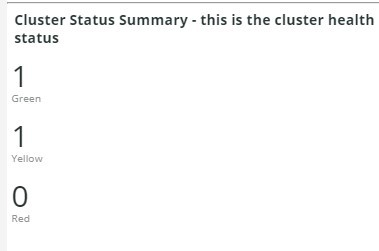
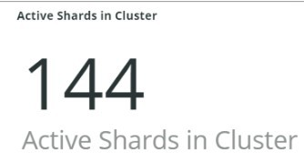

# El [!UICONTROL Elasticsearch] pestaña

## [!UICONTROL Cluster Status Summary]:

Durante el periodo de tiempo seleccionado, la variable **[!UICONTROL Cluster Status Summary]** marco muestra los estados de color que [!DNL Elasticsearch] clúster ha pasado. En este ejemplo, durante el periodo de tiempo seleccionado, el clúster estaba en estado Verde una vez y en estado Amarillo una vez durante el periodo de tiempo seleccionado.

## [!UICONTROL Active Primary Shards]

El **[!UICONTROL Active Primary Shards]** marco muestra los distintos números en función del número de fragmentos principales activos para el de la cuenta seleccionada [!DNL Elasticsearch] servicio.

Desde [!DNL Elasticsearch]: la guía definitiva [2.x]:

&quot;En [Índices actualizables dinámicamente](https://www.elastic.co/guide/en/elasticsearch/guide/2.x/dynamic-indices.html), explicamos que un fragmento es un índice Lucene y que un [!DNL Elasticsearch] index es una colección de fragmentos. La aplicación habla con un índice y [!DNL Elasticsearch] enruta las solicitudes a los fragmentos adecuados. Un fragmento es la unidad de escala. El índice más pequeño que puede tener es uno con un solo uso compartido. Esto puede ser más que suficiente para sus necesidades (un solo fragmento puede contener muchos datos), pero limita su capacidad de escalado&quot;.

Cuando se crea un índice, hay varios fragmentos creados con él. De forma predeterminada, se asignan cinco fragmentos principales a cada nuevo índice, lo que significa que un índice se puede distribuir en cinco nodos (un fragmento por nodo). También hay fragmentos de réplica. Se utilizan principalmente para failover. Los fragmentos de réplicas pueden servir solicitudes de lectura.

## [!UICONTROL Active Shards in Cluster]

El **[!UICONTROL Active Shards in Cluster]** marco muestra el número total de fragmentos principal y de réplica en un [!DNL Elasticsearch] clúster.

## [!UICONTROL Index health - this will show the index name and color status]

Este marco muestra el nombre del índice y el recuento del estado del color del índice. Al desplazarse hacia abajo en la tabla, verá el mismo nombre de índice con los estados de color amarillo y rojo. El número que sigue al nombre de índice 27 es el recuento del color del estado. Si es cero, no había instancias del índice en ese estado de color durante los periodos de tiempo seleccionados.

## [!UICONTROL Elasticsearch Status by node information]

El **[!UICONTROL Elasticsearch Status by node information]** El marco muestra el [!DNL Elasticsearch] estado del clúster por color y por nodo. Esto ayuda a indicar qué nodo del [!DNL Elasticsearch] clúster devuelve el estado durante el periodo de tiempo seleccionado.

## [!UICONTROL Elasticsearch index information]

El **[!UICONTROL Elasticsearch index information]** La tabla muestra el nombre del índice, en qué nodo se encuentra, el número de documentos indexados, el estado del índice y el tamaño del índice en MB en un momento determinado.

## [!UICONTROL Elasticsearch process CPU %]

El **[!UICONTROL Elasticsearch process CPU %]** marco muestra el porcentaje de CPU de proceso por el [!DNL Elasticsearch] procesar durante el periodo de tiempo seleccionado.

## [!UICONTROL Elasticsearch Memory garbage collection]

[!DNL Elasticsearch] es un proceso de Java. Si se queda sin memoria asignada, iniciará la recolección de elementos no utilizados para liberar memoria. Si la recolección de elementos no utilizados es frecuente, esto indica que puede haber demasiados índices o fragmentos para la memoria asignada. Puede haber una oportunidad de limpiar los índices y fragmentos o [!DNL Elasticsearch] puede necesitar más memoria.

## [!UICONTROL Elasticsearch Index information]

A medida que se crean y actualizan los índices, su estado puede cambiar.

## [!UICONTROL Elasticsearch Index Size]

El **[!UICONTROL Elasticsearch Index Size]** frame indica el nombre y el tamaño del índice en el periodo de tiempo seleccionado. Puede indicar problemas con la indexación de un sitio.

## [!UICONTROL Elasticsearch Errors]

El **[!UICONTROL Elasticsearch Errors]** frame muestra errores con [!DNL Elasticsearch] como quedarse sin espacio, cambiar del estado Amarillo al Rojo, cuando todos los fragmentos fallan, cuando hay problemas de parámetros con las búsquedas, errores de versión y cuando todos los nodos no están disponibles.

## [!UICONTROL Elasticsearch Unassigned Shards]:

Los fragmentos sin asignar harán que un grupo pase del estado Verde al estado Amarillo.
