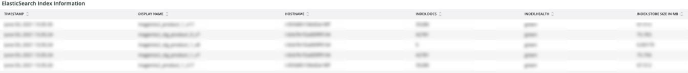

# La variable [!UICONTROL Elasticsearch] ficha

## [!UICONTROL Cluster Status Summary]:

Durante el intervalo de tiempo seleccionado, la variable **[!UICONTROL Cluster Status Summary]** el marco muestra los estados de color que la variable [!DNL Elasticsearch] el clúster ha pasado. En este ejemplo, durante el periodo de tiempo seleccionado, el clúster estaba en estado Verde una vez y en estado Amarillo una vez durante el periodo de tiempo seleccionado.

## [!UICONTROL Active Primary Shards]

La variable **[!UICONTROL Active Primary Shards]** mostrará números diferentes en función del número de elementos principales activos de la cuenta seleccionada [!DNL Elasticsearch] servicio.

De [!DNL Elasticsearch]: La Guía definitiva [2.x]:

&quot;En [Índices dinámicamente actualizables](https://www.elastic.co/guide/en/elasticsearch/guide/2.x/dynamic-indices.html), explicamos que un fragmento es un índice Lucene y que un [!DNL Elasticsearch] index es una colección de fragmentos. La aplicación habla con un índice y [!DNL Elasticsearch] envía sus solicitudes a los tableros adecuados. Una parte es la unidad de escala. El índice más pequeño que se puede tener es uno con un solo fragmento. Esto puede ser más que suficiente para sus necesidades — un solo fragmento puede contener muchos datos — pero limita su capacidad de escalar&quot;.

Cuando se crea un índice, se crean varios fragmentos con ese índice. De forma predeterminada, se asignan cinco partes principales a cada nuevo índice, lo que significa que un índice se puede propagar en cinco nodos (un compartido por nodo). También hay réplicas. Estos son principalmente para failover. Los gráficos compartidos de réplicas pueden servir solicitudes de lectura.

## [!UICONTROL Active Shards in Cluster]

**[!UICONTROL Active Shards in Cluster]** - TODOS los elementos compartidos principales y de réplica en un [!DNL Elasticsearch] clúster.

## [!UICONTROL Index health - this will show the index name and color status]

Este marco mostrará el nombre del índice y el recuento del estado de color del índice. Al bajar por la tabla, verá el mismo nombre de índice con los estados de color amarillo y rojo. El número que sigue al nombre del índice 27 es el recuento del color del estado. Si es cero, no había instancias de que el índice estuviera en ese estado de color durante estos marcos de tiempo seleccionados.

## [!UICONTROL Elasticsearch Status by node information]

La variable **[!UICONTROL Elasticsearch Status by node information]** muestra el [!DNL Elasticsearch] estado del clúster por color, por nodo. Esto ayudará a indicar qué nodo del [!DNL Elasticsearch] el clúster devuelve el estado durante el intervalo de tiempo seleccionado.

## [!UICONTROL Elasticsearch index information]

Esta **[!UICONTROL Elasticsearch index information]** la tabla muestra el nombre del índice, en qué nodo se encuentra, el número de documentos indexados, el estado del índice y el tamaño del índice en MB en un momento determinado.

## [!UICONTROL Elasticsearch process CPU %]

La variable **[!UICONTROL Elasticsearch process CPU %]** frame muestra el proceso CPU% por el [!DNL Elasticsearch] procesar a lo largo del intervalo de tiempo seleccionado.

## [!UICONTROL Elasticsearch Memory garbage collection]

[!DNL Elasticsearch] es un proceso Java. Si se ejecuta bajo en la memoria asignada, iniciará la recolección de basura para liberar memoria. Si la recolección de basura es frecuente, es una indicación de que puede haber demasiados índices o fragmentos para la memoria asignada. Puede haber una oportunidad para limpiar los índices y partes o [!DNL Elasticsearch] puede necesitar más memoria.

## [!UICONTROL Elasticsearch Index information]

A medida que se crean y actualizan los índices, el estado del índice puede cambiar.

## [!UICONTROL Elasticsearch Index Size]

La variable **[!UICONTROL Elasticsearch Index Size]** frame indica el nombre y el tamaño del índice en el intervalo de tiempo seleccionado. Puede indicar problemas con la indexación de un sitio.

## [!UICONTROL Elasticsearch Errors]

La variable **[!UICONTROL Elasticsearch Errors]** frame mostrará errores con [!DNL Elasticsearch] como quedarse sin espacio, cambiar del estado Amarillo a Rojo, cuando todos los fragmentos fallan, cuando hay problemas de parámetros con búsquedas, errores de versión y cuando todos los nodos no están disponibles.

## [!UICONTROL Elasticsearch Unassigned Shards]:

Los fragmentos no asignados harán que un clúster pase del estado Verde al estado Amarillo.
