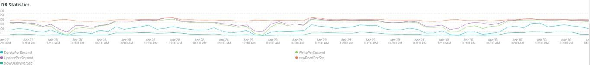

# La variable [!UICONTROL MySQL] ficha

## [!UICONTROL MySQL% free storage by node]

Muchos problemas se deben a que MySQL se queda sin almacenamiento en el almacenamiento asignado a MySQL (`datadir` Configuración de MySQL, el valor predeterminado es `/data/mysql`) o `tmpdir` se está quedando sin espacio. El valor predeterminado `tmpdir` (Configuración de MySQL) es `/tmp`. La variable **[!UICONTROL MySQL% free storage by node]** busca `/, /tmp` (si se define como un montaje independiente) y `/data/mysql` porcentaje de almacenamiento gratuito. A partir de MySQL 5.7 (MariaDB versión 10.2), sin comprimir `tmp` las tablas se escriben en `tmp` en el `/data/mysql` en el archivo (ibtmp1). Este archivo se expande automáticamente sin límite de forma predeterminada. Como es un tablespace, no disminuirá en tamaño y se restablecerá a 12MB cuando MySQL se reinicie.

## [!UICONTROL MySQL Connections by Node]

La variable **[!UICONTROL MySQL Connections by Node]** frame indica periodos de interrupciones del nodo de la base de datos o grandes volúmenes de conexiones.

## [!UICONTROL MySQL Node Summary]

La variable **[!UICONTROL MySQL Node Summary]** la tabla muestra detalles del nodo de base de datos, como la versión del software y el tipo de instancia (tamaño).

## [!UICONTROL Galera Number of Nodes in cluster]

La variable **[!UICONTROL Galera Number of Nodes in cluster]** frame muestra información de los registros MySQL. A medida que los nodos se unen y abandonan un clúster, solo se mostrarán los mensajes del intervalo de tiempo seleccionado. Si un nodo abandona el clúster antes del periodo de tiempo, no aparecerá ningún mensaje durante ese periodo de tiempo. Si sospecha que la base de datos puede estar quedando sin un nodo, amplíe el intervalo de tiempo a un periodo mayor para ver si puede ver información adicional. Si hay información durante el período de tiempo que indica menos que todos los nodos del [!DNL Galera] , expanda el intervalo de tiempo para ver si puede determinar cuándo el nodo abandonó el clúster.

## [!UICONTROL MySQL shutdowns and starts]

La variable **[!UICONTROL MySQL shutdowns and starts]** frame detecta cuándo hay un apagado de un nodo. La variable [!DNL Galera] los nodos se desalojarán y se autoexpulsarán del [!DNL Galera] nodo . Esto suele resultar en un reinicio del servicio MySQL.

## [!UICONTROL Galera log]

La variable **[!UICONTROL Galera log]** frame muestra los recuentos de señales particulares de los registros MySQL concernientes a [!DNL Galera] nodos, sus estados y los cambios de estado del [!DNL Galera] clúster.

* &#39;%1047 WSREP aún no ha preparado el nodo para el uso de la aplicación%&#39;) como &#39;node_not_prep_for_use&#39;
* WSREP &#39;%\[ERROR\]: No se pudo leer desde: wsrep_sst_xtrabackup-v2%) como &#39;xtrabackup_read_failure&#39;
* WSREP &#39;%\[ERROR\]: Proceso completado con error: wsrep_sst_xtrabackup-v2 %) como &#39;xtrabackup_compl_w_err&#39;
* WSREP &#39;%\[ERROR\]: error de escritura de rbr%) como &#39;rbr_write_failed&#39;
* &#39;%self-Leave%&#39;) como &#39;susp_node&#39;
* &#39;%Members = 3/3 (unido/total)%&#39;) como&#39;3of3&#39;
* &#39;%Members = 2/3 (unido/total)%&#39;) como&#39;2of3&#39;
* &#39;%Members = 2/2%&#39;) como &#39;2of2&#39;
* &#39;%Members = 1/2%&#39;) como &#39;1of2&#39;
* &#39;%Members = 1/3%&#39;) como &#39;1of3&#39;
* &#39;%Members = 1/1%&#39;) como &#39;1of1&#39;
* &#39;%\[Nota\] /usr/sbin/mysqld (mysqld 10.%&#39;) as&#39;sql_restart&#39;
* &#39;%Quórum: Ningún nodo con estado completo:%) como &#39;no_node_count&#39;
* &#39;%WSREP: Miembro 0%&#39;) como &#39;mem_0&#39;
* &#39;%WSREP: Miembro 1.0%) como &#39;mem_1&#39;
* &#39;%WSREP: Miembro 2%&#39;) como&#39;mem2&#39;
* &#39;%WSREP: Sincronizado con grupo, listo para conexiones%) como &quot;listo&quot;
* &#39;%/usr/sbin/mysqld, Versión:%) como &#39;mysql_restart_mysql.slow&#39;
* WSREP &#39;%\[Nota\]: Nueva vista de clúster: estado global:%) como &#39;galera_cluster_view_chng&#39;

## [!UICONTROL Galera Log by Host]

La variable **[!UICONTROL Galera Log by Host]** es el mismo que el **[!UICONTROL Galera log]** , excepto que está desglosado por nodo para ayudar en la resolución de problemas.

## [!UICONTROL Database performance]

La variable **[!UICONTROL Database performance]** frame muestra el rendimiento de la base de datos durante solicitudes específicas. Para ver cada métrica, haga clic en ellas en los iconos de color que aparecen debajo del gráfico. Muchas de las métricas incluidas en [Monitorización del rendimiento de la base de datos MySQL con nueva relación](https://newrelic.com/blog/how-to-relic/how-to-monitor-mysql) se encuentran en este marco.

* average(query.queriesPerSecond)
* average(query.slowQueriesPerSecond)
* average(db.createdTmpDiskTablesPerSecond)
* average(db.createdTmpFilesPerSecond)
* average(db.tablesLocksWaitedPerSecond)
* average(db.innodb.rowLockTimeAvg)
* average(db.innodb.rowLockWaitsPerSecond)

## [!UICONTROL Transaction Database Call Count]

La variable **[!UICONTROL Transaction Database Call Count]** frame muestra el número de llamadas a la base de datos realizadas por cada faceta de transacción. Esto parece estar centrado en filas y no en declaraciones.

## [!UICONTROL Cron_schedule table updates]

La variable **[!UICONTROL Cron_schedule table updates]** frame muestra la duración máxima de las actualizaciones de la base de datos en la tabla cron_schedule para el período de tiempo seleccionado.

## [!UICONTROL Slow Query Traces]

La variable **[!UICONTROL Slow Query Traces]** muestra la tabla y el tipo de solicitud donde existen rastreos de consulta lentos. Se crea un seguimiento de consulta lento para las transacciones de consulta que tardan más de cinco segundos. Para este marco son importantes las consultas de actualización. Si una tabla está siendo actualizada por `UPDATE`, `DELETE`y `INSERT` pueden bloquear tablas durante un periodo de tiempo.

Even `SELECT` las instrucciones pueden bloquear filas si se utilizan con FOR UPDATE.

## [!UICONTROL Datastore Operations tables]

## [!UICONTROL Cron table change]

La variable **[!UICONTROL Cron table change]** frame busca mensajes de error &quot;no se pudo adquirir el bloqueo para el trabajo cron:&quot; junto con un error específico de memoria PHP y bloqueos que involucran el `cron_schedule` tabla. Si la variable `cron_schedule` la tabla está bloqueada (por ejemplo, por un `DELETE` que se ejecute en su contra), bloqueará la ejecución de otros crons.

## [!UICONTROL Deadlocks]

La variable **[!UICONTROL Deadlocks]** frame observa las siguientes cadenas analizadas desde los registros MySQL:

* &#39;%PHP Error irrecuperable: Tamaño de memoria permitido de%&#39;) como php_mem_error
* &#39;%get lock; intente reiniciar la transacción, la consulta fue: DELETE DESDE \`cron_schedule%&#39;) como cron_sched_lock_del
* &#39;% bloqueo para trabajo cron: indexer_reindex_all_invalid%&#39;) como &#39;lock_indexer_reindex_all_invalid%&#39;
* &#39;% bloqueo para trabajo cron: cron_schedule%) como &#39;lock_cron_schedule&#39;
* &#39;% lock para el trabajo cron:%) como &#39;total_cron_lock&#39;
* &#39;%Error general: 1205 Se superó el tiempo de espera de bloqueo%) como &#39;sql_1205_lock&#39;
* &#39;%ERROR 1213 (40001): Bloqueo de demora encontrado al intentar obtener el bloqueo%) como &#39;sql_1213_lock&#39;
* &#39;%SQLSTATE[40001]: Fallo de serialización: 1213 Bloqueo de demora encontrado%) como &#39;sql_1213_lock2&#39;
* &#39;% bloqueo para trabajo cron: indexer_update_all_views%) como &#39;lock_indexer_update_all_views&#39;
* &#39;% bloqueo para trabajo cron: sales_grid_order_Invoice_async_insert%) como &#39;lock_sales_grid_order_Invoice_async_insert&#39;,
* &#39;% bloqueo para trabajo cron: staging_remove_updates%) como &#39;lock_staging_remove_updates&#39;
* &#39;% bloqueo para trabajo cron: sales_grid_order_sending_async_insert%) como &#39;lock_sales_grid_order_sending_async_insert&#39;
* &#39;% bloqueo para trabajo cron: amazon_payments_process_queued_returning%) como &#39;lock_amazon_payments_process_queued_funds&#39;
* &#39;% bloqueo para trabajo cron: sales_send_order_sending_emails%) como &#39;lock_sales_send_order_sending_emails&#39;
* &#39;% bloqueo para trabajo cron: staging_sync_entities_period%&#39;) como &#39;lock_staging_sync_entities_period&#39;
* &#39;% bloqueo para trabajo cron: indexer_clean_all_changelogs%&#39;) como &#39;lock_indexer_clean_all_changelogs&#39;
* &#39;% bloqueo para trabajo cron: magento_targetrule_index_reindex%) como &#39;lock_magento_targetrule_index_reindex&#39;
* &#39;% bloqueo para trabajo cron: newsletter_send_all%) como &#39;lock_newsletter_send_all&#39;
* &#39;% bloqueo para trabajo cron: newsletter_send_all%) como &#39;lock_newsletter_send_all&#39;
* &#39;% bloqueo para trabajo cron: sales_send_order_emails%) como &#39;lock_sales_send_order_emails&#39;
* &#39;% bloqueo para trabajo cron: sales_send_order_creditmemo_emails%) como &#39;lock_sales_send_order_creditmemo_emails&#39;
* &#39;% bloqueo para trabajo cron: sales_grid_order_creditmemo_async_insert%) como &#39;lock_sales_grid_order_creditmemo_async_insert&#39;
* &#39;% bloqueo para trabajo cron: bulk_cleanup%&#39;) como &#39;lock_bulk_cleanup&#39;
* &#39;% bloqueo para trabajo cron: flush_preview_quotas%) como &#39;lock_flush_preview_quotas&#39;
* &#39;% bloqueo para trabajo cron: sales_send_order_Invoice_emails%) como &#39;lock_sales_send_order_Invoice_emails&#39;
* &#39;% bloqueo para trabajo cron: sales_send_order_Invoice_emails%) como &#39;lock_sales_send_order_Invoice_emails&#39;
* &#39;% bloqueo para trabajo cron: captcha_delete_expire_images%) como &#39;lock_captcha_delete_expire_images&#39;
* &#39;% bloqueo para trabajo cron: magento_newrelicreporting_cron%) como &#39;lock_magento_newrelicreporting_cron&#39;
* &#39;% bloqueo para trabajo cron: outdated_authentication_failure_cleanup%&#39;) como &#39;lock_outdated_authentication_failure_cleanup&#39;
* &#39;% bloqueo para trabajo cron: send_notification%) como &#39;lock_send_notification&#39;
* &#39;% bloqueo para trabajo cron: magento_giftcardaccount_generage_codes_pool%&#39;) como &#39;lock_magento_giftcardaccount_generage_codes_pool&#39;
* &#39;% bloqueo para trabajo cron: catalog_product_frontend_actions_flush%) como &#39;lock_catalog_product_frontend_actions_flush&#39;
* &#39;% bloqueo para trabajo cron: mysqlmq_clean_messages%) como &#39;mysqlmq_clean_messages&#39;
* &#39;% bloqueo para trabajo cron: catalog_product_attribute_value_sync%) como &#39;lock_catalog_product_attribute_value_sync&#39;
* &#39;% bloqueo para trabajo cron: ddg_Automation_importer%) como &#39;lock_ddg_Automation_importer&#39;
* &#39;% bloqueo para trabajo cron: dg_Automation_review_and_wishlist%&#39;) como &#39;lock_ddg_Automation_review_and_wishlist&#39;
* &#39;% bloqueo para trabajo cron: captcha_delete_old_intentos%) como &#39;lock_captcha_delete_old_errors&#39;
* &#39;% bloqueo para trabajo cron: catalog_product_outdated_price_values_cleanup%) como &#39;lock_catalog_product_outdated_price_values_cleanup&#39;
* &#39;% bloqueo para trabajo cron: Consumer_runner%) como &#39;lock_Consumer_runner&#39;
* &#39;% bloqueo para trabajo cron: dg_Automation_customer_subscriber_Guest_sync%) como &#39;lock_ddg_Automation_customer_subscriber_Guest_sync&#39;
* &#39;% bloqueo para trabajo cron: get_amazon_capture_updates%) como &#39;lock_get_amazon_Capture_updates&#39;
* &#39;% bloqueo para trabajo cron: get_amazon_authorization_updates%) como &#39;lock_send_get_amazon_authorization_updates&#39;
* &#39;% bloqueo para trabajo cron: temando_process_platform_events%) como &#39;lock_temando_process_platform_events&#39;
* &#39;% bloqueo para trabajo cron: ddg_Automation_status%) como &#39;lock_ddg_Automation_status&#39;
* &#39;% bloqueo para trabajo cron: ddg_Automation_status%) como &#39;lock_ddg_Automation_status&#39;
* &#39;% bloqueo para trabajo cron: sales_clean_orders%) como &#39;lock_sales_clean_orders&#39;
* &#39;% bloqueo para trabajo cron: catalog_index_refresh_price%) como &#39;lock_catalog_index_refresh_price&#39;
* &#39;% bloqueo para trabajo cron: magento_wards_balance_warning_notification%&#39;) como &#39;lock_magento_wards_balance_warning_notification&#39;
* &#39;% bloqueo para trabajo cron: analytics_update%) como &#39;lock_analytics_update&#39;
* &#39;% bloqueo para trabajo cron: messagequeue_clean_outdated_locks%&#39;) como &#39;lock_messagequeue_clean_outdated_locks&#39;
* &#39;% bloqueo para trabajo cron: messagequeue_clean_outdated_locks%&#39;) como &#39;lock_messagequeue_clean_outdated_locks&#39;
* &#39;% bloqueo para trabajo cron: staging_apply_version%) como &#39;lock_staging_apply_version&#39;
* &#39;% bloqueo para trabajo cron: magento_wards_expire_points%) como &#39;lock_magento_wards_expire_points&#39;
* &#39;% bloqueo para trabajo cron: yotpo_yotpo_orders_sync%&#39;) como &#39;lock_yotpo_yotpo_orders_sync&#39;
* &#39;% bloqueo para trabajo cron: catalog_event_status_checker%) como &#39;lock_catalog_event_status_checker&#39;
* &#39;% bloqueo para trabajo cron: ddg_Automation_campaign%) como &#39;lock_ddg_Automation_campaign&#39;
* &#39;% bloqueo para trabajo cron: visitor_clean%) como &#39;lock_visitor_clean&#39;
* &#39;% bloqueo para trabajo cron: scconnector_verify_website%) como &#39;lock_scconnector_verify_website&#39;
* &#39;% bloqueo para trabajo cron: ddg_Automation_email_templates%) como &#39;lock_ddg_Automation_email_templates&#39;
* &#39;% bloqueo para trabajo cron: aggregate_sales_report_order_data%) como &#39;lock_aggregate_sales_report_order_data&#39;
* &#39;% bloqueo para trabajo cron: ddg_Automation_catalog_sync%) como &#39;lock_ddg_Automation

## [!UICONTROL DB Statistics]

La variable **[!UICONTROL DB Statistics]** frame muestra eliminaciones, escrituras, filas leídas, actualizaciones y consultas lentas por segundo.

## [!UICONTROL Request frequency]

## [!UICONTROL Database Errors]

La variable **[!UICONTROL Database Errors]** frame muestra una variedad de bases de datos [advertencias y errores](https://mariadb.com/kb/en/mariadb-error-codes/):

* &#39;%El tamaño de memoria asignado para la tabla temporal es superior al 20% de innodb_buffer_pool_size%&#39; como &#39;temp_tbl_buff_pool&#39;
* WSREP &#39;%\[ERROR\]: error de escritura de rbr%) como &#39;rbr_write_failed&#39;
* &#39;%mysqld: Disco lleno%&#39;) como &#39;disk_full&#39;
* &#39;%Error número 28%&#39;) como &#39;err_28&#39;
* &#39;%rollback%&#39;) como &#39;rollback&#39;
* &#39;%La restricción de clave externa falla para la tabla%&#39;) como &#39;external_key_constraint&#39;
* &#39;%Error_code: 1114%&#39;) como &#39;sql_1114_full&#39;%CRITICAL: SQLSTATE[HY000] [2006] El servidor MySQL ha desaparecido%) como &#39;sql_away&#39;
* &#39;%SQLSTATE[HY000] [1040] Demasiadas conexiones%) como &#39;sql_1040&#39;
* &#39;%CRÍTICO: SQLSTATE[HY000] [2002]%&#39;) como &#39;sql_2002&#39;
* &#39;%SQLSTATE[08S01]:%) como &#39;sql_1047&#39;
* &#39;%[Advertencia] Aborted connection%&#39;) como &#39;aborted_conn&#39;
* &#39;%SQLSTATE[23000]: Infracción de restricción de integridad:%) como &#39;sql_23000&#39;
* &#39;%1205 Bloquear tiempo de espera%&#39;) como &#39;sql_1205&#39;
* &#39;%SQLSTATE[HY000] [1049] Base de datos desconocida%) como &#39;sql_1049&#39;
* &#39;%SQLSTATE[42S02]: No se encuentra la tabla o vista base:%) como &#39;sql_42S02&#39;
* &#39;%Error general: 1114%) como &#39;sql_1114&#39;
* &#39;%SQLSTATE[40001]%&#39;) como &#39;sql_1213&#39;
* &#39;%SQLSTATE[42S22]: Columna no encontrada: 1054 (Columna desconocida%) como &#39;sq1_1054&#39;
* &#39;%SQLSTATE[42000]: Error de sintaxis o infracción de acceso:%&#39;) como &#39;sql_42000&#39;
* &#39;%SQLSTATE[21000]: Infracción de cardinalidad:%) como &#39;sql_1241&#39;
* &#39;%SQLSTATE[2003]:%) como &#39;sql_22003&#39;
* &#39;%SQLSTATE[HY000] [9000] Cliente con dirección IP%) como &#39;sql_9000&#39;
* &#39;%SQLSTATE[HY000]: Error general: 2014%) como &#39;sql_2014&#39;
* &#39;%1927 Se mató la conexión%&#39;) como &#39;sql_1927&#39;
* &#39;%1062 \[ERROR\] InnoDB:%&#39;) como &#39;sql_1062_e&#39;
* &#39;&#39;%[Nota] WSREP: Vaciando el mapa de memoria al disco...%&#39;) como &#39;mem_map_flush&#39;
* &#39;%Código de error interno de MariaDB: 1146%) como &#39;sql_1146&#39;
* &#39;%Código de error interno de MariaDB: 1062%) como &#39;sql_1062&#39; * &#39;%1062 [Advertencia] InnoDB:%&#39;) como &#39;sql_1062_w&#39;
* &#39;%Código de error interno de MariaDB: 1064%) como &#39;sql_1064&#39;
* &#39;%InnoDB: Error de aserción en el archivo%) como &#39;assertion_err&#39;
* &#39;%mysqld_safe Número de procesos en ejecución ahora: 0%) como &#39;mysql_oom&#39;
* &#39;%\[ERROR\] mysqld obtuvo la señal%&#39;) como &#39;mysql_sigterm&#39;
* &#39;%1452 No se puede agregar%&#39;) como &#39;sql_1452&#39;
* &#39;%ERROR 1698%&#39;) como &#39;sql_1698&#39;
* &#39;%SQLSTATE[HY000]: Error general: 3%) como &#39;cnt_wrt_tmp&#39;
* &#39;%Error general: 1 %&#39;) como &#39;sql_sintaxis&#39;
* &#39;%42S22%&#39;) como &#39;sql_42S22&#39;
* &#39;%InnoDB: Error (Duplicate key)%&quot;) como &#39;innodb_dup_key&#39; FROM Log TIMESERIES

## [!UICONTROL DB Error Table]

La variable **[!UICONTROL DB Error Table]** muestra la misma información que el **[!UICONTROL Database Errors]** , pero puede verlo por nodo y en formato de tabla. Consulte [Códigos de error de MariaDB](https://mariadb.com/kb/en/mariadb-error-codes/) para obtener más información.

## [!UICONTROL Database Traces]

La variable **[!UICONTROL Database Traces]** frame muestra los trazos de la base de datos por tipo en la línea de tiempo seleccionada.

## [!UICONTROL Database processes]

La variable **[!UICONTROL Database processes]** frame muestra los procesos de base de datos, entornos e identificadores de nodo.

## [!UICONTROL MySQL Non-Sleeping Threads by Node]

La variable **[!UICONTROL MySQL Non-Sleeping Threads by Node]** frame muestra los subprocesos de conexión a la base de datos. Este marco muestra los subprocesos activos.

## [!UICONTROL MySQL Running and Sleeping Threads by environment]

La variable **[!UICONTROL MySQL Running and Sleeping Threads by environment]** frame muestra conexiones activas y durmientes a la base de datos. Si hay conexiones a la base de datos en las que las consultas lentas se han detenido, habrá conexiones durmientes. Las conexiones duraderas pueden ser consultas de base de datos bloqueadas por filas o tablas bloqueadas. Estas conexiones durmientes también tienen conexiones de trabajo PHP.

## [!UICONTROL MySQL mem used by node]

La variable **[!UICONTROL MySQL mem used by node]** frame muestra el uso del nodo de memoria por MySQL. En sitios más grandes, este marco puede ser barras continuas con GBs de memoria utilizados.

## [!UICONTROL Database mysql-slow.log]

La variable **[!UICONTROL Database mysql-slow.log]** muestra los tipos de instrucciones de consulta que estaban en el `mysql-slow.log` en el intervalo de tiempo seleccionado.

