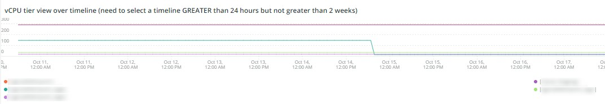

# La ficha [!DNL Infra]

La ficha **[!DNL Infra]** aísla los problemas y las causas de los problemas de infraestructura. Más adelante se describen los marcos que puede ver en la pestaña.

## [!UICONTROL Service Alerts – Infrastructure Alerts by Application name]

El gráfico **[!UICONTROL Service Alerts – Infrastructure Alerts by Application name]** muestra las alertas de servicio recopiladas por el agente de infraestructura [!DNL New Relic]. Esto mostrará los reinicios del servicio, muchos asociados con las implementaciones.

## [!UICONTROL Inode usage by mount]

El fotograma **[!UICONTROL Inode usage by mount]** muestra el uso de [!DNL inode] por montaje en el periodo de tiempo seleccionado. Aunque puede haber mucho almacenamiento disponible, si un nodo se queda sin [!DNL inodes], se mostrará una falta de almacenamiento disponible. Si quita archivos (especialmente los pequeños), se liberará espacio y estará disponible [!DNL inodes].

## [!UICONTROL vCPU tier view over timeline GREATER 2 weeks]

El fotograma **[!UICONTROL vCPU tier view over timeline GREATER 2 weeks]** muestra la vista del nivel de vCPU en el intervalo de tiempo seleccionado de más de dos semanas. Este marco observa el número de vCPU asignadas al nombre de aplicación [!DNL New Relic] que se muestra.

## [!UICONTROL vCPU tier view over timeline]

El fotograma **[!UICONTROL vCPU tier view over timeline]** muestra la vista del nivel de vCPU en el intervalo de tiempo seleccionado de más de 24 horas. Este marco observa el número de vCPU asignadas al nombre de aplicación [!DNL New Relic] que se muestra. Se mostrarán tanto las ampliaciones como las reducciones de tamaño de los clústeres.

## [!UICONTROL vCPU tier view over timeline BY NODE]

El fotograma **[!UICONTROL vCPU tier view over timeline BY NODE]** muestra las vistas del nivel de vCPU en el periodo de tiempo seleccionado por nodo. Este marco es útil para detectar la pérdida de nodos o cuando los nodos se convierten o se reducen. La vista del nivel de vCPU sobre la línea de tiempo POR NODO, debería mirar la línea de tiempo MENOS de 24 horas.

## [!UICONTROL Instance details]

La tabla **[!UICONTROL Instance details]** muestra los detalles de instancia de cada aplicación [!DNL New Relic].

## [!UICONTROL Logging, if there is a broken line for a node, it indicates non-responsive node during that time period]

El marco **[!UICONTROL Logging, if there is a broken line for a node, it indicates non-responsive node during that time period]** muestra nodos que no responden durante un período de tiempo.
