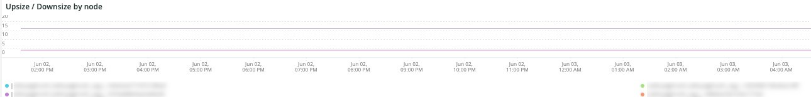

# La variable [!DNL QuickView] ficha

La variable **[!UICONTROL QuickView]** explica los distintos tipos de alertas que puede ver, incluidos los que están en un espacio de disco bajo y el uso del servidor. A continuación, se describen los marcos de la pestaña .

## [!UICONTROL Alerts]

La variable **[!UICONTROL Alerts]** frame muestra distintas alertas, incluidas las advertencias de espacio en disco y las alertas de uso del servidor en un intervalo de tiempo seleccionado. Este marco examina las operaciones de la tabla de la base de datos, incluyendo `SELECT`, `DELETE`y `UPDATE` en un intervalo de tiempo seleccionado.

## [!UICONTROL Upsize / Downsize by node]

La variable **[!UICONTROL Upsize / Downsize by node]** frame muestra los tamaños superiores y descendentes por nodo en un intervalo de tiempo seleccionado. Se usa para evaluar si hubo un cambio en el tamaño del clúster durante el período de tiempo seleccionado.

## [!UICONTROL CPU Utilization]

La variable **[!UICONTROL CPU Utilization]** frame muestra la utilización de la CPU por nodos en el intervalo de tiempo seleccionado.
