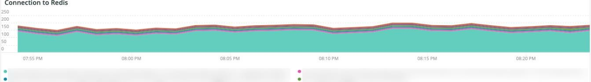

# El [!DNL Redis] pestaña

## [!UICONTROL Redis Node summary]

El **[!UICONTROL Redis Node summary]** incluye todos los nodos de un entorno. El ejemplo anterior incluye los nodos para el ensayo compartido. Hay una primaria y dos secundarias en producción y también una primaria y dos secundarias en ensayo.

## [!UICONTROL Redis node detail]

El **[!UICONTROL Redis node detail]** frame indica el entorno, [!DNL Redis] función, versión del software y tamaño del nodo.

## [!UICONTROL Redis node roles timeline]

El **[!UICONTROL Redis node roles timeline]** frame indica la pérdida de [!DNL Redis] servicio en funciones específicas. Si una línea cae, indica que la función concreta que representa la línea ha perdido un nodo o nodos.

## [!UICONTROL Connection to Redis]

El **[!UICONTROL Connection to Redis]** frame muestra el valor net.connectedClients de la variable [!DNL New Relic Redis] datos de ejemplo. Muestra el recuento de conexiones por [!DNL New Relic] aplicación (entorno) y nodo.

## [!UICONTROL Commands per second by node]

El **[!UICONTROL Commands per second by node]** El marco muestra el [!DNL Redis] comandos por nodo por segundo durante el periodo de tiempo seleccionado.

## [!UICONTROL Redis % of memory used]

El **[!UICONTROL Redis % of memory used]** frame muestra el porcentaje de memoria máxima utilizado por el [!DNL Redis] servidores.

## [!UICONTROL Redis used memory]

El **[!UICONTROL Redis used memory]** La trama muestra el uso de nodos de memoria en GB/MB.

## [!UICONTROL Redis changes since last db save]

[!DNL Redis] es residente en memoria y guarda la información en el almacenamiento. El **[!UICONTROL Redis changes since last db save]** frame indica el número de cambios realizados en la memoria desde que se guardó la última base de datos en el almacenamiento. Consulte [Persistencia de Redis](https://redis.io/docs/manual/persistence/) para obtener más información sobre [!DNL Redis's] persistencia.

## [!UICONTROL Redis synchronization from Log]

El **[!UICONTROL Redis synchronization from Log]** frame se centra en los errores encontrados durante la [!DNL Redis] sincronización o errores que se producen debido a problemas de sincronización. Para obtener más información sobre [!DNL Redis], consulte [[!DNL Redis] Documentación](https://redis.io/docs/).
