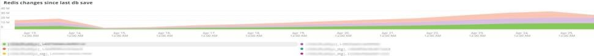

# La ficha [!DNL Redis]

## [!UICONTROL Redis Node summary]

**[!UICONTROL Redis Node summary]** incluye todos los nodos de un entorno. El ejemplo anterior incluye los nodos para el ensayo compartido. Hay una primaria y dos secundarias en producción y también una primaria y dos secundarias en ensayo.

## [!UICONTROL Redis node detail]

El marco **[!UICONTROL Redis node detail]** indica el entorno, el rol [!DNL Redis], la versión del software y el tamaño del nodo.

## [!UICONTROL Redis node roles timeline]

El fotograma **[!UICONTROL Redis node roles timeline]** indica la pérdida del servicio [!DNL Redis] en roles particulares. Si una línea cae, indica que la función concreta que representa la línea ha perdido un nodo o nodos.

## [!UICONTROL Connection to Redis]

El marco **[!UICONTROL Connection to Redis]** muestra el valor net.connectedClients de los datos de ejemplo [!DNL New Relic Redis]. Muestra el recuento de conexiones por aplicación (entorno) y nodo [!DNL New Relic].

## [!UICONTROL Commands per second by node]

El fotograma **[!UICONTROL Commands per second by node]** muestra los comandos [!DNL Redis] por nodo por segundo durante el periodo de tiempo seleccionado.

## [!UICONTROL Redis % of memory used]

El fotograma **[!UICONTROL Redis % of memory used]** muestra el porcentaje de memoria máxima que utilizan los servidores [!DNL Redis].

## [!UICONTROL Redis used memory]

El fotograma **[!UICONTROL Redis used memory]** muestra el uso de memoria del nodo en GB/MB.

## [!UICONTROL Redis changes since last db save]

[!DNL Redis] reside en la memoria y guarda la información en el almacenamiento. El marco **[!UICONTROL Redis changes since last db save]** indica el número de cambios en la memoria que se han producido desde que se guardó la última base de datos en el almacenamiento. Consulte [Redis persistence](https://redis.io/docs/latest/operate/oss_and_stack/management/persistence/) para obtener más información sobre la persistencia de [!DNL Redis's].

## [!UICONTROL Redis synchronization from Log]

El marco **[!UICONTROL Redis synchronization from Log]** se centra en los errores encontrados durante la sincronización de [!DNL Redis] o en los errores que se producen debido a problemas de sincronización. Para obtener más información sobre [!DNL Redis], consulte [[!DNL Redis] Documentación](https://redis.io/docs/).
