# La ficha [!UICONTROL Security]

La ficha **[!UICONTROL Security]** explica los problemas de seguridad y aísla sus posibles causas. Además, se describen los marcos de la pestaña.

## [!UICONTROL API calls by IP, details by URL]

El fotograma **[!UICONTROL API calls by IP, details by URL]** muestra un número de llamadas de API por dirección IP en un intervalo de tiempo seleccionado. Este marco muestra la dirección IP y la URL de API a la que accedió esa dirección IP.

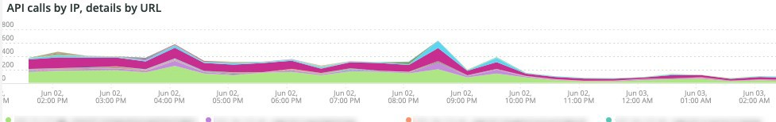

## [!UICONTROL Forgot Password]

El marco de acceso **[!UICONTROL Forgot Password]** muestra el número de intentos de contraseña olvidada en un intervalo de tiempo seleccionado. Una actividad alta contra una dirección IP puede ser un ataque al sitio.

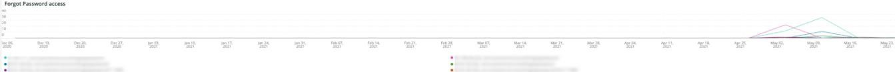

## [!UICONTROL Create Account access]

El marco **[!UICONTROL Create Account access]** muestra el número de nuevas actividades de cuenta en un intervalo de tiempo seleccionado. Una alta actividad desde una sola dirección IP puede indicar un ataque.

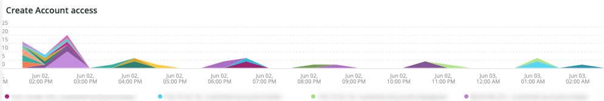

## [!UICONTROL POST activities]

El marco **[!UICONTROL POST activities]** muestra las actividades `POST` para el sitio, con facetas en `client_ip` de los registros [!DNL Fastly]. También muestra la dirección URL a la que accede la dirección IP.

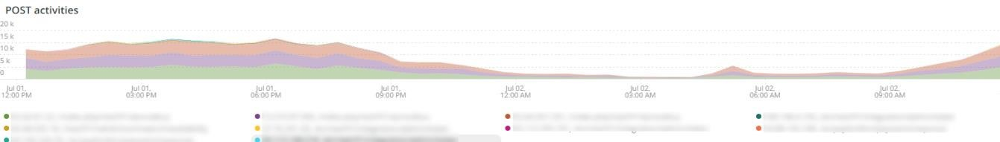

## [!UICONTROL POST activities summary table]

El marco **[!UICONTROL POST activities summary table]** muestra las actividades `POST` resumidas para el sitio, con facetas en `client_ip` de los registros [!DNL Fastly]. También muestra el recuento de la dirección URL a la que accede la dirección IP. El recuento es para el periodo de tiempo seleccionado.

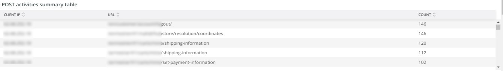

## [!UICONTROL POST activities details table]

El marco **[!UICONTROL POST activities details table]** muestra las actividades `POST` para el sitio desde los registros [!DNL Fastly]. También muestra todos los detalles del registro [!DNL Fastly] para estas solicitudes. Se limita a las últimas 2000 solicitudes.
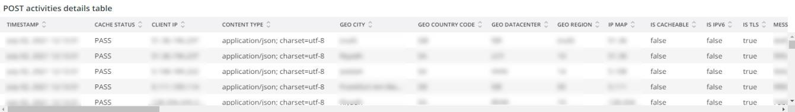

## [!UICONTROL Guest Carts activities]

El fotograma **[!UICONTROL Guest Carts activities]** muestra el número de actividades del carro de compras de invitados en un intervalo de tiempo seleccionado, faceteadas por dirección IP y dirección URL a la que se accedió. Los carros de invitados se pueden usar en un ataque de carding. Este marco muestra el número total de solicitudes en las que se accede a las direcciones URL de los carros de invitados.

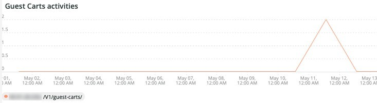

## [!UICONTROL API – forgot password, create account by Countries]

El marco **[!UICONTROL API – forgot password, create account by Countries]** muestra el número de cuentas creadas y solicita restablecer una contraseña olvidada en un intervalo de tiempo seleccionado. Se incluye una faceta para mostrar también el país de origen de la solicitud. Este marco se centra en el país de origen de la solicitud.

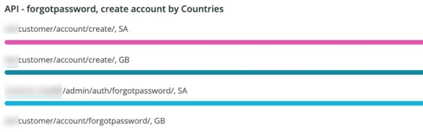

## [!UICONTROL API - forgot password, create account by Countries and IP address]

El marco **[!UICONTROL API - forgot password, create account by Countries and IP address]** muestra el número de cuentas creadas y solicita restablecer una contraseña olvidada en un intervalo de tiempo seleccionado. Incluye una faceta para mostrar la dirección IP, la dirección URL a la que se accede y el país de origen de la solicitud. Este fotograma se centra en el recuento de direcciones IP.

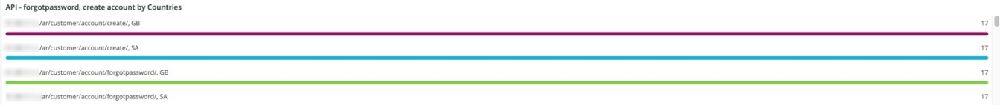

## [!UICONTROL Guest cart activities by IP]

El fotograma **[!UICONTROL Guest cart activities by IP]** muestra las actividades del carro de compras de los invitados por dirección IP en un intervalo de tiempo seleccionado.

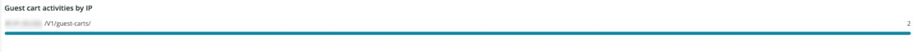

## [!UICONTROL Guest cart activities by Countries]

El fotograma **[!UICONTROL Guest cart activities by Countries]** muestra las actividades del carro de compras de los invitados por países en un intervalo de tiempo seleccionado.

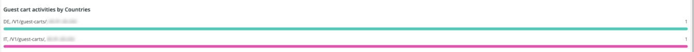
