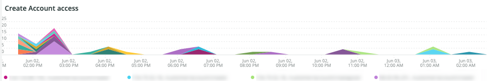

# El [!UICONTROL Security] pestaña

El **[!UICONTROL Security]** La pestaña explica los problemas de seguridad y aísla sus posibles causas. Además, se describen los marcos de la pestaña.

## [!UICONTROL API calls by IP, details by URL]

El **[!UICONTROL API calls by IP, details by URL]** El marco de trabajo muestra una serie de llamadas de API por dirección IP en un periodo de tiempo seleccionado. Este marco muestra la dirección IP y la URL de API a la que accedió esa dirección IP.

## [!UICONTROL Forgot Password]

El **[!UICONTROL Forgot Password]** cuadro de acceso muestra el número de intentos de contraseña olvidada en un intervalo de tiempo seleccionado. Una actividad alta contra una dirección IP puede ser un ataque al sitio.

## [!UICONTROL Create Account access]

El **[!UICONTROL Create Account access]** marco muestra el número de nuevas actividades de cuenta en un periodo de tiempo seleccionado. Una alta actividad desde una sola dirección IP puede indicar un ataque.

## [!UICONTROL POST activities]

El **[!UICONTROL POST activities]** El marco muestra el `POST` actividades del sitio, con facetas `client_ip` desde el [!DNL Fastly] registros. También muestra la dirección URL a la que accede la dirección IP.

## [!UICONTROL POST activities summary table]

El **[!UICONTROL POST activities summary table]** El marco muestra el resumen `POST` actividades del sitio, con facetas `client_ip` desde el [!DNL Fastly] registros. También muestra el recuento de la dirección URL a la que accede la dirección IP. El recuento es para el periodo de tiempo seleccionado.

## [!UICONTROL POST activities details table]

El **[!UICONTROL POST activities details table]** El marco muestra el `POST` actividades para el sitio desde el [!DNL Fastly] registros. También muestra todos los detalles de la [!DNL Fastly] registrar para estas solicitudes. Se limita a las últimas 2000 solicitudes.

## [!UICONTROL Guest Carts activities]

El **[!UICONTROL Guest Carts activities]** El marco de tiempo muestra el número de actividades del carro de compras de invitados en un periodo de tiempo seleccionado, faceteadas por dirección IP y dirección URL a la que se accedió. Los carros de invitados se pueden usar en un ataque de carding. Este marco muestra el número total de solicitudes en las que se accede a las direcciones URL de los carros de invitados.

## [!UICONTROL API – forgot password, create account by Countries]

El **[!UICONTROL API – forgot password, create account by Countries]** frame muestra el número de cuentas creadas y solicitudes para restablecer una contraseña olvidada en un periodo de tiempo seleccionado. Se incluye una faceta para mostrar también el país de origen de la solicitud. Este marco se centra en el país de origen de la solicitud.

## [!UICONTROL API - forgot password, create account by Countries and IP address]

El **[!UICONTROL API - forgot password, create account by Countries and IP address]** frame muestra el número de cuentas creadas y solicitudes para restablecer una contraseña olvidada en un periodo de tiempo seleccionado. Incluye una faceta para mostrar la dirección IP, la dirección URL a la que se accede y el país de origen de la solicitud. Este fotograma se centra en el recuento de direcciones IP.

## [!UICONTROL Guest cart activities by IP]

El **[!UICONTROL Guest cart activities by IP]** El marco de trabajo muestra las actividades del carro de compras de invitados por dirección IP en un intervalo de tiempo seleccionado.

## [!UICONTROL Guest cart activities by Countries]

El **[!UICONTROL Guest cart activities by Countries]** El marco muestra las actividades del carro de compras de los invitados por países en un periodo de tiempo seleccionado.

