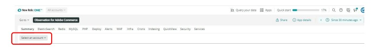
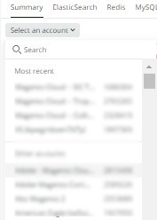

# Selección de la cuenta y el calendario:

Al hacer clic en el icono [!UICONTROL Observation for Adobe Commerce], se abrirá el nerdlet [!DNL Observation for Adobe Commerce].

1. Haga clic en el menú desplegable **Seleccionar una cuenta**. Si no ve el menú desplegable **Seleccionar una cuenta**, es posible que no tenga acceso. Haga clic [aquí](https://adobe.sharepoint.com/sites/MG/it/IT%20Services%20Wiki/Requesting%20access%20to%20Magento%20Commerce%20New%20Relic.aspx) para solicitar acceso.

   

1. Puede pegar project_id, escribir el número de cuenta [!DNL New Relic] o el nombre de cuenta, o examinar la lista de cuentas.

   

1. Haz clic en el menú desplegable **azul claro** (hacia la parte superior derecha de la ventana de nerdlet) con el icono del reloj.

   

1. Debe establecer la hora antes de la fecha y hora del vale para ver si ha habido algún evento o dato anterior. Puede usar los marcos de tiempo preestablecidos a la izquierda o establecer un marco de tiempo personalizado seleccionando **Establecer personalizado**.
