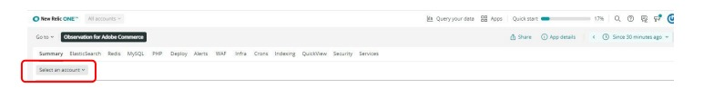

# Selección de la cuenta y el calendario:

Al hacer clic en [!UICONTROL Observation for Adobe Commerce] , el icono [!DNL Observation for Adobe Commerce] nerdlet se abrirá.

1. Haga clic en **Seleccione una cuenta** desplegable. Si no ve el **Seleccione una cuenta** , es posible que no tenga acceso. Clic [aquí](https://adobe.sharepoint.com/sites/MG/it/IT%20Services%20Wiki/Requesting%20access%20to%20Magento%20Commerce%20New%20Relic.aspx) para solicitar acceso.

   

1. Puede pegar project_id, escriba en [!DNL New Relic] número de cuenta o nombre de cuenta, o examine la lista de cuentas.

   

1. Haga clic en **azul claro** (hacia la parte superior derecha de la ventana de nerdlet) menú desplegable con el icono del reloj.

   

1. Debe establecer la hora antes de la fecha y hora del vale para ver si ha habido algún evento o dato anterior. Puede utilizar los marcos de tiempo preestablecidos a la izquierda o establecer un marco de tiempo personalizado seleccionando **Establecer personalizado**.
