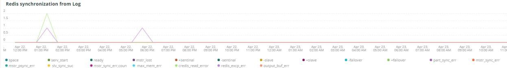
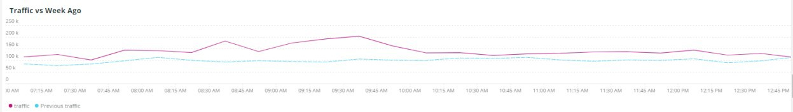
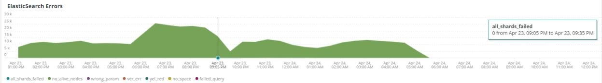
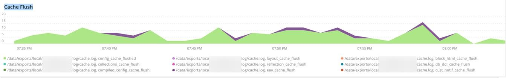

# La variable [!UICONTROL Summary] ficha

La variable [!UICONTROL Summary] pestaña [!DNL Observation for Adobe Commerce] está pensado para ver rápidamente algunos de los problemas experimentados por los sitios para ayudarle a resolver automáticamente o identificar posibles causas de los problemas del sitio. Las pestañas adicionales proporcionan información de nivel más profundo sobre los servicios de componentes, la base de datos, la infraestructura y los estados de proceso.

## [!UICONTROL Transaction Overview]

### [¿Qué es una transacción?](https://docs.newrelic.com/docs/apm/transactions/intro-transactions/transactions-new-relic-apm/#:%7E:text=transactions%20are%20reported.-,What%20is%20a%20transaction%3F,trabajo%20in%20a%20software%20application.&amp;text=For%20APM%2C%20it%20will%20frecuentemente,cuando%20the%20response%20is%20sent)

&quot;En [!DNL New Relic], una transacción se define como una unidad de trabajo lógica en una aplicación de software. En concreto, hace referencia a las llamadas a funciones y a métodos que conforman esa unidad de trabajo. A menudo hace referencia a una transacción web, que representa una actividad que se produce desde el momento en que la aplicación recibe una solicitud web hasta el momento en que se envía la respuesta.&quot;

### Tipos de transacciones:

**Web:** Las transacciones web se inician con una solicitud HTTP. Para la mayoría de las organizaciones, estas representan interacciones centradas en los clientes y, por lo tanto, son las transacciones más importantes de monitorizar.

**No web:** Las transacciones que no son de web no se inician con una solicitud web. Pueden incluir procesos de trabajo no web, procesos en segundo plano, secuencias de comandos, actividad de cola de mensajes y otras tareas.

Si consulta la **[!UICONTROL Transaction Overview]** arriba, hubo casi 53,000 transacciones con una puntuación media APDEX de 0.76, y el 95% de esas transacciones se produjeron en menos de 2.313 segundos. Este sería un marco en el que un periodo de tiempo más ajustado podría mostrar una desviación de la media actual si hay una visita de APDEX durante un periodo breve.

## [!UICONTROL 404 page errors frame]

La variable **[!UICONTROL 404 page errors]** el marco enumera las [URI](https://en.wikipedia.org/wiki/Uniform_Resource_Identifier) y el recuento de errores de 404 páginas para un intervalo de tiempo seleccionado.

## [!UICONTROL % of Storage Free frame]

La variable **[!UICONTROL % of Storage Free]** frame muestra el porcentaje promedio libre de los montajes de almacenamiento en todos los nodos del clúster. Por ejemplo, si tiene un clúster de tres nodos, el marco muestra la variable&lt;mount point=&quot;&quot;>, \&lt;environment name=&quot;&quot;>. Este marco puede resultar engañoso si hay una varianza entre tres nodos. Un ejemplo de variación sería si la variable `/data/mysql` el punto de montaje libre era un valor diferente en el clúster de tres nodos. Hay un fotograma debajo de la variable [!UICONTROL MySQL] ficha que faceta los puntos de montaje por nombre de nodo para ver con mayor precisión qué es la variable `/data/mysql` el almacenamiento gratuito en cada nodo lo es realmente.

## [!UICONTROL % of system memory that is free frame]

La variable **% de memoria del sistema libre** frame muestra, por nodo, la cantidad de memoria del sistema libre en cada nodo.

## [!UICONTROL Swap memory free in bytes]

La variable **[!UICONTROL Swap memory free in bytes]** frame muestra, por nodo, la cantidad de memoria SWAP libre en el nodo.

## [!UICONTROL CPU % by host]

El agregado de todos los entornos y nodos se muestra en la variable **[!UICONTROL CPU % by host]** cuadro. Debe anular la selección de los entornos que no sean de producción. Tenga en cuenta también las instancias en las que no están presentes todos los nodos del entorno de producción. Para obtener más sugerencias sobre la alta utilización de la CPU, consulte [Resolución de problemas de rendimiento con la nueva relación de transmisión en Adobe Commerce](https://experienceleague.adobe.com/docs/commerce-knowledge-base/kb/troubleshooting/miscellaneous/troubleshoot-performance-using-new-relic-on-magento-commerce.html).

## [!UICONTROL Alerts during timeframe]

La variable **[!UICONTROL Alerts during timeframe]** muestra todas las alertas, incluido el [!UICONTROL Managed Alerts] agregado por el servicio de asistencia técnica de Adobe Commerce.

## [!UICONTROL CPU Usage]

Si la variable **[!UICONTROL CPU Usage]** el marco está vacío, lo que indica que la aplicación de infraestructura de [!DNL New Relic] no está habilitado. Si su sitio está en Inicio, no verá esta información. Si su sitio está en Pro, abra un [ticket de asistencia](https://experienceleague.corp.adobe.com/docs/commerce-knowledge-base/kb/help-center-guide/magento-help-center-user-guide.html?lang=en) para [!DNL New Relic Infrastructure] habilitado para su sitio.

## [!UICONTROL Average Response Time]

La variable **[!UICONTROL Average Response Time]** el gráfico muestra el tiempo de respuesta promedio para las transacciones (web y otras).

## [!UICONTROL Long duration cron_schedule updates]

La variable **[!UICONTROL cron_schedule]** se escribe al principio y al final de los trabajos cron. Los trabajos cron de larga duración podrían indicar latencia al actualizar esta tabla, lo que puede indicar apilamiento cron o un problema con la programación de crons.

## [!UICONTROL Response Code]

La variable **[!UICONTROL Response Code]** frame es una buena indicación del tráfico web y el código de respuesta de las solicitudes. Es [!DNL New Relic's] los datos de transacción, que se facetean con la variable `httpResponseCode` devuelto.

## [!UICONTROL Web Traffic volume compared with one week ago Magento Managed Alerts Information]

Este marco muestra el volumen de tráfico web comparativo de la última semana y la semana actual.

## [!UICONTROL Deployment Log Entries]

La variable **[!UICONTROL Deployment Log Entries]** frame muestra un recuento de las entradas de implementación y registro de nube y facetas de los recuentos según el nombre del registro de implementación.

## [!UICONTROL Deployment State]

La variable **[!UICONTROL Deployment State]** facetas de marco de determinadas fases de implementación desde los registros de implementación. A continuación, se muestran algunos ejemplos de fases contadas en el registro y el nombre de la faceta:

**Fases de registro de implementación:**

* &#39;%Iniciando generar comando%&#39;) como &#39;start_gen&#39;
* &#39;%git aplique /app/provider/magento/ece-tools/patches%&#39;) como &#39;apply_patches&#39;
* Indicador &#39;%Set: .static_content_deploy%&#39;) como &#39;SCD&#39;
* &#39;%AVISO: Generar comando completado%) como &#39;gen_compl&#39;
* &#39;%AVISO: Implementación completada%) como &#39;deploy_compl&#39;
* &#39;%AVISO: Iniciando post-implementación.%&#39;) como &#39;start_deploy&#39;
* &#39;%AVISO: El posdespliegue se ha completado (%) como &quot;implementación&quot;
* &#39;%deploy-complete%&#39;) como &#39;cl_deploy_compl&#39;

## [!UICONTROL IP Frequency]

La variable **[!UICONTROL IP Frequency]** frame cuenta los estados (&quot;MISS&quot; y &quot;PASS&quot;) para cada IP desde el [!DNL Fastly] registros. Las solicitudes web con estos estados llegan al servidor de origen y añaden carga al servidor. Muestra las veinte direcciones principales con frecuencia. Este marco se puede utilizar para detectar ataques IP o fuentes de carga pesada en un sitio web.

## [!UICONTROL IP Response – top 20 URLs in duration]

La variable **[!UICONTROL IP Response – top 20 URLs in duration]** muestra las direcciones URL con la duración más larga en respuesta. Puede indicar archivos de imagen o páginas grandes, API o páginas con la duración de respuesta más larga.

## [!UICONTROL API Calls by IP]

La variable **[!UICONTROL API Calls by IP]** frame ayuda a identificar el tráfico pesado con respecto a las API y las direcciones IP que realizan solicitudes desde las URL de las API.

## [!UICONTROL API Calls by IP, details by URL]

La variable **[!UICONTROL API Calls by IP, details by URL]** frame proporciona detalles de tráfico pesado contra las API y detalles de las URL que realizan las solicitudes.

## [!UICONTROL IP Frequency Rate per minute]

A veces es difícil saber qué dirección IP tiene la mayor cantidad de solicitudes en las otras tramas. La variable **[!UICONTROL IP Frequency Rate per minute]** frame muestra la velocidad por minuto por dirección IP.

## [!UICONTROL Potential Bots]

La variable **[!UICONTROL Potential Bots]** frame busca solicitudes con un nombre request_user_agent como NULL o &#39;%bot%&#39;. Normalmente, el &#39;%bot%&#39; request_user_agent sigue la configuración de directivas en `robots.txt` archivo.

## [!UICONTROL Transaction Errors]

La variable **[!UICONTROL Transaction Errors]** frame muestra el recuento de errores de transacción de [!DNL New Relic].

## [!UICONTROL Nginx access by node]

La variable **[!UICONTROL Nginx access by node]** frame busca los recuentos de `access.log` por nodo. Es útil ver si la carga está distribuida de forma uniforme. A menudo muestra cuándo un nodo cae. El marco también muestra la carga en todo el sitio.

## [!UICONTROL Galera Log]

[[!DNL Galera]](https://galeracluster.com/library/galera-documentation.pdf) se utiliza para el clúster de base de datos. Este marco se centra en señales particulares de [!UICONTROL Galera] clúster. Las señales se centran en los nodos que entran y salen del clúster, lo que es un comportamiento normal para mantener la integridad de los datos de la base de datos. Los nodos se mantienen sincronizados como el [!UICONTROL Galera] cambios en el estado del clúster.

**Lista de [!UICONTROL Galera] cambios de estado:**

* &#39;%1047 WSREP aún no ha preparado el nodo para el uso de la aplicación%&#39;) como &#39;node_not_prep_for_use&#39;
* WSREP &#39;%\[ERROR\]: No se pudo leer desde: wsrep_sst_xtrabackup-v2%) como &#39;xtrabackup_read_failure&#39;
* WSREP &#39;%\[ERROR\]: Proceso completado con error: wsrep_sst_xtrabackup-v2 %) como &#39;xtrabackup_compl_w_err&#39;
* WSREP &#39;%\[ERROR\]: error de escritura de rbr%) como &#39;rbr_write_failed&#39;
* &#39;%self-Leave%&#39;) como &#39;susp_node&#39;
* &#39;%Members = 3/3 (unido/total)%&#39;) como &#39;3of3&#39;
* &#39;%Members = 2/3 (unido/total)%&#39;) como &#39;2of3&#39;
* &#39;%miembros = 2/2%&#39;) como &#39;2of2&#39; * &#39;%miembros = 1/2%&#39;) como &#39;1de2&#39; * &#39;%miembros = 1/3%&#39;) como &#39;1de3&#39;
* &#39;%Members = 1/1%&#39;) como &#39;1of1&#39;
* &#39;%\[Nota\] /usr/sbin/mysqld (mysqld 10.%&#39;) como &#39;sql_restart&#39;
* &#39;%Quórum: Ningún nodo con estado completo:%) como &#39;no_node_count&#39;
* &#39;%WSREP: Miembro 0%&#39;) como &#39;mem_0&#39;
* &#39;%WSREP: Miembro 1.0%) como &#39;mem_1&#39;
* &#39;%WSREP: Miembro 2%) como &#39;mem2&#39;
* &#39;%WSREP: Sincronizado con grupo, listo para conexiones%) como &quot;listo&quot;
* &#39;%/usr/sbin/mysqld, Versión:%) como &#39;mysql_restart_mysql.slow&#39;
* WSREP &#39;%\[Nota\]: Nueva vista de clúster: estado global:%) como &#39;galera_cluster_view_chng&#39;

Estas señales pueden indicar problemas de almacenamiento, memoria o consulta si el estado cambia con frecuencia.

## [!UICONTROL Database errors]

**Lista de errores de base de datos o mensajes detectados:**

* &#39;%El tamaño de memoria asignado para la tabla temporal es superior al 20% de innodb_buffer_pool_size%&#39;) como &#39;temp_tbl_buff_pool&#39;
* WSREP &#39;%\[ERROR\]: error de escritura de rbr%) como &#39;rbr_write_failed&#39;
* &#39;%mysqld: Disco lleno%&#39;) como &#39;disk_full&#39;
* &#39;%Error número 28%&#39;) como &#39;err_28&#39;
* &#39;%rollback%&#39;) como &#39;rollback&#39;
* &#39;%La restricción de clave externa falla para la tabla%&#39;) como &#39;external_key_constraint&#39;
* &#39;%Error_code: 1114%) como &#39;sql_1114_full&#39;
* &#39;%CRÍTICO: SQLSTATE\[HY000\] \[2006\] El servidor MySQL ha desaparecido%&#39;) como &#39;sql_away&#39;
* &#39;%SQLSTATE\[HY000\] \[1040\] Demasiadas conexiones%&#39;) como &#39;sql_1040&#39;
* &#39;%CRÍTICO: SQLSTATE\[HY000\] \[2002\]%&#39;) como &#39;sql_2002&#39;
* &#39;%SQLSTATE\[08S01\]:%&#39;) como &#39;sql_1047&#39;
* &#39;%\[Warning\] Aborted connection%&#39;) como &#39;aborted_conn&#39;
* &#39;%SQLSTATE\[23000\]: Infracción de restricción de integridad:%) como &#39;sql_23000&#39;
* &#39;%1205 Bloquear tiempo de espera%&#39;) como &#39;sql_1205&#39;
* &#39;%SQLSTATE\[HY000\] \[1049\] Base de datos desconocida%&#39;) como &#39;sql_1049&#39;
* &#39;%SQLSTATE\[42S02\]: No se encuentra la tabla o vista base:%) como &#39;sql_42S02&#39;
* &#39;%Error general: 1114%) como &#39;sql_1114&#39;
* &#39;%SQLSTATE\[40001\]%&#39;) como &#39;sql_1213&#39;
* &#39;%SQLSTATE\[42S22\]: Columna no encontrada: 1054 (Columna desconocida%) como &#39;sq1_1054&#39;
* &#39;%SQLSTATE\[42000\]: Error de sintaxis o infracción de acceso:%) como &#39;sql_42000&#39;
* &#39;%SQLSTATE\[21000\]: Infracción de cardinalidad:%) como &#39;sql_1241&#39;
* &#39;%SQLSTATE\[2003\]:%&#39;) como &#39;sql_22003&#39;
* &#39;%SQLSTATE\[HY000\] \[9000\] Cliente con dirección IP%&#39;) como &#39;sql_9000&#39;
* &#39;%SQLSTATE\[HY000\]: Error general: 2014%) como &#39;sql_2014&#39;
* &#39;%1927 Se mató la conexión%&#39;) como &#39;sql_1927&#39;
* &#39;%1062 \[\ERROR\] InnoDB:%&#39;) como &#39;sql_1062_e&#39;
* WSREP &#39;%\[Nota\]: Vaciando el mapa de memoria al disco...%&#39;) como &#39;mem_map_flush&#39;
* &#39;%Código de error interno de MariaDB: 1146%) como &#39;sql_1146&#39;
* &#39;%Código de error interno de MariaDB: 1062%) como &#39;sql_1062&#39; * &#39;%1062 \[Warning\] InnoDB:%&#39;) como &#39;sql_1062_w&#39;
* &#39;%Código de error interno de MariaDB: 1064%) como &#39;sql_1064&#39;
* &#39;%InnoDB: Error de aserción en el archivo%) como &#39;assertion_err&#39;
* &#39;%mysqld_safe Número de procesos en ejecución ahora: 0%) como &#39;mysql_oom&#39;
* &#39;%\[ERROR\] mysqld obtuvo la señal%&#39;) como &#39;mysql_sigterm&#39;
* &#39;%1452 No se puede agregar%&#39;) como &#39;sql_1452&#39;
* &#39;%ERROR 1698%&#39;) como &#39;sql_1698&#39;
* &#39;%SQLSTATE\[HY000\]: Error general: 3%) como &#39;cnt_wrt_tmp&#39;
* &#39;%Error general: 1 %&#39;) como &#39;sql_sintaxis&#39;
* &#39;%42S22%&#39;) como &#39;sql_42S22&#39;
* &#39;%InnoDB: Error (Duplicate key)%&#39;) como &#39;innodb_dup_key&#39;

## [!UICONTROL Database traces]

La variable **[!UICONTROL Database traces]** frame busca los datos de [sql trace](https://docs.newrelic.com/docs/apm/transactions/transaction-traces/transaction-traces-database-queries-page/) entidad de [!DNL New Relic] y devuelve la ruta del seguimiento.

## [!UICONTROL Database mysql-slow.log]

La variable **[!UICONTROL Database mysql-slow.log]** frame hace un recuento de entradas en la variable [mysql-slow.log](https://dev.mysql.com/doc/refman/5.7/en/slow-query-log.html) por tipo de solicitud de consulta. Aísla visualmente los marcos de tiempo que pueden ser de interés en mysql-slow.log (registro de consulta lento). Las consultas de tablas sin índices o consultas que actualizan tablas grandes pueden bloquear otras consultas.

## [!UICONTROL Redis synchronization from Log]

[[!DNL Redis]](https://redis.io/docs/about/) es un almacén de estructura de datos en memoria de código abierto (con licencia BSD) que se utiliza como base de datos, caché y agente de mensajes. Si se configura, puede almacenar en caché la base de datos y la sesión. La variable **[!UICONTROL Redis synchronization from Log]** el enfoque del marco [[!DNL Redis] sincronización](https://redis.io/docs/manual/replication/). Cuanto mayor sea, [!DNL Redis] conjunto de datos, cuanto más probable sea que haya problemas con la sincronización (más datos para mantener sincronizados).

**[!DNL Redis]errores y mensajes:**

* Sincronización &#39;%SLAVE: No queda espacio en el dispositivo%&#39;) como &quot;espacio&quot;
* &#39;%Server se inició, Redis version%&#39;) como &#39;serv_start&#39;
* &#39;%El servidor está listo para aceptar conexiones%&#39;) como &#39;listo&#39;
* &#39;%Se perdió la conexión con el maestro.%&#39;) como &#39;mstr_lost&#39;
* &#39;%+sdown sentinel%&#39;) como &#39;+sentinal&#39;
* &#39;%-sdown sentinel%&#39;) como &#39;-sentinal&#39;
* &#39;%-sdown esclavo%&#39;) como &#39;-esclavo&#39;, &#39;%+sdown esclavo%&#39;) como &#39;+esclavo&#39;
* &#39;%-failover-abort-not-selected master mymaster%&#39;) como &#39;-failover&#39;
* &#39;%+failover-abort-not-selected master mymaster%&#39;) como &#39;+failover&#39;
* &#39;%No es posible la resincronización parcial (sin maestro en caché)%&#39; como &#39;part_sync_err&#39;
* &#39;%MASTER anuló la replicación con un error: ERR Can%&#39;) como &#39;mstr_sync_err&#39;
* &#39;%Master no es compatible con PSYNC o está en estado de error%&#39;) como &#39;mstr_psync_err&#39;
* &#39;%SLAVE sync: Finalizado con éxito%&#39;) como &#39; slv_sync_suc&#39;
* &#39;%MASTER anuló la replicación con un error: ERR Can%) como &#39;mstr_sync_err,coun&#39;
* &#39;%OOM comando no permitido cuando se usa la memoria%&#39;) como &#39; max_mem_err&#39;
* &#39;%CredisException(código: 0): error de lectura en connection%&#39;) como &#39;credis_read_error&#39;
* &#39;%RedisException no capturada:%&#39;) como &#39;redis_excp_err&#39;
* &#39;%psync programado para cerrarse lo antes posible para superar el búfer de salida%&#39;) como &#39;output_buf_err&#39;

## [!UICONTROL PHP process states]

La manera en que se comportan los procesos PHP depende de la variable [configuración](https://www.php.net/manual/en/install.fpm.configuration.php). La configuración es compleja, con muchas variables y opciones. La variable **[!UICONTROL PHP process states]** frame le ayuda a comprender cuándo se terminan y reinician los procesos PHP.

### [!UICONTROL PHP errors]

La variable **[!UICONTROL PHP errors]** frame muestra el número de errores de PHP con trabajadores a lo largo del periodo de tiempo seleccionado. Para obtener más información, consulte [Configuración de Adobe Commerce PHP](../../installation/prerequisites/php-settings.md).

**Errores y mensajes de PHP:**

* &#39;%worker_connectors no es suficiente%&#39;) como &#39;secundario&#39;
* &#39;%PHP Error irrecuperable: ¡Tamaño de memoria permitido!%&#39;) como &#39;mem_size&#39;
* &#39;%salió en la señal 11 (SIGSEGV)%&#39; como &#39;sig_11&#39;
* &#39;%se cerró en la señal 7 (SIGBUS)%&#39; como &#39;sig_7&#39;
* &#39;%incremente pm.start_servers%&#39;) como &#39;pmstart_serv&#39;
* &#39;%max_children%&#39;) como &#39;max_children_cnt&#39;
* &#39;%PHP Error irrecuperable: Tamaño de memoria permitido de%&#39;) como &#39;mem_exhst_coun&#39;
* &#39;%No se puede asignar memoria para pool%&#39;) como &#39;opc_mem_count&#39;
* &#39;%Warning Interstring buffer overflow%&#39;) como &#39;opc_str_buf&#39;
* &#39;%Desconexión de cadena no válida%&#39;) como &#39;opc_sv_comments&#39;
* &#39;%PHP Error irrecuperable: RedisException no detectada: error de lectura en connection%&#39;) como &#39;php_exc&#39;

## [!UICONTROL PHP processes]

[PHP-FPM](https://php-fpm.org/) es [!UICONTROL FastCGI Process Manager] usado por [!DNL Nginx]. Para obtener más información sobre los requisitos del sistema, consulte [Requisitos de versión de PHP asignados a versiones de Adobe Commerce](../../installation/system-requirements.md). La variable **[!UICONTROL PHP processes]** frame muestra el número de procesos PHP que se ejecutan en un momento en particular en la cronología seleccionada.

## [!UICONTROL Secondary processes]

Los procesos secundarios pueden afectar a la respuesta del sitio. La variable **[!UICONTROL Secondary processes]** frame indica un proceso o procesos que pueden estar agregando carga al sitio. La base de datos tiene principalmente la mayoría de procesos secundarios en ejecución.

## [!UICONTROL Traffic vs Week Ago]

La variable **[!UICONTROL Traffic vs Week Ago]** frame observa el tráfico del sitio web (solicitudes) desde el [!DNL Fastly] registros con estados de caché (&quot;MISS&quot;, &quot;PASS&quot;). Estas solicitudes añaden carga a los servidores de origen. Este marco muestra el volumen de solicitud web comparativo de la semana actual y de la semana anterior durante el mismo periodo de tiempo.

## [!UICONTROL Fastly Cache]

La variable **[!UICONTROL Fastly Cache]** frame muestra una vista agregada del estado de caché de las solicitudes del [!DNL Fastly] registros. Si selecciona ERROR, se mostrará el porcentaje de errores en las solicitudes. Esto suele aumentar cuando el servidor de origen no responde lo suficientemente rápido a las solicitudes de página.

## [!UICONTROL Page Rendering]

La variable **[!UICONTROL Page Rendering]** frame muestra la duración promedio de representación de página de la semana actual desde el origen de vista de página de [!DNL New Relic] comparado con la semana anterior durante el mismo período de tiempo.

## [!UICONTROL Page loading detail]

La variable **[!UICONTROL Page loading detail]** frame describe los eventos de carga de página. Detalla el significado de estas facetas. Esta es la consulta que se ejecuta para este marco:

`SELECT percentile(timeToResponseStart, 50) AS 'first byte', percentile(firstPaint, 50) as 'First paint', percentile(firstContentfulPaint, 50) as 'First contentful paint', percentile(timeToDomContentLoadedEventEnd, 50) AS 'DOM content loaded', percentile(duration, 50) AS 'Window load + AJAX' FROM BrowserInteraction TIMESERIES`

## [!UICONTROL Transactions – Avg, Max, Min]

La duración de la transacción está en segundos. Dependiendo de la transacción, puede afectar a otras transacciones si es de larga duración. Las transacciones enumeradas bajo nombre y las duraciones son para el período de tiempo específico. Si hay un intervalo de tiempo del problema conciso, cambie el tamaño de la variable [!DNL Observation for Adobe Commerce] selector de fecha y hora a ese intervalo de tiempo limitado.

## [!UICONTROL Admin Activities]

La variable **[!UICONTROL Admin Activities]** frame identifica transacciones con un usuario administrador.

## [!UICONTROL Order transactions (default?)]

La variable **[!UICONTROL Order transactions (default?)]** busca marco para transacciones `request.headers.host` de transacciones, donde el nombre = `WebTransaction/Action/checkout/onepage/success`. Si la URL de éxito del pedido es diferente, este marco no tendrá datos.

## [!UICONTROL Elasticsearch Index information]

**[estados del Elasticsearch:](https://www.elastic.co/guide/en/elasticsearch/reference/current/cluster-health.html)**

* Verde: Se asignan todos los fragmentos.
* Amarillo: Se asignan todos los elementos compartidos principales, pero uno o más elementos compartidos de réplica no están asignados. Si falla un nodo del clúster, es posible que algunos datos no estén disponibles hasta que se repare el nodo.
* Rojo: Uno o más elementos principales no están asignados, por lo que algunos datos no están disponibles. Esto puede ocurrir brevemente durante el inicio del clúster, ya que se asignan los elementos principales.

## [!UICONTROL Elasticsearch Errors]

**[!DNL Elasticsearch]errores:**

* &#39;%todos los fragmentos fallaron%&#39; como &#39;all_shards_failed&#39;
* &#39;%NoNodesAvailableException%&#39; como &#39;no_live_nodes&#39;
* &#39;%PHP Error irrecuperable: Error no detectado: Parámetros incorrectos para el Elasticsearch% como &quot;incorrecto_param&quot;
* &#39;%Puede solucionar este problema actualizando el servicio de Elasticsearch de la infraestructura de Magento Cloud a la versión%&#39; como &#39;ver_err&#39;
* &#39;%El estado de mantenimiento del clúster cambió de \[AMARILLO\] a \[RED\] (motivo:%) como &#39;yel_red&#39;
* &#39;%No queda espacio en el dispositivo%&#39; como &#39;no_space&#39;
* &#39;% No se pudo ejecutar [SearchRequest{searchType=%&#39; como &#39;failed_query&#39;

## [!UICONTROL Cron view]

La variable **[!UICONTROL Cron view]** frame busca en el registro cron el equilibrio entre el número de crons iniciados y el número de crons terminados.

## [!UICONTROL Cron error]

**Errores cron de cron.log:**

* &#39;%_stg%&#39; como &#39;stg_crons&#39;
* &#39;%No se pudo adquirir el bloqueo para el trabajo cron%&#39; como &#39;cron_lock&#39;
* &#39;%Error general: 2006 El servidor MySQL ha desaparecido% como &#39;mysql_has_away_away&#39;
* &#39;%error%&#39; como &#39;error&#39;
* &#39;%Error general: 1205 Se superó el tiempo de espera de bloqueo%&#39; como sql_1205_cron

## [!UICONTROL cron_schedule table updates]

La variable **[!UICONTROL cron_schedule table updates]** frame busca la duración máxima en segundos donde las actualizaciones de operaciones del almacén de datos involucran la tabla cron_schedule. Se le aplica un aspecto al tipo de solicitud SQL.

## [!UICONTROL Datastore Operations Tables]

Esta **[!UICONTROL Datastore Operations Tables]** frame muestra las 25 operaciones principales por duración, nombre de tabla y tipo de solicitud SQL. Pase el ratón sobre los picos para ver los detalles de a qué tabla se estaba accediendo y por qué tipo de solicitud.

## [!UICONTROL Cache Flush]

**Borradores de caché detectados:**

* &#39;%config%&#39; como &#39;config_cache_flushing&#39;
* &#39;%layout%&#39; como &#39;layout_cache_flush&#39;
* &#39;%block_html%&#39; como &#39;block_html_cache_flush&#39;
* &#39;%collections%&#39; como &#39;collections_cache_flush&#39;
* &#39;%reflejo%&#39; como &#39;reflejo_cache_flush&#39;
* &#39;%db_ddl%&#39; como &#39;db_ddl_cache_flush&#39;
* &#39;%compilado_config%&#39; como &#39;compile_config_cache_flush&#39;
* &#39;%eav%&#39; como &#39;eav_cache_flush&#39;
* &#39;%customer_notification%&#39; como &#39;cust_notif_cache_flush&#39;
* &#39;%config_integration%&#39; como &#39;config_integ_cache_flush&#39;
* &#39;%config_integration_api%&#39; como &#39;config_integ_api_cache_flush&#39;
* &#39;%full_page%&#39; como &#39;full_page_cache_flush&#39;
* &#39;%config_webservice%&#39; como &#39;config_webserv_cache_flush&#39;
* &#39;%translate%&#39; como &#39;translate_cache_flush&#39;
