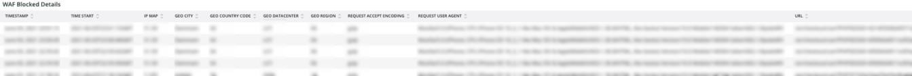

# La ficha [!DNL WAF]

La ficha **[!DNL WAF]** muestra el tráfico pasado y bloqueado por [!DNL firewall].

## [!DNL WAF traffic summary]

El marco **[!DNL WAF traffic summary]** muestra un recuento del tráfico pasado, registrado, bloqueado y con errores por [!DNL firewall].

## [!DNL WAF Top 10 blocked IP Addresses]

El marco **[!DNL WAF Top 10 blocked IP Addresses]** muestra las 10 direcciones IP más bloqueadas por [!DNL firewall].

## [!DNL WAF Top 10 countries for blocked requests]

El marco **[!DNL WAF Top 10 countries for blocked requests]** muestra un recuento de solicitudes bloqueadas de países dentro de los 10 principales para solicitudes bloqueadas por parte de [!DNL firewall].

## [!DNL WAF Top 10 logged IP Addresses]

El marco **[!DNL WAF Top 10 logged IP Addresses]** muestra las direcciones IP en las 10 principales direcciones IP registradas por [!DNL firewall].

## [!DNL Top 10 WAF Rules Executed and Logged by IP address]

El marco **[!DNL Top 10 WAF Rules Executed and Logged by IP address]** muestra las direcciones IP que se encuentran entre las 10 reglas que coinciden con más frecuencia con [!DNL firewall].

## [!DNL WAF Logged Details]

El marco **[!DNL WAF Logged Details]** muestra las solicitudes registradas por [!DNL firewall], incluidos detalles como la marca de tiempo, la ciudad, la región y el centro de datos.

## [!DNL WAF Blocked Details]

El marco **[!DNL WAF Blocked Details]** muestra las solicitudes bloqueadas por [!DNL firewall], incluidos detalles como la marca de tiempo, la ciudad, la región y el centro de datos.
