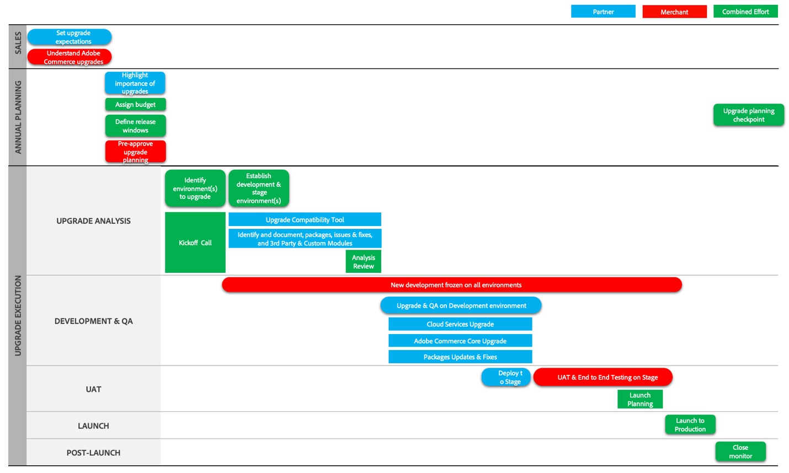

# Fases de recorrido de actualización

Las actualizaciones requieren atención, planificación y administración. Para ayudarle a comprender el recorrido de actualización para Adobe Commerce y Magento Open Source, describimos el proceso en tres fases principales:

- [Inicio del proyecto](project-launch.md)
- [Planificación anual](annual-planning.md)
- [Implementación](implementation.md)

