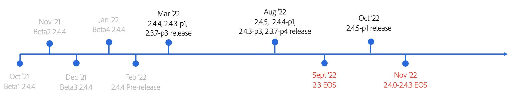

# Descripción general del proceso de actualización

La actualización de su proyecto Adobe Commerce o Magento Open Source es fundamental para garantizar que su tienda siga siendo segura, compatible con PCI y funcionando con la máxima eficacia. Hemos desarrollado esta guía para guiarle por las consideraciones clave al prepararse para una actualización.

La guía proporciona información general sobre el recorrido de actualización típico de Adobe Commerce/Magento Open Source y prácticas recomendadas para seguir ese recorrido. También se describen detalles técnicos del proceso de actualización con un ejemplo oportuno e instrucciones paso a paso para actualizar a la versión 2.4.4 de Adobe Commerce/Magento Open Source. La versión de parches 2.4.4 estará disponible para el público general el 8 de marzo de 2022, por lo que es importante empezar a prepararse para esta actualización antes de que finalice el [Fin de vida útil (EOL)](https://devdocs.magento.com/release/lifecycle-policy.html) las fechas se aproximan tanto para la línea 2.3 como para las versiones 2.4.0 a 2.4.3 en 2022. Finalmente, proporcionamos recursos de planificación y herramientas de actualización que hacen que su proceso de actualización sea más eficiente.

## ¿Para quién es esta guía?

La audiencia de destino de esta guía incluye:

### Administradores de comercio electrónico y directores técnicos

Esta guía ayuda a los clientes con estas funciones a comprender el recorrido de la actualización, la importancia de la actualización regularmente y cómo planificar y preparar mejor una actualización.

### Equipos de operaciones y desarrollo

Esta guía ayuda a estos equipos a aprender los pasos técnicos necesarios para actualizar a la versión 2.4.4 (o a cualquier versión de Adobe Commerce/Magento Open Source) y las herramientas que pueden utilizar para facilitar, acelerar y hacer que el proceso sea más asequible.

## Explicación del proceso de actualización

Una de las razones por las que eligió probablemente Adobe Commerce/Magento Open Source incluye:

- Conjunto de funciones integrado
- Funciones SaaS ofrecidas por separado del código principal
- Sólida oferta de extensiones de Marketplace
- Capacidad única para permitir una flexibilidad infinita, de modo que pueda personalizar su sitio para que se adapte mejor a las necesidades de su empresa y de los clientes.

Sin embargo, la ventaja de ser un producto altamente extensible y personalizable puede estimular posibles problemas de actualización cuando las personalizaciones no están codificadas según las prácticas recomendadas, lo que genera costos de actualización más altos de lo esperado.

_Entonces... ¿por qué actualizar?_

La actualización permite a su empresa mantenerse ágil en el sector del comercio electrónico, que se encuentra en una posición acelerada y cambiante, y permite que su plataforma sea siempre compatible con las últimas funciones que ayudan a maximizar las ventas y las conversiones. La inclusión de actualizaciones en sus planes de mantenimiento regulares también es fundamental para garantizar que su tienda siga siendo segura, compatible con PCI y funcionando con la máxima eficiencia.

### Seguridad

La seguridad es una de las principales razones para actualizar, ya que el 83% de los incidentes de seguridad se producen en software obsoleto. Según [IBM](https://www.ibm.com/security/data-breach), el costo promedio de una infracción de datos es de $3,86 millones, mucho bueno de lo que cuesta mitigar este riesgo a través de la actualización. Adobe ofrece dos maneras de mantener su tienda segura durante todo el año:

- **Versiones de parches**: incluye correcciones de errores de seguridad, rendimiento, calidad y alta prioridad.
- **Versiones de parches de seguridad**: incluye correcciones y mejoras para mantener el sitio seguro y es más fácil de implementar.

### Rendimiento

El rendimiento es otra razón importante para la actualización. Según [HubSpot](https://blog.hubspot.com/marketing/page-load-time-conversion-rates), los primeros cinco segundos de tiempo de carga tienen un efecto significativo en las tasas de conversión y cada segundo de latencia a partir de entonces tiene un impacto de -4,4%. Esto, unido al hecho de que la velocidad de la página es un factor de clasificación de SEO líder, demuestra por qué el rendimiento del sitio es un elemento crítico del sitio para mantener y mejorar regularmente. Cada versión de parches incluye mejoras de rendimiento, por lo que aprovechar las nuevas versiones es compatible con sus planes de crecimiento y mantiene la competitividad de su negocio.

### Coste del retraso

El caso de retrasar o aplazar las actualizaciones de la plataforma a menudo se reduce al coste inmediato. Sin embargo, el costo real de ejecutar una versión obsoleta de cualquier software es mucho mayor y puede tener un impacto duradero en un negocio.

Puede parecer contrario a la intuición, pero realizar actualizaciones regulares de la plataforma requiere menos esfuerzo general que realizar actualizaciones poco frecuentes debido a la cantidad de deuda técnica acumulada que resulta de un retraso. Recientemente trabajamos con un socio que tiene un comerciante minorista que solía realizar actualizaciones de manera poco frecuente y poco sistemática (anualmente o más). Al transformar la forma en que abordan las actualizaciones y siguiendo una ruta de actualización regular recomendada por el Adobe a lo largo de 12 meses, el socio pudo ahorrar al cliente cuatro semanas de tiempo, esfuerzo y costos asociados de desarrollo acumulativos, todos los cuales fueron redirigidos a iniciativas que impulsan el crecimiento del negocio.

Cuando las actualizaciones se realizan regularmente, los cambios son incrementales y el esfuerzo de actualización correspondiente lo refleja. Cuando las actualizaciones de la plataforma se posponen durante un periodo prolongado, pueden convertirse en un proceso mucho más involucrado. Además, las extensiones que utiliza desde la variable [Marketplace](https://marketplace.magento.com/) y cualquier otra integración de terceros también puede verse afectada. Por último, el tiempo que se tarda en investigar, planificar y realizar una actualización retrasada se amplía, lo que añade esfuerzo y costes evitables.

Algunos de los factores generales que afectan al nivel de esfuerzo para actualizar el proyecto incluyen, entre otros:

| Complejidad técnica | Planificación y estrategia |
|-----------------------------------------------------------|--------------------------------------------------------------|
| Alcance de las personalizaciones | Claridad de los requisitos, decisiones vacilantes y margen de maniobra |
| Número de extensiones | Su frecuencia de actualización |
| Número de integraciones con terceros (OMS, ERP) | Su estrategia de pruebas |
| Codificación para prácticas recomendadas |  |

El continuo crecimiento del espacio de comercio digital ha ejercido una mayor presión sobre las empresas para que evolucionen más rápido, con más frecuencia y de maneras impredecibles. La incapacidad para mantenerse al día y anticipar el comportamiento de compra de los clientes ha nivelado el campo de juego incluso para las marcas más grandes y establecidas. Debe poder proporcionar experiencias sólidas y personalizadas en todos los puntos de contacto, sin lapsos de rendimiento y tiempo activo. Debe ser capaz de innovar más rápido, sin límites, para mantenerse por delante de los competidores globales. Al realizar la actualización, está probando su empresa en el futuro y configurándose para atender mejor las necesidades dinámicas del cliente.

## Calendario de versiones de 2022

Adobe publica un [programación de versiones](https://devdocs.magento.com/release/) anualmente para facilitar el proceso de planificación de los comerciantes y recomienda actualizar cada ciclo de lanzamiento de parches. Para seguir cumpliendo con PCI, los comerciantes deben estar en el último parche o parche de seguridad. En la siguiente cronología se muestran los principales eventos de lanzamiento y fin de vida útil de 2022.

Los eventos importantes que debe tener en cuenta son:

- La línea 2.3.x llega al fin de la asistencia (EOS) en septiembre de 2022
- 2.4.0 a 2.4.3 (basado en PHP 7.4) llega a EOS en noviembre de 2022, cuando PHP 7.4 llega al final de su vida útil (EOL)
- En función de estos dos eventos de EOS, **es importante actualizar a la versión 2.4.4 o superior para noviembre de 2022**
- En línea con Adobe Commerce [directiva de ciclo vital](https://devdocs.magento.com/release/lifecycle-policy.html), las versiones 2.4.4 y 2.4.5 recibirán asistencia de calidad y parches de seguridad hasta noviembre de 2024
