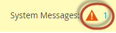

# Todas las aplicaciones requisitos previos de actualización

Es importante entender lo que es necesario para ejecutar Adobe Systems Commerce. Primero debe revisar los requisitos](../../installation/system-requirements.md) del [sistema para la versión a la que planea actualizar.

Después de revisar los requisitos del sistema, debe completar los siguientes requisitos previos antes de actualizar el sistema:

* Actualizar todo software
* Compruebe que está instalado un motor de búsqueda compatible
* Convertir tabla de base de datos formato
* Establecer el límite de archivos abiertos
* Verifique que los trabajos cron se estén ejecutando
* Poner `DATA_CONVERTER_BATCH_SIZE`
* Verificar permisos del sistema de archivos
* Establecer raíz del `pub/` directorio
* Instalar el plug-in de actualización de Composer

## Actualizar todo software

Los [requisitos](../../installation/system-requirements.md) del sistema describen exactamente qué versiones de terceros software se han probado con las versiones de Adobe Systems Commerce.

Asegúrese de haber actualizado todos los requisitos del sistema y las dependencias de la entorno. Consulte PHP [7.4](https://www.php.net/manual/en/migration74.php), PHP [8.0](https://www.php.net/manual/en/migration80.php), PHP [8.1](https://www.php.net/manual/en/migration81.php) y [la configuración](../../installation/prerequisites/php-settings.md#php-settings) de PHP requerida.

>[!NOTE]
>
>Para Adobe Systems Commerce en proyectos infraestructura en la nube Pro, debe crear un ticket de [soporte](https://experienceleague.adobe.com/docs/commerce-knowledge-base/kb/help-center-guide/magento-help-center-user-guide.html#submit-ticket) técnico para instalar o actualizar servicios en entornos de ensayo y producción. Indique los cambios de servicio necesarios e incluya sus archivos y actualizados `.magento.app.yaml` `services.yaml` y la versión de PHP en el ticket. El equipo de infraestructura de nube puede tardar hasta 48 horas en actualizar el proyecto. Consulte [Software y servicios compatibles](https://experienceleague.adobe.com/docs/commerce-cloud-service/user-guide/architecture/cloud-architecture.html#supported-software-and-services).

## Compruebe que está instalado un motor de búsqueda compatible

Adobe Systems Commerce requiere que Elasticsearch u OpenSearch estén instalados para poder utilizar el software.

**Si está actualizando de 2.3.x a 2.4**, debe comprobar si está utilizando MySQL, Elasticsearch o una extensión terceros ya que su catálogo motor de búsqueda en su instancia 2.3.x. El resultado determina lo que debe hacer _antes de_ actualizar a 2.4.

**Si está actualizando parche versiones dentro de las líneas** de versión 2.3.x o 2.4.x, si Elasticsearch 7.x ya está instalado, puede migrar opcionalmente [a OpenSearch](opensearch-migration.md).

Puede utilizar la línea de comandos o el administrador para determinar los motor de búsqueda del catálogo:

* Introduzca el `bin/magento config:show catalog/search/engine` comando. El comando devuelve un valor de `mysql`, `elasticsearch` (que indica Elasticsearch 2 está configurado), `elasticsearch5`, `elasticsearch6`, `elasticsearch7`, o un valor personalizado, lo que indica que ha instalado un terceros motor de búsqueda. Para versiones anteriores a 2.4.6, utilice el `elasticsearch7` valor para el motor Elasticsearch 7 u OpenSearch. Para la versión 2.4.6 y posterior, utilice el `opensearch` valor para el motor OpenSearch.

* Desde el campo Administrador, compruebe el valor del **[!UICONTROL Stores]** > [!UICONTROL Settings] > **[!UICONTROL Configuration]** > **[!UICONTROL Catalog]** > **[!UICONTROL Catalog]** > **[!UICONTROL Catalog Search]** > **[!UICONTROL Search Engine]** campo.

Las siguientes secciones describen las acciones que debe realizar antes de actualizar a 2.4.0.

### MySQL (en inglés)

A partir de la versión 2.4, MySQL ya no es un motor de búsqueda de catálogo compatible. Debe instalar y configurar Elasticsearch u OpenSearch antes de actualizar. Utilice los siguientes recursos para ayudarle guía en este proceso:

* [Instalación y configuración Elasticsearch](../../configuration/search/overview-search.md)
* [Instalación de Elasticsearch](https://www.elastic.co/guide/en/elasticsearch/reference/current/install-elasticsearch.html)
* Configure [nginx](../../installation/prerequisites/search-engine/configure-nginx.md) o [Apache](../../installation/prerequisites/search-engine/configure-apache.md) para que funcionen con su motor de búsqueda
* [Configurar Commerce para usar Elasticsearch](../../configuration/search/configure-search-engine.md) y reindexar

Algunos motores de búsqueda catálogo terceros funcionan sobre el motor de búsqueda de Adobe Systems Commerce. Póngase en contacto con su proveedor para determinar si debe actualizar la extensión.

### Cambios en MySQL 8.4

Adobe Systems añadido soporte para MySQL 8.4 en la versión 2.4.8.
Esta sección describe los principales cambios en MySQL 8.4 que los desarrolladores deben tener en cuenta.

#### Clave no estándar obsoleta

El uso de claves no únicas o parciales como claves externas no es estándar y está en desuso en MySQL 8.4. A partir de MySQL 8.4.0, debe habilitar explícitamente dichas claves configurándolas en [`restrict_fk_on_non_standard_key`](https://dev.mysql.com/doc/refman/8.4/en/server-system-variables.html#sysvar_restrict_fk_on_non_standard_key) `OFF`, o iniciando el servidor con la `--skip-restrict-fk-on-non-standard-key` opción.

#### Actualización de MySQL 8.0 (o versiones anteriores) a MySQL 8.4

Para actualizar correctamente MySQL de la versión 8.0 a la versión 8.4, debe seguir estos pasos en orden:

1. Habilite el modo de mantenimiento:

   ```bash
   bin/magento maintenance:enable
   ```

1. Hacer que una base de datos sea copia de seguridad:

   ```bash
   bin/magento setup:backup --db
   ```

1. Actualice MySQL a la versión 8.4.
1. Establecer `restrict_fk_on_non_standard_key` en `OFF` `[mysqld]` en el `my.cnf`  archivo.

   ```bash
   [mysqld]
   restrict_fk_on_non_standard_key = OFF 
   ```

   >[!WARNING]
   >
   >Si no cambia el valor de `restrict_fk_on_non_standard_key` a `OFF`, obtendrá el siguiente error durante la importación:
   >
   ```sql
   > ERROR 6125 (HY000) at line 2164: Failed to add the foreign key constraint. Missing unique key for constraint 'CAT_PRD_FRONTEND_ACTION_PRD_ID_CAT_PRD_ENTT_ENTT_ID' in the referenced table 'catalog_product_entity'
   >```
1. Reinicie el servidor MySQL.
1. Importar los datos respaldados en MySQL.
1. Limpie la caché:

   ```bash
   bin/magento cache:clean
   ```

1. Desactivar modo de mantenimiento:

   ```bash
   bin/magento maintenance:disable
   ```

#### MariaDB

{{$include /help/_includes/maria-db-config.md}}

### Motor de búsqueda

Debe instalar y configurar Elasticsearch 7.6 o superior u OpenSearch 1.2 antes de actualizar a 2.4.0. Adobe Systems ya no admite Elasticsearch 2.x, 5.x y 6.x. [Search configuración](../../configuration/search/configure-search-engine.md) del motor de la Guía _de_ configuración describe las tareas que debe realizar después de actualizar Elasticsearch a una versión compatible.

Consulte Actualización [Elasticsearch](https://www.elastic.co/guide/en/elasticsearch/reference/current/setup-upgrade.html) para obtener instrucciones completas sobre cómo realizar copias de seguridad de los datos, detectar posibles problemas de migración y probar actualizaciones antes de implementarlas en producción. Según la versión actual de Elasticsearch, es posible que sea necesario o no un reinicio completo del clúster.

Elasticsearch requiere Java Development Kit (JDK) 1.8 o superior. Consulte [Instalar Java Software Development Kit (JDK)](../../installation/prerequisites/search-engine/overview.md#install-the-java-software-development-kit-jdk) para comprobar qué versión de JDK está instalada.

#### OpenSearch

OpenSearch es una bifurcación de código abierto de Elasticsearch 7.10.2, tras el cambio de licencia de Elasticsearch. Las siguientes versiones de Adobe Systems Commerce presentan compatibilidad con OpenSearch:

* 2.4.6 (OpenSearch tiene un módulo y una configuración independientes)
* 2.4.5
* 2.4.4
* 2.4.3-p2
* 2.3.7-p3

Puede [migrar de Elasticsearch a OpenSearch](opensearch-migration.md) solo si está actualizando a una versión de Adobe Systems Commerce mencionada anteriormente (o superior).

OpenSearch requiere JDK 1.8 o superior. Consulte [Instalar Java Software Development Kit (JDK)](../../installation/prerequisites/search-engine/overview.md#install-the-java-software-development-kit-jdk) para comprobar qué versión de JDK está instalada.

[Search configuración](../../configuration/search/configure-search-engine.md) del motor describe las tareas que debe realizar después de cambiar búsqueda motor.

#### Actualizar Elasticsearch

La compatibilidad con Elasticsearch 8.x se introdujo en Adobe Systems Commerce 2.4.6. Las siguientes instrucciones muestran un ejemplo de actualización de Elasticsearch de 7.x a 8.x:

>[!NOTE]
>
>En la próxima versión 2.4.8, estos pasos no serán necesarios porque la módulo Elasticsearch 8 se incluye de forma predeterminada y no necesitará instalarla por separado.

1. Actualice el servidor Elasticsearch 7.x a 8.x y asegúrese de que está en funcionamiento. Consulte la documentación](https://www.elastic.co/guide/en/elasticsearch/reference/current/install-elasticsearch.html) Elasticsearch[.

1. Habilite el `id_field_data` campo añadiendo la siguiente configuración a su `elasticsearch.yml` archivo y reiniciando el servicio Elasticsearch 8.x.

   ```yaml
   indices:
     id_field_data:
       enabled: true
   ```

   >[!INFO]
   >
   >Para admitir Elasticsearch 8.x, Adobe Systems Commerce 2.4.6 no permite el `indices.id_field_data` Propiedad de forma predeterminada y utiliza el `_id` campo en la `docvalue_fields` Propiedad.

1. En el directorio raíz del proyecto de Adobe Systems Commerce, actualice las dependencias de Composer para quitar el `Magento_Elasticsearch7` módulo e instalar el `Magento_Elasticsearch8` módulo.

   ```bash
   composer require magento/module-elasticsearch-8 --update-with-all-dependencies
   ```

   Si encuentra un error de dependencia para `psr/http-message`, haga clic para expandir la siguiente sección de solución de problemas:

   +++Solución de problemas

   Si tiene conflictos de dependencia durante la instalación de Elasticsearch 8, especialmente con `psr/http-message`, puede resolverlos siguiendo estos pasos:

   1. Primero, exija el Elasticsearch 8 módulo sin actualizar otras dependencias:

      ```bash
      composer require magento/module-elasticsearch-8 --no-update
      ```

   1. A continuación, actualice los módulo y `aws/aws-sdk-php` paquetes de Elasticsearch 8:

      ```bash
      composer update magento/module-elasticsearch-8 aws/aws-sdk-php -W
      ```

   Este enfoque funciona para 2.4.7-p4 con PHP 8.3. El problema se produce porque `aws/aws-sdk-php` requiere `psr/http-message >= 2.0`, lo que puede causar conflictos. Los pasos anteriores ayudan a resolver estos problemas de dependencia.

+++

1. Actualice los componentes del proyecto.

   ```bash
   bin/magento setup:upgrade
   ```

1. [Configure Elasticsearch](../../configuration/search/configure-search-engine.md#configure-your-search-engine-from-the-admin) en el [!DNL Admin].

1. Vuelva a indexar el índice del catálogo.

   ```bash
   bin/magento indexer:reindex catalogsearch_fulltext
   ```

1. Eliminar todos los elementos de los tipos de caché habilitados.

   ```bash
   bin/magento cache:clean
   ```

#### Bajar de categoría Elasticsearch

Si actualiza inadvertidamente la versión de Elasticsearch en su servidor o determina que necesita bajar de versión por cualquier otro motivo, también debe actualizar las dependencias del proyecto de Adobe Systems Commerce. Por ejemplo, para bajar de versión de Elasticsearch 8.x a 7.x

1. Degrade el servidor Elasticsearch 8.x a 7.x y asegúrese de que está en funcionamiento. Consulte la documentación](https://www.elastic.co/guide/en/elasticsearch/reference/current/install-elasticsearch.html) Elasticsearch[.

1. En el directorio raíz del proyecto de Adobe Systems Commerce, actualice las dependencias de Composer para eliminar el `Magento_Elasticsearch8` módulo y sus dependencias de Composer e instalar el `Magento_Elasticsearch7` módulo.

   ```bash
   composer remove magento/module-elasticsearch-8
   ```

1. Actualice los componentes del proyecto.

   ```bash
   bin/magento setup:upgrade
   ```

1. [Configure Elasticsearch](../../configuration/search/configure-search-engine.md#configure-your-search-engine-from-the-admin) en el [!DNL Admin].

1. Vuelva a indexar el índice del catálogo.

   ```bash
   bin/magento indexer:reindex catalogsearch_fulltext
   ```

1. Eliminar todos los elementos de los tipos de caché habilitados.

   ```bash
   bin/magento cache:clean
   ```

### Extensiones de terceros

Le recomendamos que se ponga en contacto con su proveedor de motor de búsqueda para determinar si la extensión es totalmente compatible con una versión de Adobe Systems Commerce.

## Convertir tabla de base de datos formato

Debe convertir la formato de todas las tablas de base de datos de `COMPACT` a `DYNAMIC`. También debe convertir el tipo de motor de almacenamiento de `MyISAM` a `InnoDB`. Consulte [las prácticas recomendadas](../../implementation-playbook/best-practices/maintenance/mariadb-upgrade.md).

## Establecer el límite de archivos abiertos

Establecer el límite de archivos abiertos (ulimit) puede ayudar a evitar errores de varias llamadas recursivas de cadenas de consulta larga o problemas con el uso del `bin/magento setup:rollback` comando. Este comando es diferente para distintos shells de UNIX. Consulte su sabor individual para obtener información específica sobre el `ulimit` comando.

Adobe Systems recomienda establecer el límite de archivos [abiertos en un valor igual o `65536` superior a uno, pero se puede utilizar un valor mayor si es](https://ss64.com/bash/ulimit.html) necesario. Puede establecer el ulimit en la línea de comandos o puede convertirlo en un ajuste permanente para el shell del usuario.

Para establecer el límite desde la línea de comandos:

1. Cambie al sistema de [archivos propietario](../../installation/prerequisites/file-system/overview.md).
1. Establezca el límite en `65536`.

   ```bash
   ulimit -n 65536
   ```

Para establecer el valor en tu shell Bash:

1. Cambie al sistema de [archivos propietario](../../installation/prerequisites/file-system/overview.md).
1. Abrir `/home/<username>/.bashrc` en un editor de texto.
1. añadir la siguiente línea:

   ```bash
   ulimit -n 65536
   ```

1. Guardar los `.bashrc` cambios del archivo y salga del editor de texto.

>[!IMPORTANT]
>
>Se recomienda evitar establecer un valor para el `pcre.recursion_limit` Propiedad en el `php.ini` archivo, ya que puede dar como resultado reversiones incompletas sin aviso de error.

## Verifique que los trabajos cron se estén ejecutando

La planificador UNIX tarea `cron` se esencial a las operaciones diarias de Adobe Systems Commerce. Programa cosas gustar reindexación, boletines, correos electrónicos y mapas del sitio. Varias características requieren al menos un trabajo cron que se ejecute como propietario del sistema de archivos.

Para verificar que su trabajo cron está configurado correctamente, verifique el crontab ingresando el siguiente comando como el sistema de archivos propietario:

>[!NOTE]
>
>El crontab es el archivo de configuración responsable de ejecutar los trabajos cron.

```bash
crontab -l
```

Se mostrarán resultados similares a los siguientes:

```cron
#~ MAGENTO START c5f9e5ed71cceaabc4d4fd9b3e827a2b
* * * * * /usr/bin/php /var/www/html/magento2/bin/magento cron:run 2>&1 | grep -v "Ran jobs by schedule" >> /var/www/html/magento2/var/log/magento.cron.log
#~ MAGENTO END c5f9e5ed71cceaabc4d4fd9b3e827a2b
```

Otro síntoma de que cron no se ejecuta es el siguiente error en el administrador:


Para ver el error, haga clic **en Mensajes** del sistema en la parte superior de la ventana de la siguiente manera:



Consulte [Configurar y ejecutar cron](../../configuration/cli/configure-cron-jobs.md) para obtener más información.

## Definir DATA_CONVERTER_BATCH_SIZE

Adobe Systems Commerce 2.4 incluye mejoras de seguridad que requieren que algunos datos se conviertan de serializados a JSON. Este Conversión se produce durante la actualización y puede tardar mucho tiempo, dependiendo de la cantidad de datos que haya en la base de datos.

Las siguientes tablas son las que más se ven afectadas:

* `catalogrule`
* `core_config_data`
* `magento_reward_history`
* `quote_payment`
* `quote`
* `sales_order_payment`
* `sales_order`
* `salesrule`
* `url_rewrite`

Si dispone de una gran cantidad de datos, puede mejorar el rendimiento estableciendo el valor de un entorno variable, `DATA_CONVERTER_BATCH_SIZE`. De forma predeterminada, el valor se establece en `50,000`.

Para establecer el variable de entorno:

1. Cambie al sistema de [archivos propietario](../../installation/prerequisites/file-system/overview.md).
1. Establezca el variable:

   ```bash
   export DATA_CONVERTER_BATCH_SIZE=100000
   ```

   >[!NOTE]
   >
   > `DATA_CONVERTER_BATCH_SIZE` requiere memoria; evite establecerlo en un valor grande (aproximadamente 1 GB) sin probarlo primero.

1. Una vez completada la actualización, puede anular la configuración del variable:

   ```bash
   unset DATA_CONVERTER_BATCH_SIZE
   ```

## Verificar permisos del sistema de archivos

Por razones de seguridad, Adobe Systems Commerce requiere ciertos permisos en el sistema de archivos. Los permisos son diferentes de _[la propiedad](../../upgrade/prepare/prerequisites.md#verify-file-system-permissions)_. La propiedad determina quién puede realizar acciones en el sistema de archivos; Los permisos determinan lo que puede hacer el usuario.

Los directorios del sistema de archivos deben poder ser grabados por el [grupo del sistema de](../../installation/prerequisites/file-system/overview.md) archivos del propietario.

Para comprobar que los permisos del sistema de archivos están configurados correctamente, inicie sesión en el servidor aplicación o utilice el administrador de archivos de su proveedor de hospedaje aplicación.

Por ejemplo, introduzca el siguiente comando si el aplicación está instalado en `/var/www/html/magento2`:

```bash
ls -l /var/www/html/magento2
```

Salida de muestra:

```console
total 1028
drwxrwx---. 12 magento_user apache   4096 Jun  7 07:55 .
drwxr-xr-x.  3 root         root     4096 May 11 14:29 ..
drwxrwx---.  4 magento_user apache   4096 Jun  7 07:53 app
drwxrwx---.  2 magento_user apache   4096 Jun  7 07:53 bin
-rw-rw----.  1 magento_user apache 439792 Apr 27 21:23 CHANGELOG.md
-rw-rw----.  1 magento_user apache   3422 Apr 27 21:23 composer.json
-rw-rw----.  1 magento_user apache 425214 Apr 27 21:27 composer.lock
-rw-rw----.  1 magento_user apache   3425 Apr 27 21:23 CONTRIBUTING.md
-rw-rw----.  1 magento_user apache  10011 Apr 27 21:23 CONTRIBUTOR_LICENSE_AGREEMENT.html
-rw-rw----.  1 magento_user apache    631 Apr 27 21:23 COPYING.txt
drwxrwx---.  4 magento_user apache   4096 Jun  7 07:53 dev
-rw-rw----.  1 magento_user apache   2926 Apr 27 21:23 Gruntfile.js
-rw-rw----.  1 magento_user apache   7592 Apr 27 21:23 .htaccess
-rw-rw----.  1 magento_user apache   6419 Apr 27 21:23 .htaccess.sample
drwxrwx---.  4 magento_user apache   4096 Jun  7 07:53 lib
-rw-rw----.  1 magento_user apache  10376 Apr 27 21:23 LICENSE_AFL.txt
-rw-rw----.  1 magento_user apache  30634 Apr 27 21:23 LICENSE_EE.txt
-rw-rw----.  1 magento_user apache  10364 Apr 27 21:23 LICENSE.txt
-rw-rw----.  1 magento_user apache   4108 Apr 27 21:23 nginx.conf.sample
-rw-rw----.  1 magento_user apache   1427 Apr 27 21:23 package.json
-rw-rw----.  1 magento_user apache   1659 Apr 27 21:23 .php_cs
-rw-rw----.  1 magento_user apache    804 Apr 27 21:23 php.ini.sample
drwxrwx---.  2 magento_user apache   4096 Jun  7 07:53 phpserver
drwxrwx---.  6 magento_user apache   4096 Jun  7 07:53 pub
-rw-rw----.  1 magento_user apache   2207 Apr 27 21:23 README_EE.md
drwxrwx---.  7 magento_user apache   4096 Jun  7 07:53 setup
-rw-rw----.  1 magento_user apache   3731 Apr 27 21:23 .travis.yml
drwxrwx---.  7 magento_user apache   4096 Jun  7 07:53 update
drwxrws---. 11 magento_user apache   4096 Jun 13 16:05 var
drwxrws---. 29 magento_user apache   4096 Jun  7 07:53 vendor
```

Consulte lo siguiente para obtener una explicación de la salida de muestra:

* La mayoría de los archivos son `-rw-rw----`, que es `660`
* `drwxrwx---` = `770`
* `-rw-rw-rw-` = `666`
* El sistema de archivos propietario es `magento_user`

Para obtener información más detallada, puede introducir el siguiente comando:

```bash
ls -la /var/www/html/magento2/pub
```

Dado que Adobe Systems Commerce implementa activos de archivos estáticos en los subdirectorios de `pub`, también es una buena idea verificar los permisos y la propiedad allí.

Para obtener más información, consulte [Archivo los permisos del sistema y la propiedad](../../installation/prerequisites/file-system/overview.md).

## Establecer raíz del `pub/` directorio

Consulte [Modificar docroot para mejorar la seguridad](../../installation/tutorials/docroot.md) para obtener más información.

## Instalar el plug-in de actualización de Composer

El [`magento/composer-root-update-plugin`](https://github.com/magento/composer-root-update-plugin) plug-in Composer resuelve los cambios que deben realizarse en el archivo raíz del proyecto `composer.json` antes de actualizar a un nuevo requisito del producto.

El plug-in automatiza parcialmente la actualización manual identificando y ayudando a resolver conflictos de dependencias en lugar de tener que identificarlos y corregirlos manualmente.

Para instalar el plug-in:

1. añadir el paquete a su `composer.json` archivo.

   ```bash
   composer require magento/composer-root-update-plugin ~2.0 --no-update
   ```

1. Actualice las dependencias:

   ```bash
   composer update
   ```
