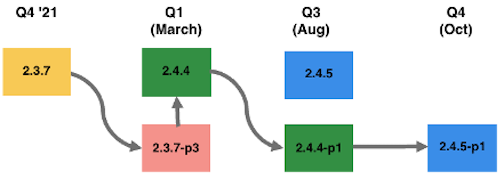

# Rutas de actualización recomendadas para 2022

Una implementación de comercio electrónico es una evolución, nunca ha finalizado. Su negocio debe estar un paso por delante de las tendencias al introducir las últimas funciones y funcionalidades que mantienen a sus clientes comprometidos. Con el tiempo, estas capacidades adicionales aumentan la huella y la complejidad general de la implementación.

Algunos de los factores generales que afectan al nivel de esfuerzo necesario para el proyecto de actualización son, entre otros:

| Complejidad técnica | Planificación y estrategia |
|-----------------------------------------------------------|--------------------------------------------------------------|
| Alcance de las personalizaciones | Claridad de los requisitos, decisiones vacilantes y margen de maniobra |
| Número de extensiones | Su frecuencia de actualización |
| Número de integraciones con terceros (OMS, ERP) | Su estrategia de pruebas |
| Codificación para prácticas recomendadas |  |

A continuación se indican las rutas recomendadas por Adobe Commerce para mantener el sitio seguro y con un buen rendimiento durante todo el año 2022.

## Actualización de las versiones 2.3.0 a 2.3.6 (opción 1)

Puede pasar de cualquier línea 2.3.x a 2.4.3. Sin embargo, cuanto más tiempo pase sin una actualización, más esfuerzo será ir directamente a 2.4.3 a medida que la base de código cambie más.

Por ejemplo, si está en la versión 2.3.4 que se lanzó en enero de 2020, está en una versión que tiene casi dos años, por lo que la base de código de 2.4.3, en comparación con la versión 2.3.4, es muy buena. Por este motivo, Adobe recomienda que actualice con frecuencia, ya que el nivel de esfuerzo tiende a ser aún mayor si retrasa la actualización durante un período prolongado.

Una vez que esté en la versión 2.4.3, entonces en el primer trimestre puede seguir siendo seguro tomando 2.4.3-p2, lo cual es un esfuerzo bajo ya que es una versión de seguridad ligera. A continuación, en el tercer trimestre, puede tomar el parche completo 2.4.5 y un parche de seguridad luminoso más para mantenerse seguro en el cuarto trimestre. Esta ruta requiere dos actualizaciones de gran esfuerzo para fines de 2022.

## Actualización de las versiones 2.3.0 a 2.3.6 (opción 2)

Alternativamente, puede actualizar de 2.3.x directamente a 2.4.4 en marzo de 2022. A partir de la versión 2.4.4, puede tomar el parche de seguridad ligera en el tercer trimestre y luego actualizar a la versión 2.4.5-p1 en el cuarto trimestre, que incluye todas las actualizaciones incluidas en la versión 2.4.5 y parches de seguridad adicionales.

Consideraciones clave a la hora de decidir entre estas dos opciones:

| Opción 1: Actualizar a 2.4.3-p1 o -p2 | Opción 2: Actualización a 2.4.4 o 2.4.4-p1 |
|--------------------------------------------------------------------------------------------------------------------|--------------------------------------------------------------------------------------------------------------------------------------------------|
| Requiere 2 actualizaciones significativas antes de finales de 2022 para seguir siendo seguro, compatible con PCI y recibir soporte de calidad | Requiere una actualización significativa y una actualización de bajo nivel de esfuerzo antes de finales de 2022 para seguir siendo segura, compatible con PCI y recibir soporte de calidad |
| Permite llegar a una versión compatible con PCI antes | Posiblemente se enfrente a una ventana más larga hasta que llegue a una versión compatible con PCI, ya que la línea 2.3 llega a EOL en abril de 2022 |
| Consideración de tiempo: puede retrasar el paso a una nueva versión de PHP hasta más tarde en el año (agosto) | Consideración de tiempo: puede empezar a pasar a una nueva versión de PHP a principios de año (marzo) |

## Actualización de 2.3.7 (opción 1)

Al igual que en la última versión 2.3.7, está en una línea que solo está recibiendo versiones de seguridad. En el primer trimestre del 22, Adobe lanzará la última versión de 2.3, que es 2.3.7-p3, junto con una versión de seguridad (2.4.3-p2) y una versión completa (2.4.4).

Su primera opción sería tomar la versión 2.3.7-p3 y obtener las últimas correcciones de seguridad. Luego, en agosto, podría tomar la versión 2.4.5. Por último, en el cuarto trimestre se puede tomar la versión de seguridad ligera en función de la versión completa 2.4.5. En este escenario, estaría en una versión EOL durante unos meses hasta que tomara 2.4.5. Sin embargo, actualmente 2.3.x no ofrece soporte de calidad y tendría las vulnerabilidades de seguridad más recientes parcheadas.

## Actualización de 2.3.7 (opción 2)

La segunda opción sería tomar la versión 2.3.7-p3 para obtener rápidamente las últimas correcciones de seguridad, ya que los parches de seguridad para la línea actual son un esfuerzo menor de implementar y, a continuación, puede iniciar la actualización a la versión 2.4.4.

En agosto, podría tomar 2.4.4-p1, que sería una versión de seguridad ligera, y luego en el cuarto trimestre tomar 2.4.5-p1, que incluye todas las actualizaciones incluidas en 2.4.5 y las últimas versiones de seguridad.

También puede pasar de 2.3.7-p3 a 2.4.4-p1, pero tenga en cuenta que el 2.4.4-p1 es un &quot;alza pesada&quot; ya que básicamente está recibiendo todas las actualizaciones incluidas en 2.4.4 y las actualizaciones de seguridad en 2.4.4-p1. Decidir si desea iniciar este alza más pesada a la línea 2.4.4 en marzo o agosto depende de usted y de su equipo.

Consideraciones clave a la hora de decidir entre estas dos opciones:

| Opción 1: Actualización a 2.3.7-p3 y luego a 2.4.5 | Opción 2: Actualización a 2.3.7-p3 y luego a 2.4.4 |
|--------------------------------------------------------------------------------------------------------------------|-----------------------------------------------------------------------------------------------------------------------------------------------------|
| Reciba primero las últimas actualizaciones de seguridad con un parche de seguridad de bajo esfuerzo | Reciba primero las últimas actualizaciones de seguridad con un parche de seguridad de bajo esfuerzo |
| Requiere una actualización significativa antes de finales de 2022 para seguir siendo segura, compatible con PCI y recibir soporte de calidad | Requiere una actualización significativa y una actualización de bajo nivel de esfuerzo antes de finales de 2022 para seguir siendo segura, compatible con PCI y recibir soporte de calidad |
| Lleve una ventana más larga hasta que llegue a una versión compatible con PCI, ya que la línea 2.3 llega a EOL en abril | Consideración de tiempo: puede empezar a pasar a una nueva versión de PHP a principios de año (marzo) |
| Consideraciones de tiempo: puede retrasar la actualización del esfuerzo superior hasta agosto | Consideraciones de tiempo: puede iniciar una actualización de mayor esfuerzo en marzo y, a continuación, realizar una actualización de mediana baja en octubre |

## Actualización de 2.4.0 a 2.4.2

Como se encuentra en la versión 2.4.0-2.4.2, le recomendamos que actualice a la versión 2.4.4 en el primer trimestre. Este es un esfuerzo relativamente alto debido a los cambios de ruptura en 2.4.4 causados por el cambio a PHP 8.1. Sin embargo, el resto de las actualizaciones para el año son esfuerzos menores, por lo que solo necesita realizar una actualización de esfuerzo de nivel superior en 2022.

## Actualización de 2.4.3

Como está en la versión 2.4.3, tomar 2.4.3-p2 en el primer trimestre sería la menor cantidad de esfuerzo. Luego, en agosto, podría tomar la versión 2.4.5. Por último, en el cuarto trimestre se puede tomar la versión de seguridad ligera en función de la versión completa 2.4.5. En esta situación, solo realizará una actualización de esfuerzo de nivel superior en 2022.
