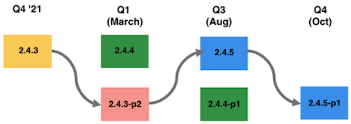

# Rutas de actualización recomendadas para 2022

Una implementación de comercio electrónico es una evolución, nunca ha finalizado. Su negocio debe estar un paso por delante de las tendencias al introducir las últimas funciones y funcionalidades que mantienen a sus clientes comprometidos. La actualización a Adobe Commerce 2.4.4 o superior le permite mantenerse al día con las mejores innovaciones de su clase y ofrecer pruebas futuras a su empresa con:

- Acceso más rápido a las funciones innovadoras que se ofrecen como servicios SaaS
- Mantenimiento y actualizaciones más sencillos y rentables
- Flexibilidad y personalización continuas para satisfacer necesidades empresariales únicas
- Aumento significativo del rendimiento y la escalabilidad
- Mejor experiencia para desarrolladores y herramientas
- Capacidad de integración con otras aplicaciones de Adobe Experience Cloud

Para proporcionar a nuestros comerciantes más flexibilidad a la hora de planificar su actualización a la versión 2.4.4 o superior, hemos actualizado recientemente nuestra [Calendario de versiones de 2022](https://devdocs.magento.com/release/), amplió la fecha de finalización del soporte (EOS) 2.3 y anunció nuevas opciones de soporte extendidas para versiones seleccionadas de nuestro software. Para más información sobre estas actualizaciones, por favor consulte nuestro blog.

Las siguientes son las rutas recomendadas por Adobe Commerce a la versión 2.4.4 o posterior para mantener el sitio seguro y el rendimiento mientras actualiza a una de las versiones más recientes.

## Actualización desde las versiones 2.3.6 y posteriores

## Actualización de 2.3.7

## Actualización de 2.4.0 a 2.4.3

## Actualización de la versión 2.4.3 (o de reciente actualización)

