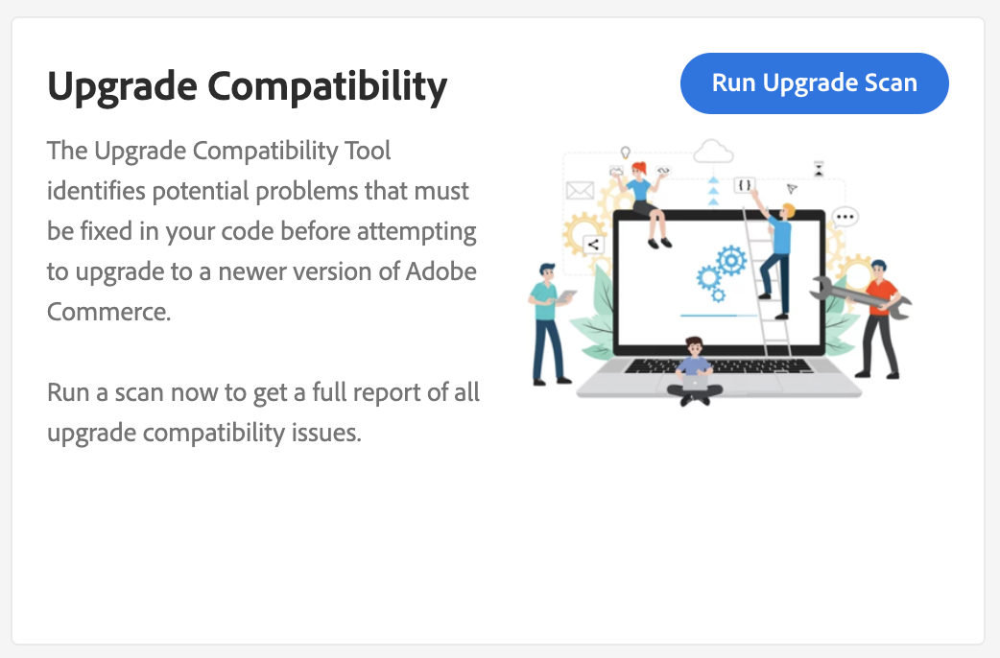

# Integrar el [!DNL Site-Wide Analysis Tool]

La variable [!DNL Site-Wide Analysis Tool] proporciona monitoreo del rendimiento en tiempo real, informes y recomendaciones las 24 horas del día, los 7 días de la semana para garantizar la seguridad y la operabilidad de las instalaciones de Adobe Commerce.

La variable [!DNL Upgrade Compatibility Tool] ahora está integrado con la variable [!DNL Site-Wide Analysis Tool] para que las personas no técnicas puedan ejecutar el [!DNL Upgrade Compatibility Tool] y obtenga un [informe del HTML](https://experienceleague.adobe.com/docs/commerce-operations/upgrade-guide/upgrade-compatibility-tool/run.html?lang=en#output) que contiene una lista de problemas para cada archivo que especifica su gravedad, código de error y descripción del error.

Consulte la [[!DNL Site-Wide Analysis Tool] guía del usuario](https://docs.magento.com/user-guide/reports/site-wide-analysis-tool.html) para obtener más información.

## Ejecute el [!DNL Upgrade Compatibility Tool] de SWAT

Vaya a la [!DNL Site-Wide Analysis Tool] tablero para el proyecto y ubique el [!DNL Upgrade Compatibility Tool] para abrir el Navegador.

Haga clic **[!UICONTROL Run Upgrade Scan]**. El análisis puede tardar algún tiempo dependiendo del tamaño del proyecto. Un control de número indica que el análisis está en curso.

Una vez completado el análisis, los resultados de alto nivel se muestran en el widget.

Haga clic en **[!UICONTROL Download Report]** para recuperar el [!DNL Upgrade Compatibility Tool] informe del HTML y revise los detalles.
