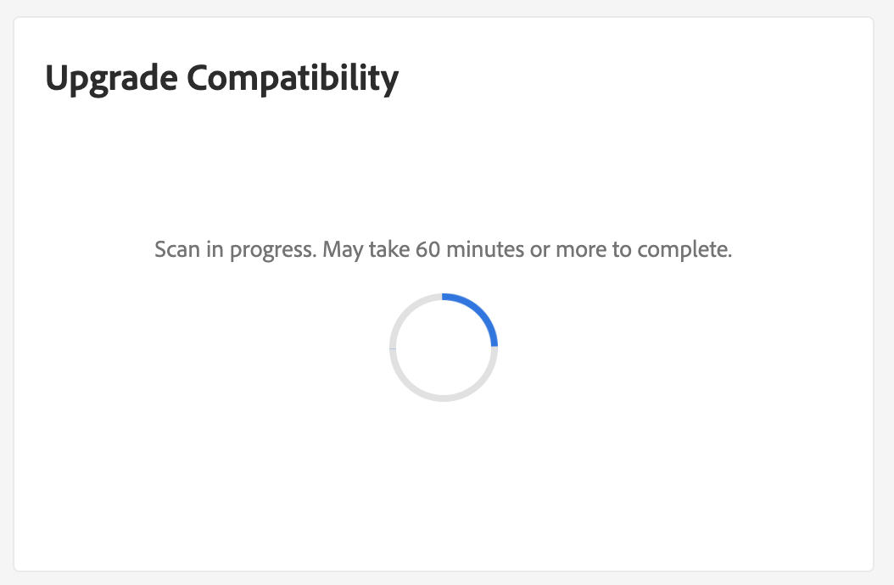
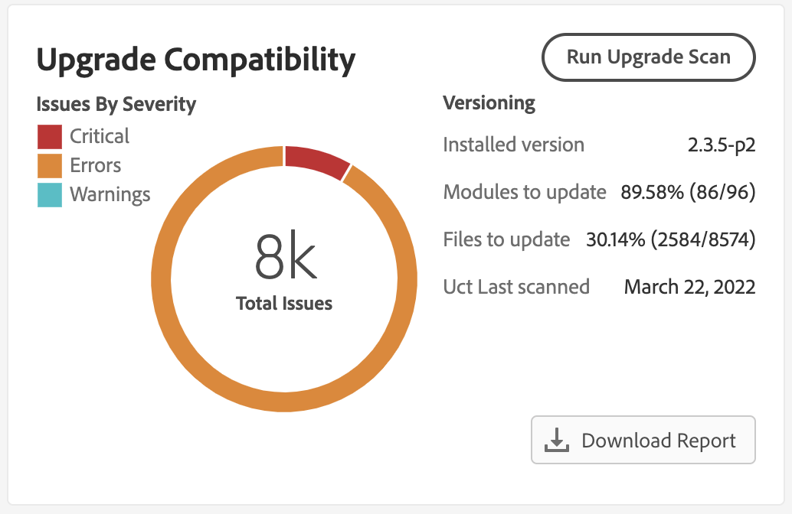

# Integrar [!DNL Site-Wide Analysis Tool]

[!DNL Site-Wide Analysis Tool] proporciona supervisión de rendimiento, informes y recomendaciones en tiempo real las 24 horas del día, los 7 días de la semana para garantizar la seguridad y la operabilidad de las instancias de Adobe Commerce.

El [!DNL Upgrade Compatibility Tool] está ahora integrado con el [!DNL Site-Wide Analysis Tool] para proporcionar a los usuarios no técnicos la capacidad de ejecutar el [!DNL Upgrade Compatibility Tool] y obtener un [informe](../upgrade-compatibility-tool/reports.md) que contenga una lista de problemas para cada archivo.

Consulte la [[!DNL Site-Wide Analysis Tool] guía del usuario](/help/tools/site-wide-analysis-tool/access.md) para obtener más información.

## Ejecutar [!DNL Upgrade Compatibility Tool] desde [!DNL Site-Wide Analysis Tool]

Vaya al panel [!DNL Site-Wide Analysis Tool] de su proyecto y busque el widget [!DNL Upgrade Compatibility Tool].

Haga clic en **[!UICONTROL Run Upgrade Scan]**. El análisis puede tardar algún tiempo en función del tamaño del proyecto. Un control de número indica que el análisis está en curso.

Una vez finalizado el análisis, los resultados de alto nivel se muestran en el widget.

Haga clic en **[!UICONTROL Download Report]** para recuperar [!DNL Upgrade Compatibility Tool] [informe de HTML](../upgrade-compatibility-tool/reports.md#html-report) y revise los detalles.

>[!NOTE]
>
> Al ejecutar [!DNL Upgrade Compatibility Tool] a través de [!DNL Site-Wide Analysis Tool], se optimizan los resultados y se ayuda a centrarse en los problemas que son nuevos y críticos para la actualización de destino. Utiliza la opción [`--ignore-current-version-compatibility-errors`](run.md#optimize-your-results) y siempre muestra los resultados comparando la versión del proyecto con la última versión lanzada.
