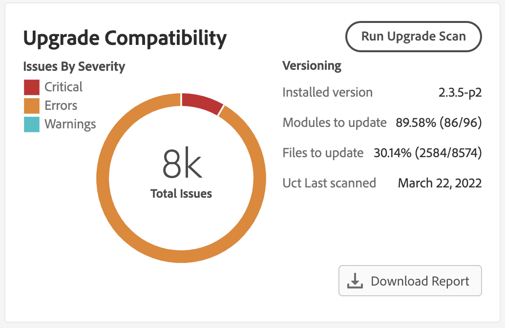

# Integrar el [!DNL Site-Wide Analysis Tool]

La variable [!DNL Site-Wide Analysis Tool] proporciona monitoreo del rendimiento en tiempo real, informes y recomendaciones las 24 horas del día, los 7 días de la semana para garantizar la seguridad y la operabilidad de las instancias de Adobe Commerce.

La variable [!DNL Upgrade Compatibility Tool] ahora está integrado con la variable [!DNL Site-Wide Analysis Tool] para que las personas no técnicas puedan ejecutar el [!DNL Upgrade Compatibility Tool] y obtenga un [informe](../upgrade-compatibility-tool/reports.md) que contiene una lista de problemas para cada archivo.

Consulte la [[!DNL Site-Wide Analysis Tool] guía del usuario](https://docs.magento.com/user-guide/reports/site-wide-analysis-tool.html) para obtener más información.

## Ejecute el [!DNL Upgrade Compatibility Tool] de la variable [!DNL Site-Wide Analysis Tool]

Vaya a la [!DNL Site-Wide Analysis Tool] tablero para el proyecto y ubique el [!DNL Upgrade Compatibility Tool] para abrir el Navegador.

Haga clic **[!UICONTROL Run Upgrade Scan]**. El análisis puede tardar algún tiempo dependiendo del tamaño del proyecto. Un control de número indica que el análisis está en curso.

Una vez completado el análisis, los resultados de alto nivel se muestran en el widget.

Haga clic en **[!UICONTROL Download Report]** para recuperar el [!DNL Upgrade Compatibility Tool] [informe del HTML](../upgrade-compatibility-tool/reports.md#html-report) y revise los detalles.

>[!NOTE]
>
> Ejecución de [!DNL Upgrade Compatibility Tool] a través de [!DNL Site-Wide Analysis Tool] optimiza los resultados y le ayuda a centrarse en los problemas nuevos y críticos para la actualización de target. Utiliza el [`--ignore-current-version-compatibility-errors`](run.md#optimize-your-results) y siempre muestra resultados comparando la versión del proyecto con la última versión publicada.
